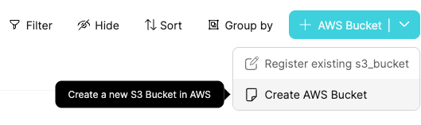
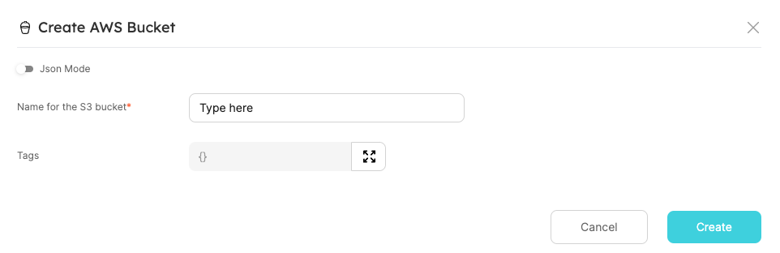
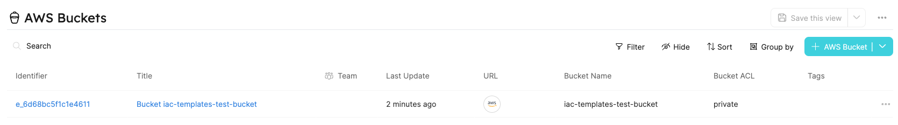
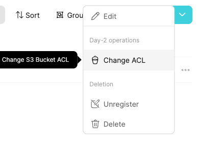
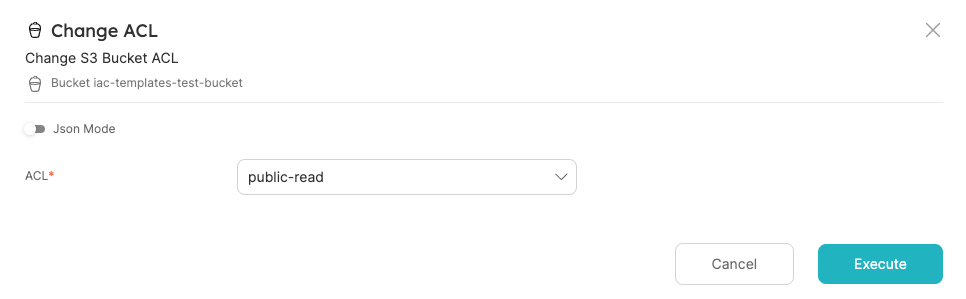

# IaC Templates

Infrastructure as Code templates are used for automating operations (such as create, day-2, and delete) for the cloud resources lifecycle.

Working with an IaC template allows developers to easily manage resources, without needing to know the underlying systems, tools, and practices (such as Terraform).

Let's review an example of how to make use of IaC templates, using Port's Self-Service Actions.

## Example

The following example will walk you through how to set up Self-Service Actions to create, change ACL (Day-2 operation), and delete S3 buckets.

We will use a backend written in Go, which leverages Terraform templates to execute the aforementioned operations.

:::info
The full example can be found [**HERE**](https://github.com/port-labs/terraform-connector).

Another template for managing `SNS Topic` is available there.
:::

:::note Prerequisites

- AWS credentials with permissions to create, change ACL, and delete S3 buckets.
- A Docker daemon for running the backend image.

:::

### Running the backend

First, run the backend image with the following command (make sure to replace the placeholders):

```shell
docker run \
  -e PORT_CLIENT_ID=<PORT_CLIENT_ID> \
  -e PORT_CLIENT_SECRET=<PORT_CLIENT_SECRET> \
  -e AWS_ACCESS_KEY_ID=<AWS_ACCESS_KEY_ID> \
  -e AWS_SECRET_ACCESS_KEY=<AWS_SECRET_ACCESS_KEY> \
  -e AWS_SESSION_TOKEN=<AWS_SESSION_TOKEN> \
  -e AWS_REGION=<AWS_REGION> \
  -e DEBUG=true \
  -p 8080:8080 \
  -it ghcr.io/port-labs/webhook-terraform:v0.2
```

Now you have a running server that receives a webhook request from Port and applies them to terraform files!

To make your local machine public to Port, you can use either [ngrok](https://ngrok.com/download) or [smee](https://smee.io/).

Our [local debugging guide](../self-service-actions/webhook/local-debugging-webhook.md#creating-the-vm-create-action) contains a reference on how to work with `smee`.

Otherwise, if you choose `ngrok`, run:

```shell
ngrok http 8080
```

You will see output similar to the following:

```shell
ngrok

Session Status                online
...
Forwarding                    https://1234-5678-9101-112-1314-1516-abcd-efgh-ijkl.eu.ngrok.io -> http://localhost:8080
...
```

Keep the `Forwarding URL` for later use.

### Set up Port resources

First, set up a Blueprint for an S3 bucket in Port.

You can create as many properties as you want for the bucket, but for this example we will keep it lean with 4 properties - `URL`, `Bucket Name`, `Bucket ACL` and `Tags`.

<details>
<summary> AWS Bucket Blueprint </summary>

```json showLineNumbers
{
  "identifier": "s3_bucket",
  "title": "AWS Bucket",
  "icon": "Bucket",
  "schema": {
    "properties": {
      "url": {
        "type": "string",
        "title": "URL",
        "format": "url"
      },
      "bucket_name": {
        "type": "string",
        "title": "Bucket Name"
      },
      "bucket_acl": {
        "type": "string",
        "title": "Bucket ACL",
        "default": "private"
      },
      "tags": {
        "type": "object",
        "title": "Tags"
      }
    },
    "required": ["url", "bucket_name"]
  },
  "mirrorProperties": {},
  "calculationProperties": {},
  "relations": {}
}
```

</details>

Next, we want to create Self-Service Actions to support `Create`, `Change ACL`, and `Delete` S3 buckets.

<details>
<summary> Self-Service Actions for AWS Bucket Blueprint </summary>

Replace `<YOUR_WEBHOOK_URL>` with the URL you got earlier.

```json showLineNumbers
[
  {
    "identifier": "create_bucket",
    "title": "Create",
    "icon": "Bucket",
    "userInputs": {
      "properties": {
        "bucket_name": {
          "type": "string",
          "title": "Name for the S3 bucket"
        },
        "tags": {
          "type": "object",
          "title": "Tags",
          "default": {}
        }
      },
      "required": ["bucket_name"]
    },
    "invocationMethod": {
      "type": "WEBHOOK",
      "url": "<YOUR_WEBHOOK_URL>"
    },
    "trigger": "CREATE",
    "description": "Create a new S3 Bucket in AWS"
  },
  {
    "identifier": "change_acl",
    "title": "Change ACL",
    "icon": "Bucket",
    "userInputs": {
      "properties": {
        "bucket_acl": {
          "type": "string",
          "enum": ["private", "public-read"],
          "title": "ACL"
        }
      },
      "required": ["bucket_acl"]
    },
    "invocationMethod": {
      "type": "WEBHOOK",
      "url": "<YOUR_WEBHOOK_URL>"
    },
    "trigger": "DAY-2",
    "description": "Change S3 Bucket ACL"
  },
  {
    "identifier": "delete_bucket",
    "title": "Delete",
    "icon": "Bucket",
    "userInputs": {
      "properties": {},
      "required": []
    },
    "invocationMethod": {
      "type": "WEBHOOK",
      "url": "<YOUR_WEBHOOK_URL>"
    },
    "trigger": "DELETE",
    "description": "Delete an S3 Bucket from AWS"
  }
]
```

</details>

### Running the Self-Service Actions

#### Create

Everything is ready to run the configured Self-Service Actions.

Go to the `AWS Bucket` Blueprint page, and run `Create AWS Bucket`:


Fill in the name of the S3 bucket (must be globally unique!) and click `Create`:



Hooray! In a minute, you'll have a new S3 bucket, which is also added as a Port entity.



#### Change ACL (Day-2 operation)

After creating the bucket, you might want to make changes in its configuration over time.

For example, a valid use case is to change bucket visibility from `private` to `public-read`.

Go to the bucket entity and choose the `Change ACL` Day-2 operation:



Choose the `public-read` option for `ACL`, and `Execute`:



`Terraform apply` will be triggered behind the scenes, and when it finishes, you will see the entity's `Bucket ACL` property updated to `public-read`.

#### Delete

Finally, you can clear your environment and delete the bucket.

Go to the bucket entity and choose `Delete`:


Click on `Delete`:


Done! Your bucket will be deleted from AWS and Port.

## Summary

IaC templates help your team efficiently control and configure any cloud resources in your possession.

Port Self-Service Actions allow you to quickly ramp up an event based infrastructure to leverage your IaC templates.
