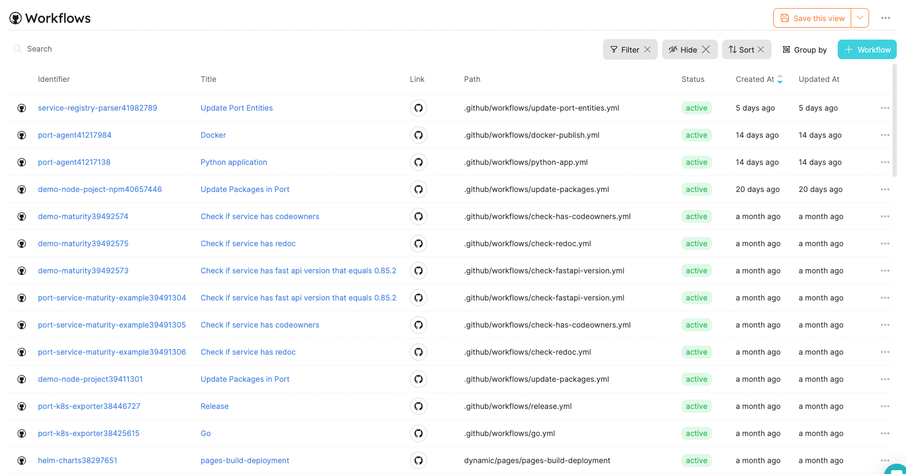

:::note Prerequisites

[Please install our GitHub app](./installation).
:::

In this tutorial, we will export workflows from GitHub and create matching Port Entities!

1. Create a `workflow` Blueprint and `port-app-config.yml` configuration file.

To export your GitHub `Workflows` to Port, you can use the following Port Blueprints definitions, and `port-app-config.yml`:

<details>
<summary> Workflow Blueprint </summary>

```json showLineNumbers
{
  "identifier": "workflow",
  "title": "Workflow",
  "icon": "Github",
  "schema": {
    "properties": {
      "path": {
        "title": "Path",
        "type": "string"
      },
      "status": {
        "title": "Status",
        "type": "string",
        "enum": [
          "active",
          "deleted",
          "disabled_fork",
          "disabled_inactivity",
          "disabled_manually"
        ],
        "enumColors": {
          "active": "green",
          "deleted": "red"
        }
      },
      "createdAt": {
        "title": "Created At",
        "type": "string",
        "format": "date-time"
      },
      "updatedAt": {
        "title": "Updated At",
        "type": "string",
        "format": "date-time"
      },
      "deletedAt": {
        "title": "Deleted At",
        "type": "string",
        "format": "date-time"
      },
      "link": {
        "title": "Link",
        "type": "string",
        "format": "url"
      }
    },
    "required": []
  },
  "mirrorProperties": {},
  "calculationProperties": {},
  "relations": {}
}
```

</details>

You have to place the `port-app-config.yml` inside the `.github` folder or within the `.github-private` repository in the root directory to apply it for the whole organization.

<details>

<summary> Port port-app-config.yml </summary>

```yaml showLineNumbers
resources:
  - kind: workflow
    selector:
      query: "true" # a JQ expression that it's output (boolean) determinating wheter to report the current resource or not
    port:
      entity:
        mappings:
          identifier: ".repo + (.id|tostring)"
          title: ".name"
          blueprint: '"workflow"'
          properties:
            path: ".path"
            status: ".state"
            createdAt: ".created_at"
            updatedAt: ".updated_at"
            link: ".html_url"
```

</details>

:::info

- We leverage [JQ JSON processor](https://stedolan.github.io/jq/manual/) to map and transform GitHub objects to Port Entities.
- Click [Here](https://docs.github.com/en/rest/actions/workflows?apiVersion=2022-11-28#get-a-workflow) for the GitHub workflow object structure.

You might have noticed that the `repo` field is not provided by GitHub's API, that's because it is a custom property we added to simplify things.
:::

2. push `port-app-config.yml` to your default branch.

Done! after the push is complete, the exporter will begin creating all the workflows in the repository or organization, and update on every change to existing or creation of new `workflows`.

Now you can view and query all of your Workflows as Port Entities!


