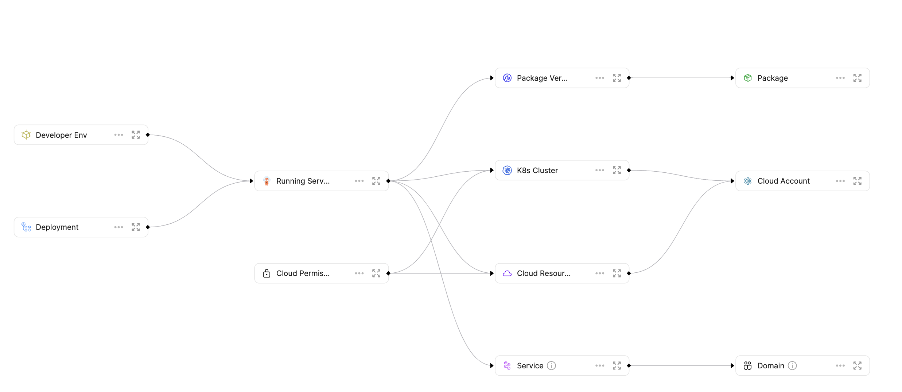
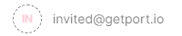

# Blueprint

## What is a Blueprint?

A Blueprint is _our basic_ building block in Port. It represents assets that can be managed in Port, such as `Microservice`, `Environments`, `Packages`, `Clusters`, `Databases`, and many more.

Blueprints are completely customizable, and they support any number of properties the user chooses, all of which can be modified as you go.

## Defining your blueprints

Before you start, there are a few things to consider when defining your Blueprints:

1. **What part of your infrastructure do you want to manage**, or in other words, what is the best way to catalog your software and infrastructure to reflect the architecture that matters for the developer portal experience? For example, in one organization, the focus could be managing microservices (with clusters, deployments, etc...). While in another, it could be understanding what dev environments the organization has in a given moment.

2. **What properties characterize your assets?** For example, a microservice’s characteristics could be its owner, a link to its Github repository, a relevant slack channel and a health check status.

3. **What are the relationships between the different assets?** For example, relations between microservices and deployments that track where each microservice is deployed.

:::note
By the end of this section, you should have a Blueprint architecture similar to this in mind:


:::

## Blueprint structure

### Blueprint JSON schema

Each Blueprint is represented by a [Json schema](https://json-schema.org/), as shown in the following section:

```json showLineNumbers
{
  "identifier": "uniqueID",
  "title": "Title",
  "description": "Description",
  "icon": "Service",
  "calculationProperties": {},
  "schema": {
    "properties": {
      "foo": {
        "type": "string",
        "title": "Foo"
      },
      "bar": {
        "type": "number",
        "title": "Bar"
      },
      "date": {
        "type": "string",
        "format": "date-time",
        "title": "Date"
      }
    },
    "required": []
  },
  "relations": {}
}
```

---

### Structure table

| Field                   | Type     | Description                                                                                                                                       | Optional Values                                                                                                                               |
| ----------------------- | -------- | ------------------------------------------------------------------------------------------------------------------------------------------------- | --------------------------------------------------------------------------------------------------------------------------------------------- |
| `identifier`            | `String` | Unique identifier.<br /> Note that while the identifier is unique, it [can be changed](./tutorial.md/#update-blueprint-identifier) after creation |
| `title`                 | `String` | Blueprint's name.                                                                                                                                 |
| `description`           | `String` | Description for the Blueprint.<br /> The value is visible to users when hovering over the info icon in the UI.                                    |
| `icon`                  | `String` | Icon for the Blueprint's graph node and Entities of the Blueprint.                                                                                | Icon options: `Airflow, Ansible, Argo, Aws, Azure, Blueprint, Bucket, Cloud,...` <br /><br />See the full icon list [below](#full-icon-list). |
| `calculationProperties` | `Object` | Contains the properties defined using [calculation templates](./calculation-properties).                                                          | Example: "`repo-link`": "`https://github.com/{{$identifier}}`"                                                                                |
| `schema`                | `Object` | An object containing two more nested fields, including `properties` and `required`.                                                               | See the schema structure [here](#blueprint-schema).                                                                                           |
| `changelogDestination`  | `Object` | Defines a destination where change events in the Blueprint or Blueprint's Entities will be sent to                                                | See the object structure [here](#changelog-destination).                                                                                      |

#### Special blueprint fields

| Field              | Type     | Description                                                                                                                                                          | Optional Values                                                        |
| ------------------ | -------- | -------------------------------------------------------------------------------------------------------------------------------------------------------------------- | ---------------------------------------------------------------------- |
| `relations`        | `Object` | Contains the [Relations](../relation/relation.md) of the Blueprint                                                                                                   |
| `mirrorProperties` | `Object` | Becomes available when a Relation is defined between two blueprints.<br />A Mirror Property represents additional data queried from the related [Entity](../entity). | See more details on the [Mirror Properties](./mirror-properties) page. |

#### Full icon list

:::info Available Icons
`API, Airflow, AmazonEKS, Ansible, ApiDoc, Aqua, Argo, ArgoRollouts, Aws, Azure, BitBucket, Bucket, CPU, CPlusPlus, CSharp, Clickup, Cloud, Cluster, Codefresh, Confluence, Coralogix, Crossplane, Datadog, Day2Operation, DeployedAt, Deployment, DevopsTool, EC2, EU, Environment, Falcosidekick, GKE, GPU, Git, GitLab, GitVersion, Github, GithubActions, Go, Google, GoogleCloud, GoogleCloudPlatform, GoogleComputeEngine, Grafana, Graphql, HashiCorp, Infinity, Istio, Jenkins, Jira, Kafka, Kiali, Kotlin, Lambda, Launchdarkly, Link, Lock, LucidCharts, Matlab, Microservice, MongoDb, Moon, NewRelic, Node, NodeJS, Notion, Okta, Package, Pearl, PostgreSQL, Prometheus, Pulumi, Python, R, React, RestApi, Ruby, S3, SDK, SQL, Scala, Sentry, Server, Service, Slack, Swagger, Swift, TS, Terraform, TwoUsers, Youtrack, Zipkin, checkmarx, css3, html5, java, js, kibana, logz, pagerduty, php, port, sonarqube, spinnaker, Docker, Neo4j, TeamCity, Book, Box, Home, Rope, Siren, Star, BlankPage`
:::

#### Blueprint schema

```json showLineNumbers
"schema": {
    "properties": {},
    "required": []
}
```

| Schema field | Type     | Description                                                                                                                           |
| ------------ | -------- | ------------------------------------------------------------------------------------------------------------------------------------- |
| `properties` | `Object` | See our [`properties`](#blueprint-properties) section for more details.                                                               |
| `required`   | `List`   | A list of the **required** properties, out of the `properties` object list. <br /> These are mandatory fields to fill in the UI form. |

## Blueprint properties

Each Blueprint has a `properties` section under its `schema`. In this section, you can define all of the unique properties that describe your asset.

For Example:

```json showLineNumbers
"string_props": {
    "title": "My String Property",
    "type": "string",
    "default": "foo",
    "icon": "Microservice",
    "description": "This is a string property"
}
```

Now let's look at the structure of this property definition and also explore the entire set of options for a single property:

| Field         | Type                    | Description                                                                                                                                                                                                                                           |
| ------------- | ----------------------- | ----------------------------------------------------------------------------------------------------------------------------------------------------------------------------------------------------------------------------------------------------- |
| `title`       | `String`                | Property name                                                                                                                                                                                                                                         |
| `type`        | `String`                | **Mandatory field.** The data type of the property. You can explore all available types in the [Property Types](#property-types) section                                                                                                              |
| `format`      | `String`                | Specific data format to pair with some of the available types. You can explore all formats in the [Formats](#format) section                                                                                                                          |
| `pattern`     | `String`                | [Regular expression](https://en.wikipedia.org/wiki/Regular_expression) (regex) pattern to specify the set of allowed values for the property. You can see an example in the [regular expressions](#regular-expressions) section                       |
| `default`     | Should match the `type` | Default value for this property in case an Entity is created without explicitly providing a value.                                                                                                                                                    |
| `icon`        | `String`                | Icon for the property column in the Blueprint page, in the [Entity page](../entity#entity-page) and in the [Entity creation](../../software-catalog/entity/tutorial.md#from-the-ui) form <br /><br />See the full icon list [above](#full-icon-list). |
| `description` | `String`                | Description of the property.<br /> This value is visible to users when hovering on the info icon in the UI. It provides detailed information about the use of a specific property.                                                                    |

:::tip
We highly recommend you set a `description`, so your developers will understand the property’s context.


:::

## Property types

```json {3} showLineNumbers
"string_props": {
    "title": "My String Property",
    "type": "string",
    "default": "foo",
    "description": "This is a string property"
}
```

We currently support the following types:

| `type`    | Description                                                                       | Example values                               |
| --------- | --------------------------------------------------------------------------------- | -------------------------------------------- |
| `string`  | A free-text string value                                                          | `"This is a string field"`                   |
| `number`  | Numeric field (including integers, doubles, floats, etc...)                       | `1`, `2.3`, `5e3`,...                        |
| `boolean` | Boolean field                                                                     | A `true` or `false`                          |
| `object`  | A well formatted object (i.e. python dictionary, javascript object, JSON, etc...) | `{ 'key1': 'value1', 'key2': 'value2', ...}` |
| `array`   | A multi-element array                                                             | `[1,2,3]`, `["a","b","c"]`                   |

:::note
Those are the `properties` that our API supports. See [API reference](../../api-providers/rest.md).
:::

### Examples

Here is how property definitions look like for all available types (remember that only the `type` field is mandatory):

### String

```json showLineNumbers
{
  "title": "String Property",
  // highlight-start
  "type": "string",
  // highlight-end
  "description": "A string property",
  "default": "foo"
}
```

### Number

```json showLineNumbers
{
  "title": "Number Property",
  // highlight-start
  "type": "number",
  // highlight-end
  "description": "A number property",
  "default": 42
}
```

### Boolean

```json showLineNumbers
{
  "title": "Boolean Property",
  // highlight-start
  "type": "boolean",
  // highlight-end
  "description": "A boolean property",
  "default": true
}
```

### Object

```json showLineNumbers
{
  "title": "Object Property",
  // highlight-start
  "type": "object",
  // highlight-end
  "description": "An object property",
  "default": {
    "foo": "bar"
  }
}
```

See also [Properties keyword](./blueprint.md#properties)

### Array

```json showLineNumbers
{
  "title": "Array Property",
  // highlight-start
  "type": "array",
  // highlight-end
  "description": "An array property",
  "default": [1, 2, 3]
}
```

See also [Items keyword](./blueprint.md#items)

## Additional keywords

Some property types provide additional settings you can use to ensure data validity

### Format

We currently support the following `string` formats:

| `format`    | Description                                               | Example values                            |
| ----------- | --------------------------------------------------------- | ----------------------------------------- |
| `url`       | Formatted URL                                             | `"https://getport.io"`                    |
| `email`     | Formatted Email                                           | `"port@getport.io"`                       |
| `user`      | Formatted Email or any string                             | `"port@getport.io"`                       |
| `team`      | Team name                                                 | `"Batman Team"`                           |
| `date-time` | Formatted ISO datetime string                             | `"2022-04-18T11:44:15.345Z"`              |
| `ipv4`      | Standard IPv4 address                                     | `127.0.0.1`                               |
| `ipv6`      | Standard IPv6 address                                     | `FE80:CD00:0A20:0CDE:1257:1C34:211E:729C` |
| `timer`     | Formatted ISO datetime string                             | `"2022-04-18T11:44:15.345Z"`              |
| `yaml`      | a [YAML](https://en.wikipedia.org/wiki/YAML) file content | `a: 123`                                  |

:::note
Those are the `format` types that our API supports. See [API reference](../../api-providers/rest.md).
:::

#### URL

```json showLineNumbers
{
  "title": "URL Property",
  // highlight-start
  "type": "string",
  "format": "url",
  // highlight-end
  "description": "A URL property",
  "default": "https://getport.io"
}
```

#### Email

```json showLineNumbers
{
  "title": "Email Property",
  // highlight-start
  "type": "string",
  "format": "email",
  // highlight-end
  "description": "An Email property",
  "default": "mor@getport.io"
}
```

#### User

```json showLineNumbers
{
  "title": "User Property",
  // highlight-start
  "type": "string",
  "format": "user",
  // highlight-end
  "description": "A User property"
}
```

:::note
Even though the input is the same in both `email` and `user` formats, their presentation is different:

- `email` format displays the raw email string;
- `user` format displays the user's name and avatar from Port's list of known users.

In addition, `user` format distinguishes between users by their status:

| User Status  | Example                                                                           |
| ------------ | --------------------------------------------------------------------------------- |
| Active       |      |
| Invited      |    |
| Unregistered |  |

:::

#### Team

```json showLineNumbers
{
  "title": "Team Property",
  // highlight-start
  "type": "string",
  "format": "team",
  // highlight-end
  "description": "A Team property"
}
```

#### Date Time

```json showLineNumbers
{
  "title": "Datetime Property",
  // highlight-start
  "type": "string",
  "format": "date-time",
  // highlight-end
  "description": "A datetime property",
  "default": "2022-04-18T11:44:15.345Z"
}
```

#### Timer

Timer properties allow you to define an expiration date on specific properties. For more information, See the [timer properties section](../blueprint/timer-properties.md).

```json showLineNumbers
{
  "title": "Timer Property",
  // highlight-start
  "type": "string",
  "format": "timer",
  // highlight-end
  "description": "a property that will trigger an expiration event in a specific date"
}
```

#### Yaml

```json showLineNumbers
{
  "title": "Microservice Config",
  // highlight-start
  "type": "string",
  "format": "yaml",
  // highlight-end
  "description": "The configuration to use when deploying the service"
}
```

You can see below a `python` code snippet that parses a `yaml` formatted property as a dictionary object:

<details>
<summary>Click here to see the code</summary>

The Entity used in the example:

```json showLineNumbers
{
  "identifier": "my-cool-service-prod",
  "title": "Cool Service Production",
  "properties": {
    {...} // some properties
    // highlight-start
    "config": "do_awesome_things: true\nthings_not_to_do:\n    - fail\n    - be slow\n    - have bugs"
    // highlight-end
  }
}
```

Snippet to fetch the `config` property and parse it from `yaml` to a python dictionary:

```python showLineNumbers
# pip install pyyaml requests
import yaml
import requests

API_URL = 'https://api.getport.io/v1'

target_blueprint = 'Microservice'
target_entity = 'my-cool-service-prod'

credentials = {'clientId': 'YOUR_CLIENT_ID', 'clientSecret': 'YOUR_CLIENT_SECRET'}
token_response = requests.post(f'{API_URL}/auth/access_token', json=credentials)
access_token = token_response.json()['accessToken']

headers = {
    'Authorization': f'Bearer {access_token}'
}
response = requests.get(f'{API_URL}/blueprints/{target_blueprint}/entities/{target_entity}', headers=headers)

config_prop = yaml.safe_load(response.json()["entity"]["properties"]["config"])

print(config_prop["do_awesome_things"]) # prints: True
```

</details>

### Enum

The `enum` keyword is used to restrict a value to a fixed set of values. It must be an array with at least one element, where each element is unique. Can be used with properties of type `string` or `number`.

```json showLineNumbers
{
  "title": "Enum field",
  "type": "string",
  // highlight-start
  "enum": ["Option 1", "Option 2", "Option 3"],
  "enumColors": {
    "Option 1": "red",
    "Option 2": "green",
    "Option 3": "blue"
  },
  // highlight-end
  "description": "Enum dropdown menu"
}
```

:::tip
When using the `enum` keyword, you can also make use of the `enumColors` key to define the colors of the available values.

Each key is one of the available enum options and each value is one of the following colors: `blue, turquoise, orange, purple, lightBlue, pink, yellow, green, red, darkGray`

If `enum` is defined without `enumColors` definitions, the default colors will be set
:::

### Length

The length of a string can be constrained using the `minLength` and `maxLength` keywords. For both keywords, the value must be a non-negative number.

```json showLineNumbers
{
  "type": "string",
  "minLength": 2,
  "maxLength": 3
}
```

### Regular Expressions

In order to use a regex pattern for a property value, both the `"type": "string"` and the `"pattern": "[REGEX_PATTERN]"` keys need to be used in the property JSON.

A regex pattern will limit the set of legal values only to ones that are matched by the specified `[REGEX_PATTERN]`:

```json showLineNumbers
{
  "type": "string",
  "pattern": "^[a-zA-Z0-9-]*-service$" // requires the value to be a string with letters/numbers/dash with the suffix "-service"
}
```

:::tip
Port supports standard Javascript regex syntax ([ECMA 262](https://www.ecma-international.org/publications-and-standards/standards/ecma-262/)), for quick reference of some of the available regex syntax, refer to the [JSON Schema docs](https://json-schema.org/understanding-json-schema/reference/regular_expressions.html)
:::

### Range

Ranges of numbers are specified using a combination of the `minimum` and `maximum` keywords, (or `exclusiveMinimum` and `exclusiveMaximum` for expressing exclusive range).

If _x_ is the value being validated, the following must hold true:

- _x_ ≥ `minimum`
- _x_ > `exclusiveMinimum`
- _x_ ≤ `maximum`
- _x_ < `exclusiveMaximum`

The following example matches a number (x) in range 0 ≤ x < 100:

```json showLineNumbers
{
  "type": "number",
  "minimum": 0,
  "exclusiveMaximum": 100
}
```

### Items

List validation is useful for arrays of arbitrary length where each item matches the same schema. For this kind of array, set the `items` keyword to a single schema that will be used to validate all of the items in the array.

#### Numbers array

```json showLineNumbers
{
  "type": "array",
  "items": {
    "type": "number"
  }
}
```

#### Objects array

```json showLineNumbers
{
  "title": "Array of Objects",
  // highlight-start
  "type": "array",
  "items": {
    "type": "object"
  },
  // highlight-end
  "description": "An array property",
  "default": [
    {
      "foo": "bar",
      "version": 1
    }
  ]
}
```

#### URLs array

```json showLineNumbers
{
  "title": "Array of URLs",
  // highlight-start
  "type": "array",
  "items": {
    "type": "string",
    "format": "url"
  },
  // highlight-end
  "default": ["https://grafana.com", "https://getport.io", "https://slack.com"]
  "description": "An array of URLs property"
}
```

#### Users array

```json showLineNumbers
{
  "title": "Array of Users",
  "description": "An array of Users property",
  // highlight-start
  "type": "array",
  "items": {
    "type": "string",
    "format": "user"
  }
  // highlight-end
}
```

#### Teams array

```json showLineNumbers
{
  "title": "Array of Teams",
  "description": "An array of Teams property",
  // highlight-start
  "type": "array",
  "items": {
    "type": "string",
    "format": "team"
  }
  // highlight-end
}
```

### Properties

It is possible to define the format and validation rules of key-value pairs inside an `object` property by using the `properties` keyword inside the `object` type definition.

The value of `properties` is an object, where each key is the name of a property and each value is a schema used to validate that property. Any property that doesn’t match any of the property names in the `properties` keyword is ignored by this keyword.

For example, let’s say we want to define a simple schema for service metadata:

```json showLineNumbers
{
  "type": "object",
  "properties": {
    "config_file_path": { "type": "string" },
    "min_required_cpu": { "type": "number", "maximum": 8 }
  }
}
```

:::tip
When using the `properties` keyword, you can also make use of the `additionalProperties` keyword to control the handling of extra properties that were not explicitly defined. That is, properties whose names are not listed in the `properties` keyword of the `object`.

By default, any additional properties are allowed (`"additionalProperties": true`), by setting `additionalProperties` to `false`, only keys explicitly specified can be saved, and any other fields will be rejected (in the example below, only `config_file_path` and `min_required_cpu` will be allowed).

```json showLineNumbers
{
  "type": "object",
  "properties": {
    "config_file_path": { "type": "string" },
    "min_required_cpu": { "type": "number", "maximum": 8 }
  },
  "additionalProperties": false
}
```

:::

## Widget properties

It is possible to configure widget properties that expose completely new functionality in Port, including new display options and loading data from external sources.

The available special types and their usage examples are listed below:

|                                   | Description                                                                                                                                   | Example values                                                                               |
| --------------------------------- | --------------------------------------------------------------------------------------------------------------------------------------------- | -------------------------------------------------------------------------------------------- |
| [`markdown`](../widgets/markdown) | String in markdown language format                                                                                                            | `An Example of **bold text**.`                                                               |
| `spec`                            | Field with a pre-defined set of allowed values. A property with a `spec` key will be displayed as a separate tab in the Specific Entity Page. | [`open-api`](../widgets/open-api), [`embedded-url`](../widgets/embedded-url/embedded-url.md) |

### Markdown

```json showLineNumbers
{
  "title": "Markdown Property",
  // highlight-start
  "type": "string",
  "format": "markdown",
  // highlight-end
  "description": "A Markdown property"
}
```

### OpenAPI Specification as URL

For more info on the `OpenAPI specification` property, refer to the [OpenAPI Widget](../widgets/open-api.md) doc.

```json showLineNumbers
{
  "title": "Swagger",
  // highlight-start
  "type": "string",
  "format": "url",
  "spec": "open-api",
  // highlight-end
  "description": "Open-API Prop"
}
```

### OpenAPI Specification as object

For more info on the `OpenAPI specification` property, refer to the [OpenAPI Widget](../widgets/open-api.md) doc.

```json showLineNumbers
{
  "title": "Swagger",
  // highlight-start
  "type": "object",
  "spec": "open-api",
  // highlight-end
  "description": "Open-API Prop"
}
```

### AsyncAPI Specification as URL

For more info on the `AsyncAPI specification` property, refer to the [AsyncAPI Widget](../widgets/async-api.md) doc.

```json showLineNumbers
{
  "title": "Swagger",
  // highlight-start
  "type": "string",
  "format": "url",
  "spec": "async-api",
  // highlight-end
  "description": "Async-API Prop"
}
```

### AsyncAPI Specification as object

For more info on the `AsyncAPI specification` property, refer to the [AsyncAPI Widget](../widgets/async-api.md) doc.

```json showLineNumbers
{
  "title": "Swagger",
  // highlight-start
  "type": "object",
  "spec": "async-api",
  // highlight-end
  "description": "Async-API Prop"
}
```

:::note

Keep in mind that these 2 methods of getting an OpenAPI/AsyncAPI spec and rendering it as a Swagger are only differentiated by the type and format but give the same value.

1. `type: object` - you provide the complete `json` spec into Port.

2. `type: string` and `format: url` - you provide a URL which the `json` spec will be fetched from

:::

### Embedded URL

For more info on the `embedded-url` property, refer to the [Embedded URL Widget](../widgets/embedded-url/embedded-url.md) doc.

```json showLineNumbers
{
  "title": "Swagger",
  // highlight-start
  "type": "string",
  "format": "url",
  "spec": "embedded-url",
  // highlight-end
  "description": "Open-API Prop"
}
```

## Property icons

You can add icons to properties:

```json showLineNumbers
"string_props": {
    "title": "My String Property",
    "type": "string",
    // highlight-next-line
    "icon": "Github",
    "default": "foo",
    "description": "This is a string property"
}
```

The icon will be displayed in the column header of the property (in the example above - `repoUrl`):


For a list of available icons refer to the [full icon list](#full-icon-list)

## Changelog destination

The `changelogDestination` object controls whether events that happen in the context of the Blueprint are reported to a user configured destination, and if so to which destination.

Events that the `changelogDestination` configuration will report on include:

- Changes to the Blueprint schema'
- Creation of new Entities that match the type of the Blueprint;
- Changes to Entities that match the type of the Blueprint;
- And more.

The `changelogDestination` supports 2 configurations:

- [Webhook](../../self-service-actions/webhook/webhook.md)
- [Kafka](../../self-service-actions/kafka/kafka.md)

:::tip
If you don't want to send changelog events to any destination, you can simply remove the `changeLog` destination from the Blueprint JSON.
:::

### Changelog destination structure fields

| Field   | Type      | Description                                                                                                                                                                                          | Example values              |
| ------- | --------- | ---------------------------------------------------------------------------------------------------------------------------------------------------------------------------------------------------- | --------------------------- |
| `type`  | `string`  | Defines the changelog destination type                                                                                                                                                               | Either `WEBHOOK` or `KAFKA` |
| `agent` | `boolean` | Defines whether to use [Port Agent](../../self-service-actions/webhook/port-execution-agent/port-execution-agent.md) for execution or not. <br></br> Can only be added if `type` is set to `WEBHOOK` | Either `true` or `false`    |
| `url`   | `string`  | Defines the webhook URL where Port sends changelog events to via HTTP POST request. <br></br> Can be added only if `type` is set to `WEBHOOK`                                                        | `https://example.com`       |

For more information about Port's changelog capabilities, refer to the [Self-Service Actions deep dive](../../self-service-actions/self-service-actions-deep-dive/self-service-actions-deep-dive.md) page.

## Mirror properties

When two Blueprints are connected via a Relation, a new set of properties becomes available to Entities in the source Blueprint.

Those new properties are called `mirrorProperties`, you can learn more about them in the [mirrorProperties](./mirror-properties) page.

## Next Steps

[Explore How to Create, Edit, and Delete Blueprints with basic examples](./tutorial)

[Dive into advanced operations on Blueprints with our API ➡️ ](../../api-providers/rest.md)
