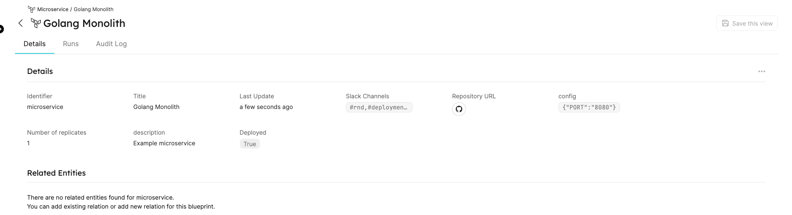

# Terraform Provider

Our integration with Terraform allows you to combine the state of your infrastructure with the Entities representing them in Port. For the official documentation of the Port Terraform provider check out the [registry page](https://registry.terraform.io/providers/port-labs/port-labs/).

Here you'll find a step-by-step guide to installing the Port Terraform provider.

## What does our Terraform Provider give you?

- Automatic management of Entities based on resources in Terraform files.
- The option to define resources in yml files and reflect them in Port using the provider.

## Installation

:::note Prerequisites

[Terraform CLI](https://learn.hashicorp.com/tutorials/terraform/install-cli).
:::

First, require the provider in your Terraform configuration (refer [here](https://registry.terraform.io/providers/port-labs/port-labs/latest/docs/resources/entity) for our resources schema):

```hcl
terraform {
  required_providers {
    port-labs = {
      source  = "port-labs/port-labs"
      version = "~> 0.5.0"
    }
  }
}

provider "port-labs" {
  client_id = "{YOUR CLIENT ID}"     # or set the env var PORT_CLIENT_ID
  secret    = "{YOUR CLIENT SECRET}" # or set the env var PORT_CLIENT_SECRET
}
```

Run the following command to make Terraform install the Port provider:

```shell
terraform init
```

The command will print the following when the `init` command has finished running:

`Terraform has been successfully initialized!`

In order to validate the module initialization works, run the command:

```shell
 terraform plan
```

The result will be: `no changes. Your infrastructure matches the configuration.`

## Usage

### Creating Blueprints

First, we will create two Blueprints (microservice and package) and then connect a microservice to multiple packages. Add the following to your Terraform files:

```hcl
resource "port-labs_blueprint" "microservice" {
  title      = "Microservice"
  icon       = "Microservice"
  identifier = "microservice"
  properties {
    identifier = "slackChannels"
    type       = "array"
    title      = "Slack Channels"
    required   = true
  }
  properties {
    identifier = "repoUrl"
    type       = "string"
    format     = "url"
    title      = "Repository URL"
    required   = true
  }
  properties {
    identifier = "description"
    type       = "string"
    title      = "Description"
    required   = false
  }
  properties {
    identifier = "config"
    type       = "object"
    title      = "Config"
  }
  properties {
    identifier = "replicas"
    type       = "number"
    title      = "Number of Replicas"
  }
  properties {
    identifier = "deployed"
    type       = "boolean"
    title      = "Is Deployed"
  }
}
resource "port-labs_blueprint" "package" {
  title      = "Package"
  icon       = "Package"
  identifier = "package"
  properties {
    identifier = "name"
    type       = "string"
    title      = "name"
  }
  properties {
    identifier = "version"
    type       = "string"
    title      = "version"
  }
  relations {
    identifier = "package"
    title      = "Packages"
    target     = port-labs_blueprint.microservice.id
  }
}
```

### Creating entities

Next, we would like to create a microservice (for example, "Golang Monolith") and connect to it a few packages. To do so, Add the following resources to your Terraform files:

```hcl
resource "port-labs_entity" "golang_monolith" {
  title     = "Golang Monolith"
  blueprint = port-labs_blueprint.microservice.id
  properties {
    name  = "slackChannels" # should match the identifier of the property in the blueprint schema.
    items = ["#rnd", "#deployments"]
  }
  properties {
    name  = "config"
    value = jsonencode({ "PORT" : "8080" })
  }
  properties {
    name  = "description"
    value = "Example microservice"
  }
  properties {
    name  = "deployed"
    value = "true"
  }
  properties {
    name  = "replicas"
    value = 1
  }
}
resource "port-labs_entity" "fmt" {
  title     = "fmt"
  blueprint = port-labs_blueprint.package.id
  relations {
    identifier = port-labs_entity.golang_monolith.id
    name       = "package"
  }
  properties {
    name  = "version"
    value = 1.1
  }
}
resource "port-labs_entity" "net" {
  title     = "net"
  blueprint = port-labs_blueprint.package.id
  relations {
    identifier = port-labs_entity.golang_monolith.id
    name       = "package"
  }
  properties {
    name  = "version"
    value = 12.3
  }
}
```

- Run the command `terraform plan` to see the resulting set of actions Terraform will take: (You will see this result `Plan: 5 to add, 0 to change, 0 to destroy`)

:::note Prerequisites
Don't forget to set your Port client id and secret in order for the provider to authenticate with Port's API:

```shell
export `PORT_CLIENT_ID`=YOUR_CLIENT_ID
export `PORT_CLIENT_SECRET`=YOUR_CLIENT_SECRET
```

:::

To create the Blueprints and Entities above, run:

```shell
terraform apply
```

That's it! the Entity has been created and visible in the UI.



For more examples, check out the examples and test cases in the [public repository](https://github.com/port-labs/terraform-provider-port).

### Update a resource

- To update a resource, change the value of the resource in the Terraform configuration files and use the command `terraform apply`.

### Delete a resource

- To delete a resource, you need to run `terraform destroy --target port-labs.{resource-name}`.
