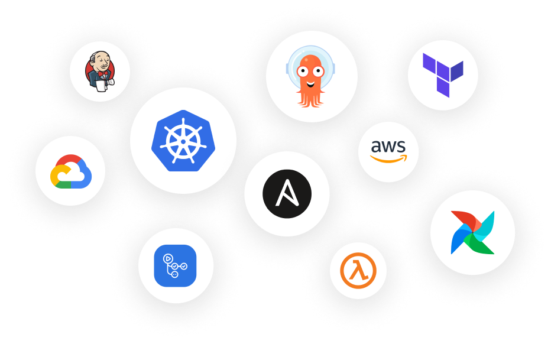

import Image from "@theme/IdealImage";
import Integrations from "../../static/img/software-catalog/integrations.png";

# 🏗️ Build your Software Catalog

Port's software catalog is a central metadata store for software, environments, resources and more. Its building blocks are blueprints and relations, and you can use them to build a catalog that reflects your exact data model. You can also build the catalog with one of Port's common data models.

## 📋 Step 1 - Define your data model

This step begins with determining the information you would like to include for your main entity (most people begin with service), and defining the associated blueprint (in this case, a service blueprint).

The next steps would be defining additional blueprints, such as cloud resource or cluster, the data it should include and its relation to other entities.
For instance, if you want to manage packages in your software catalog, you'll define a package blueprint.

By defining the structure of your data model in this way, you can ensure that the software catalog accurately reflects your engineering organization and as a result will provide you with the centralized and opinionated software catalog you need.

See how to --> [Define your data model](./define-your-data-model/define-your-data-model.md)

## 🔄 Step 2 - Sync data to catalog

The next step in setting Port's Software Catalog is to sync data into the catalog. This involves using Port's integrations and APIs to import data into the catalog, so that blueprints will be populated with the relevant data.

Port's Software Catalog provides integrations to surface data that exists in various tools and repositories, creating a central metadata store across your devOps architecture, making it easy to centralize all relevant information in one place.

By syncing data into the software catalog, you can ensure that you have a comprehensive and up-to-date view of your software, infrastructure, cloud resources, CI/CD and more.

See how to --> [Sync data to the software catalog](./sync-data-to-catalog/sync-data-to-catalog.md)

<!--  -->

<Image img={Integrations} style={{ width: 700 }} />

