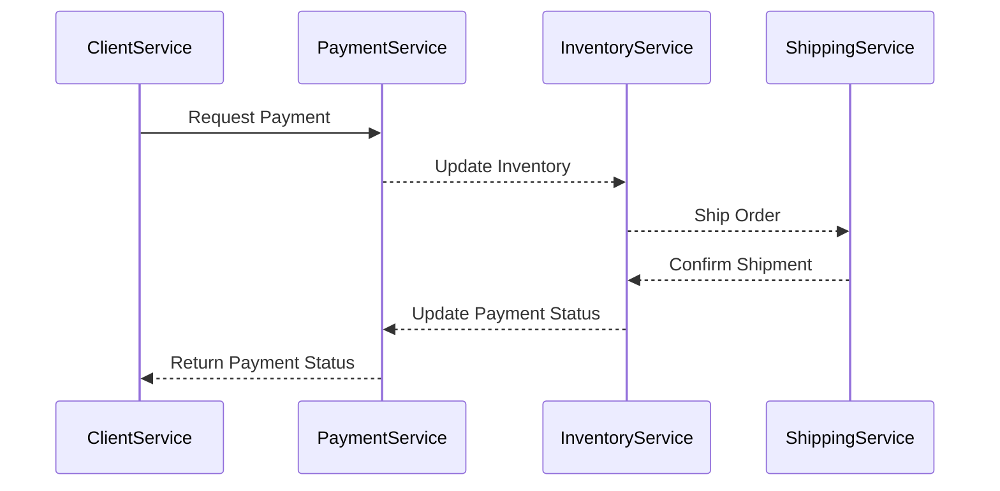

import PortTooltip from "/src/components/tooltip/tooltip.jsx"

# Markdown

The `Markdown` property is used to display [Markdown](https://en.wikipedia.org/wiki/Markdown) content within an <PortTooltip id="entity">entity</PortTooltip> in Port.  
Using this property will automatically create an additional tab in each [entity page](/customize-pages-dashboards-and-plugins/page/entity-page.md), displaying the formatted content.

In the following example, we see the `awesome-kubectl-plugins` entity page, which is an instance on the `Service` blueprint.  
The blueprint has a `Markdown` property that takes the Readme file from the service's Git repository, and automatically displays it in a dedicated tab:


With Port, you can import and display [Markdown](https://en.wikipedia.org/wiki/Markdown) files as tabs.

## 💡 Common embedded URL usage

- Display a service's Readme file
- Display relevant documentation for a service/package

## Schema definition

```json showLineNumbers
{
  "title": "Markdown Property",
  "type": "string",
  "format": "markdown",
  "description": "A Markdown property"
}
```

## Mermaid

The markdown widget also supports [Mermaid](https://mermaid-js.github.io/mermaid/#/), a diagramming and charting tool that uses text and code to generate diagrams and charts.

To use Mermaid with the markdown widget, all you need to do is add mermaid syntax to the markdown property. You can refer to the [Mermaid Examples](https://mermaid.js.org/syntax/examples.html) for more examples and information on how to use it.


<details>
<summary><b>Mermaid diagram example (click to expand)</b></summary>

````

````

</details>
