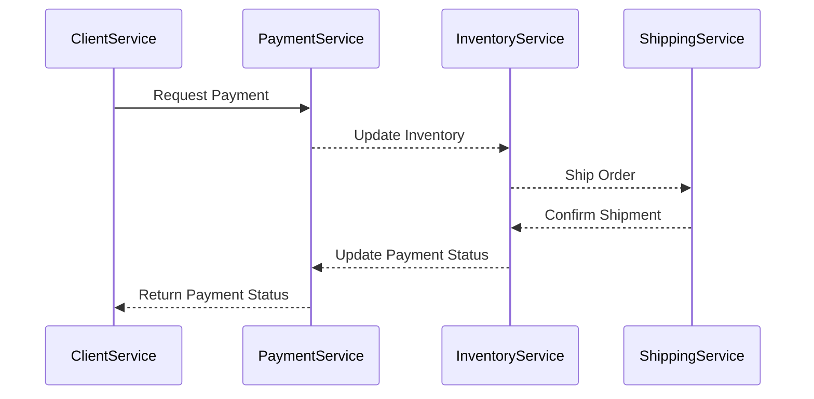

import PortTooltip from "/src/components/tooltip/tooltip.jsx"

# Markdown

The `Markdown` property is used to display [Markdown](https://en.wikipedia.org/wiki/Markdown) content within an <PortTooltip id="entity">entity</PortTooltip> in Port.  
Using this property will automatically create an additional tab in each [entity page](/customize-pages-dashboards-and-plugins/page/entity-page.md), displaying the formatted content.

An example can be seen in the [live demo](https://showcase.port.io/serviceEntity?identifier=payment&activeTab=5):  
The `service` blueprint has a `README` property that displays the service's Readme file. As you can see in the example, the "Payment" service has a `README` tab that displays the value of the property in markdown format.

## Schema definition

```json showLineNumbers
{
  "title": "Markdown Property",
  "type": "string",
  "format": "markdown",
  "description": "A Markdown property"
}
```

## Limitations

### Relative links are not supported

When displaying markdown content in Port (especially content ingested from Git repositories or other external sources), **relative links will not work**. This is because the markdown is rendered in the context of your Port portal, not the original source location.

For example, links like `[guide](./docs/guide.md)` or `[readme](../README.md)` from a GitHub README file will not function correctly when displayed in Port.

**Solutions:**
- Use **absolute URLs** instead: `[guide](https://github.com/your-org/your-repo/blob/main/docs/guide.md)`.
- Transform relative links to absolute URLs during ingestion using JQ expressions in your integration mapping.
- For links to other entities in your Port catalog, use entity page URLs: `/serviceEntity?identifier=my-service`.

### GitOps and external markdown files

When using GitOps to display an external markdown file using the `markdown` property, changes made to the markdown file will not be reflected in Port until the `port.yml` file is also updated (this triggers a re-ingestion of the entity).  

One way to handle this is to add a step in your CI workflow that bumps a "version" field in the `port.yml` file whenever specific files in the repository are updated, ensuring re-ingestion of the entity.

---

## Mermaid

The markdown widget also supports [Mermaid](https://mermaid-js.github.io/mermaid/#/), a diagramming and charting tool that uses text and code to generate diagrams and charts.

To use Mermaid with the markdown widget, all you need to do is add mermaid syntax to the markdown property. You can refer to the [Mermaid Examples](https://mermaid.js.org/syntax/examples.html) for more examples and information on how to use it.


<details>
<summary><b>Mermaid diagram example (click to expand)</b></summary>

````

````

</details>
