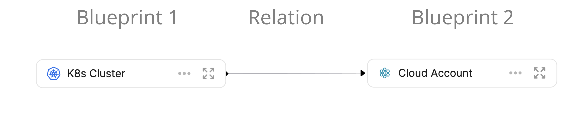

# Define Your Data Model

Every organization have a different data model representing their way architecture and way of work.

## Data models usecases

- C4
- Multi-cloud
- x
- y
- z

## Data Modeling Building blocks

Diagram demonstrating how 2 blueprints are related

  
  
  

### Blueprint

A blueprint is xyz

[Setup Blueprints](./setup-blueprint/setup-blueprint.md)

### Relation

A xyz is xyz

[Relate Relations](./relate-blueprints/relate-blueprints.md)
