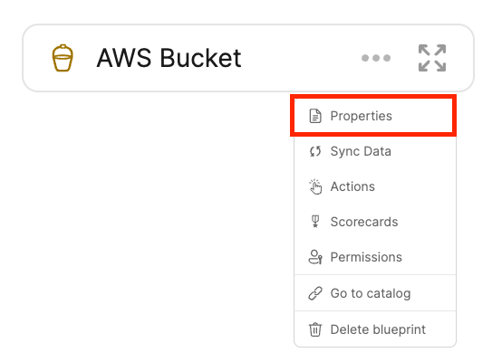

import ApiRef from "../../../api-reference/\_learn_more_reference.mdx"

import Tabs from "@theme/Tabs"
import TabItem from "@theme/TabItem"

# 🔀 Relate Blueprints

<center>

<iframe width="60%" height="400" src="https://www.youtube.com/embed/McUWOC4gcu4" title="YouTube video player" frameborder="0" allow="accelerometer; autoplay; clipboard-write; encrypted-media; gyroscope; picture-in-picture; web-share" allowfullscreen allow="fullscreen;"></iframe>

</center>

Relations define connections between blueprints results into dependency reflection of assets in your software catalog.

## What is a relation?

Relations enable us to make connections between blueprints, consequently connecting the entities based on these blueprints. That provides logical context to the software catalog.

## 💡 Common relations

Relations can be used to represent the logical connections between assets in your software catalog, for example:

- The **packages** that a **microservice** uses;
- The **run** history of a **CI job**;
- The **Kubernetes clusters** that exist in a **cloud account**;
- etc.

In this [live demo](https://demo.getport.io/dev-portal) example, we can see the DevPortal Builder page with all of the blueprints and their relations. 🎬

## Relation schema structure

The basic structure of a relation object:

```json showLineNumbers
{
  "myRelation": {
    "title": "My title",
    "target": "My target blueprint",
    "required": true,
    "many": false
  }
}
```

:::info
A relation exists under the `relations` key in the [Blueprint JSON schema](../setup-blueprint/setup-blueprint.md#blueprint-schema-structure)
:::

## Structure table

| Field        | Description                                                                                            | Notes                                                                                                                                                                                                                                                                              |
| ------------ | ------------------------------------------------------------------------------------------------------ | ---------------------------------------------------------------------------------------------------------------------------------------------------------------------------------------------------------------------------------------------------------------------------------- |
| `identifier` | Unique identifier                                                                                      | The identifier is used for API calls, programmatic access and distinguishing between different relations. <br></br> <br></br> The identifier is the key of the relation schema object, in the [schema structure](#relation-schema-structure) above, the identifier is `myRelation` |
| `title`      | Relation name that will be shown in the UI                                                             | Human-readable name for the relation                                                                                                                                                                                                                                               |
| `target`     | Target blueprint identifier                                                                            | The target blueprint has to exist when defining the relation                                                                                                                                                                                                                       |
| `required`   | Boolean flag to define whether the target must be provided when creating a new entity of the blueprint |
| `many`       | Boolean flag to define whether multiple target entities can be mapped to the Relation                  | For more information refer to [many relation](#many)                                                                                                                                                                                                                               |

## Types of relations

### :bust_in_silhouette: Single

A single type relation is used to map a single target entity to the source.

#### 💡 Common Single Relations

- Map a **Deployment** to the **Running Service** that it deployed;
- Map a **package version** to the **package**;
- Map a **K8s cluster** to the **cloud account** it is provisioned in;
- etc.

In this [live demo](https://demo.getport.io/packageVersionEntity?identifier=AnalyticsTracker_1_2_9) example, we can see a specific package version and its related core packages. 🎬

#### Single Relation Structure

A single type relation is distinguished by the `many: false` configuration:

<Tabs groupId="definition" defaultValue="api" values={[
{label: "API", value: "api"},
{label: "Terraform", value: "tf"}
]}>

<TabItem value="api">

```json showLineNumbers
{
  "myRelation": {
    "title": "My title",
    "target": "myTargetBlueprint",
    "required": false,
    "many": false
  }
}
```

<ApiRef />

</TabItem>
<TabItem value="tf">

```hcl showLineNumbers
resource "port_blueprint" "myBlueprint" {
  # ...blueprint properties
  # ...user-defined properties
  # highlight-start
  relations {
    identifier = "myRelation"
    title      = "My relation"
    target     = "myTargetBlueprint"
    required   = false
    many       = false
  }
  # highlight-end
}
```

</TabItem>
</Tabs>

### 👥 Many

A many type relation is used to map multiple target entities to the source.

#### 💡 Common Many Relations

- Map dependencies between services;
- Map the **packages** used by a **service**;
- Map the **cloud resources** used by a **service**;
- Map the **services deployed** in a **developer environment**;
- etc.

In this [live demo](https://demo.getport.io/developerEnvEntity?identifier=test-shizuko) example, we can see a specific developer environment and the running services it uses. 🎬

#### Many Relation Structure

A many type relation is distinguished by the `many: true` configuration:

<Tabs groupId="definition" defaultValue="api" values={[
{label: "API", value: "api"},
{label: "Terraform", value: "tf"}
]}>

<TabItem value="api">

```json showLineNumbers
{
  "myRelation": {
    "title": "My title",
    "target": "myTargetBlueprint",
    "required": false,
    "many": true
  }
}
```

<ApiRef />

</TabItem>
<TabItem value="tf">

```hcl showLineNumbers
resource "port_blueprint" "myBlueprint" {
  # ...blueprint properties
  # ...user-defined properties
  # highlight-start
  relations {
    identifier = "myRelation"
    title      = "My relation"
    target     = "myTargetBlueprint"
    required   = false
    many       = true
  }
  # highlight-end
}
```

:::danger
At the moment, Port's Terraform provider does not support reporting entities from a blueprint that has a many relation configured.

If you plan on using Port's Terraform provider to report entities, please do not define blueprints with many relations in your Terraform definitions.
:::

</TabItem>
</Tabs>

:::note
A Relation can't be configured with both `many` and `required` set to `true`
:::

## Configure relations in Port

Relations are part of the structure of a [blueprint](../setup-blueprint/setup-blueprint.md#blueprint-structure).

<Tabs groupId="definition" queryString defaultValue="api" values={[
{label: "API", value: "api"},
{label: "UI", value: "ui"},
{label: "Terraform", value: "tf"}
]}>

<TabItem value="api">

```json showLineNumbers
{
  "identifier": "myIdentifier",
  "title": "My title",
  "description": "My description",
  "icon": "My icon",
  "calculationProperties": {},
  "schema": {
    "properties": {},
    "required": []
  },
  // highlight-start
  "relations": {
    "myRelation": {
      "title": "My title",
      "target": "My target blueprint",
      "required": true,
      "many": false
    }
  }
  // highlight-end
}
```

<ApiRef />

</TabItem>

<TabItem value="ui">

1. Go to the [DevPortal Builder page](https://app.getport.io/dev-portal);
2. Click the pencil icon on the blueprint that will be the `source` blueprint of the relation:



</TabItem>

<TabItem value="tf">

```hcl showLineNumbers
resource "port_blueprint" "myBlueprint" {
  # ...blueprint properties
  # ...user-defined properties
  # highlight-start
  relations = {
    "myRelation" = {
      title    = "My title"
      target   = "My target blueprint"
      required = true
      many     = false
    }
  }
  # highlight-end
}
```

</TabItem>
</Tabs>

Once added to the blueprint definition, you can [apply the blueprint](../setup-blueprint/setup-blueprint.md#apply-blueprints-to-port) to Port
