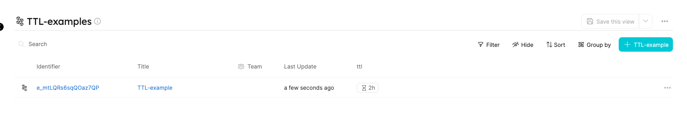
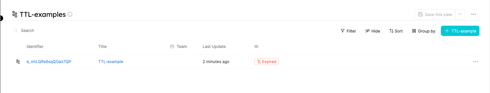
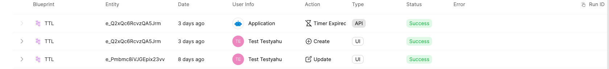

import Tabs from "@theme/Tabs"
import TabItem from "@theme/TabItem"

# Timer

Timer is a data type used to define an expiration date/lifespan on a specific property.

## Use cases

The timer property type can be used to store the future expiration date of catalog entities and properties, for example:

- Temporary development environment;
- Countdown to next healthcheck;
- Temporary cloud resources;
- etc.

In this [live demo](https://demo.getport.io/developerEnvs) example, we can see the `TTL` timer property.

## API definition

<Tabs groupId="api-definition" defaultValue="basic" values={[
{label: "Basic", value: "basic"}
]}>

<TabItem value="basic">

```json showLineNumbers
{
  "myTimerProp": {
    "title": "My timer",
    "icon": "My icon",
    "description": "My timer property",
    // highlight-start
    "type": "string",
    "format": "timer",
    // highlight-end
    "default": "2022-04-18T11:44:15.345Z"
  }
}
```

</TabItem>
</Tabs>

## Terraform definition

<Tabs groupId="tf-definition" defaultValue="basic" values={[
{label: "Basic", value: "basic"},
{label: "Enum - coming soon", value: "enum"},
{label: "Array - coming soon", value: "array"}
]}>

<TabItem value="basic">

```hcl showLineNumbers
resource "port-labs_blueprint" "myBlueprint" {
  # ...blueprint properties
  # highlight-start
  properties {
    identifier = "myTimerProp"
    title      = "My timer"
    required   = false
    type       = "string"
    format     = "timer"
  }
  # highlight-end
}
```

</TabItem>
</Tabs>

## Timer properties deep dive

Let's look at some examples of basic timer properties definitions to better understand how timer properties work.

In the following example, we will create a timer property called locked, that will expire in 2 hours:

```json showLineNumbers
  "identifier": "e_mtLQRs6sqQOaz7QP",
  "title": "Timer Example",
  "icon": "Microservice",
  "blueprint": "timerExample",
  "properties": {
    "timer": "2022-12-01T16:50:00+02:00"
  },
  "relations": {}
```



After 2 hours, the property status will change to `Expired`, and an event of `Timer Expired` will be sent to the ChangeLog.

The following action invocation body will be sent to the Webhook/Kafka topic:

```json showLineNumbers
{
  "identifier": "event_4QyQDmuzaAhY8lM2",
  "context": {
    "blueprintIdentifier": "timerExample",
    "entityId": "e_mtLQRs6sqQOaz7QP",
    "blueprintId": "bp_djjY7NcdzHdpxI1y",
    "entityIdentifier": "e_mtLQRs6sqQOaz7QP"
  },
  "action": "TIMER_EXPIRED",
  "trigger": {
    "at": "2022-12-01T16:50:00+02:00",
    "by": {
      "port": true,
      "orgId": "org_example"
    },
    "origin": "API"
  },
  "additionalData": {
    "property": "timer"
  },
  "_orgId": "org_example",
  "resourceType": "entity",
  "status": "SUCCESS"
}
```




