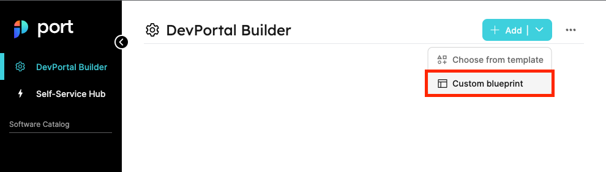

import ApiRef from "../../../api-reference/\_learn_more_reference.mdx";

import Tabs from "@theme/Tabs"
import TabItem from "@theme/TabItem"

# 🧱 Setup Blueprints

<center>

<iframe width="60%" height="400" src="https://www.youtube.com/embed/ssBKpPiENQA" title="YouTube video player" frameborder="0" allow="accelerometer; autoplay; clipboard-write; encrypted-media; gyroscope; picture-in-picture; web-share" allowfullscreen allow="fullscreen;"></iframe>

</center>

Define blueprint schemas to begin building your software catalog.

## What is a blueprint?

A Blueprint is the generic building block in Port. It represents assets that can be managed in Port, such as `Microservice`, `Environments`, `Packages`, `Clusters`, `Databases`, and many more.

Blueprints are completely customizable, and they support any number of properties the user chooses, all of which can be modified as you go.

## 💡 Common blueprints

Blueprints can be used to represent any asset in your software catalog, for example:

- Microservices;
- Packages;
- Package versions;
- CI jobs;
- K8s Clusters;
- Cloud accounts;
- Cloud environments;
- Developer environments;
- Service deployment;
- Pods;
- VMs;
- etc.

In this [live demo](https://demo.getport.io/dev-portal) example, we can see the DevPortal Builder page with all of the blueprints. 🎬

## Blueprint structure

Each blueprint is represented by a [Json schema](https://json-schema.org/), as shown in the following section:

```json showLineNumbers
{
  "identifier": "myIdentifier",
  "title": "My title",
  "description": "My description",
  "icon": "My icon",
  "calculationProperties": {},
  "schema": {
    "properties": {
      "myProp1": {
        "type": "my_type",
        "title": "My title"
      },
      "myProp2": {
        "type": "my_special_type",
        "title": "My special title"
      }
    },
    "required": []
  },
  "relations": {}
}
```

### Structure table

| Field                   | Description                                                                                                               | Notes                                                                                                                   |
| ----------------------- | ------------------------------------------------------------------------------------------------------------------------- | ----------------------------------------------------------------------------------------------------------------------- |
| `identifier`            | Unique identifier                                                                                                         | **Required**. The identifier is used for API calls, programmatic access and distinguishing between different blueprints |
| `title`                 | Name                                                                                                                      | **Required**. Human-readable name for the blueprint                                                                     |
| `description`           | Description                                                                                                               | The value is visible as a tooltip to users when hovering over the info icon in the UI                                   |
| `icon`                  | Icon for the blueprint and entities of the blueprint.                                                                     | See the full icon list [below](#full-icon-list)                                                                         |
| `calculationProperties` | Contains the properties defined using [calculation properties](./properties/calculation-property/calculation-property.md) | **Required**                                                                                                            |
| `mirrorProperties`      | Contains the properties defined using [mirror properties](./properties/mirror-property/mirror-property.md)                |                                                                                                                         |
| `schema`                | An object containing two nested fields: `properties` and `required`.                                                      | **Required**. See the schema structure [here](#schema-object)                                                           |

:::tip Available properties
All available properties are listed in the [properties](./properties/properties.md) page
:::

### Schema object

```json showLineNumbers
"schema": {
    "properties": {},
    "required": []
}
```

| Schema field | Description                                                                                                                           |
| ------------ | ------------------------------------------------------------------------------------------------------------------------------------- |
| `properties` | See the [`properties`](./properties/properties.md) section for more details.                                                          |
| `required`   | A list of the **required** properties, out of the `properties` object list. <br /> These are mandatory fields to fill in the UI form. |

## Configure blueprints in Port

<Tabs groupId="definition" queryString defaultValue="api" values={[
{label: "API", value: "api"},
{label: "Terraform", value: "tf"},
{label: "Pulumi", value: "pulumi"},
{label: "UI", value: "ui"}
]}>

<TabItem value="api">

```json showLineNumbers
{
  "identifier": "myIdentifier",
  "title": "My title",
  "description": "My description",
  "icon": "My icon",
  "calculationProperties": {},
  "schema": {
    "properties": {},
    "required": []
  },
  "relations": {}
}
```

<ApiRef />

</TabItem>

<TabItem value="tf">

```hcl showLineNumbers
resource "port_blueprint" "myBlueprint" {
  title      = "My blueprint"
  icon       = "My icon"
  identifier = "myIdentifier"
  description = "My description"
}
```

</TabItem>

<TabItem value="pulumi">

<Tabs groupId="pulumi-definition" queryString defaultValue="python" values={[
{label: "Python", value: "python"},
{label: "TypeScript", value: "typescript"},
{label: "JavaScript", value: "javascript"},
{label: "GO", value: "go"}
]}>

<TabItem value="python">

```python showLineNumbers
"""A Python Pulumi program"""

import pulumi
from port_pulumi import Blueprint

blueprint = Blueprint(
    "myBlueprint",
    identifier="myBlueprint",
    title="My Blueprint",
    icon="My icon",
    description="My description",
)
```

</TabItem>

<TabItem value="typescript">

```typescript showLineNumbers
import * as pulumi from "@pulumi/pulumi";
import * as port from "@port-labs/port";

export const blueprint = new port.Blueprint("myBlueprint", {
  identifier: "myBlueprint",
  title: "My Blueprint",
  icon: "My icon",
  description: "My description",
});
```

</TabItem>

<TabItem value="javascript">

```javascript showLineNumbers
"use strict";
const pulumi = require("@pulumi/pulumi");
const port = require("@port-labs/port");

const entity = new port.Blueprint("myBlueprint", {
  title: "My Blueprint",
  identifier: "myBlueprint",
  icon: "My icon",
  description: "My description",
});

exports.title = entity.title;
```

</TabItem>
<TabItem value="go">

```go showLineNumbers
package main

import (
	"github.com/port-labs/pulumi-port/sdk/go/port"
	"github.com/pulumi/pulumi/sdk/v3/go/pulumi"
)

func main() {
	pulumi.Run(func(ctx *pulumi.Context) error {
		blueprint, err := port.NewBlueprint(ctx, "myBlueprint", &port.BlueprintArgs{
			Identifier:  pulumi.String("myBlueprint"),
			Title:       pulumi.String("My Blueprint"),
			Icon:        pulumi.String("My icon"),
			Description: pulumi.String("My description"),
		})
		ctx.Export("blueprint", blueprint.Title)
		if err != nil {
			return err
		}
		return nil
	})
}
```

</TabItem>

</Tabs>

</TabItem>

<TabItem value="ui">

1. Go to the [DevPortal Builder page](https://app.getport.io/dev-portal);
2. Click on **Add blueprint** at the top right hand corner;
3. Configure your blueprint using the from:



</TabItem>
</Tabs>

## Full icon list

`API, Airflow, AmazonEKS, Ansible, ApiDoc, Aqua, Argo, ArgoRollouts, Aws, Azure, BitBucket, Bucket, Buddy, CPU, CPlusPlus, CSharp, Clickup, Cloud, Cluster, Codefresh, Confluence, Coralogix, Crossplane, Datadog, Day2Operation, DeployedAt, Deployment, DevopsTool, EC2, EU, Environment, Falcosidekick, Fluxcd, GKE, GPU, Git, GitLab, GitVersion, Github, GithubActions, Go, Google, GoogleCloud, GoogleCloudPlatform, GoogleComputeEngine, Grafana, Graphql, HashiCorp, Infinity, Istio, Jenkins, Jira, Kafka, Kiali, Kotlin, Lambda, Launchdarkly, Link, Lock, LucidCharts, Matlab, Microservice, MongoDb, Moon, NewRelic, Node, NodeJS, Notion, Okta, Package, Pearl, PostgreSQL, Prometheus, Pulumi, Python, R, React, RestApi, Ruby, S3, SDK, SQL, Scala, Sentry, Server, Service, Slack, Swagger, Swift, TS, Terraform, TwoUsers, Youtrack, Zipkin, checkmarx, css3, html5, java, js, kibana, logz, pagerduty, php, port, sonarqube, spinnaker`
