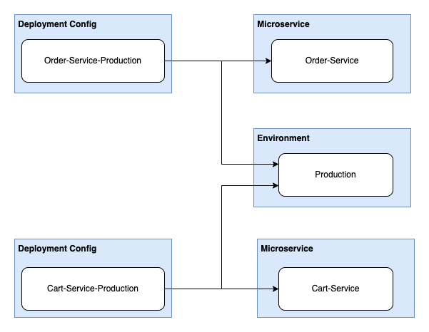

# Search & Query

import Tabs from "@theme/Tabs"
import TabItem from "@theme/TabItem"

Port's API provides tools to query, search and filter data in your software catalog with ease.

## Use cases

High quality search is essential to effectively track assets in your software catalog, using Port's search you can:

- Find all running services that are not healthy;
- List all libraries that have known vulnerabilities;
- Get all services running in a specific cluster;
- etc.

## Search request

The base search route is `https://api.getport.io/v1/entities/search`, it receives HTTP POST requests.

A search request defines the logical Relation between different search rules, and contains filters and rules to find suitable Entities.
Each search request is represented by a JSON object, as shown in the following example:

```json showLineNumbers
{
  "combinator": "and",
  "rules": [
    {
      "property": "$blueprint",
      "operator": "=",
      "value": "myBlueprint"
    },
    {
      "property": "$identifier",
      "operator": "contains",
      "value": "myIdentifierPart"
    }
  ]
}
```

The above query searches for all entities from type `microservice` that their `identifier` contains the string `admin`

## Search request elements

| Field        | Description                                               |
| ------------ | --------------------------------------------------------- |
| `combinator` | Defines the logical operation to apply to the query rules |
| `rules`      | An array of search rules to filter results with           |

## Combinator

There are two available combinators: `and`/`or`:

- `and` - will apply a logical AND operation between all rules, requiring all of them to satisfy for a given asset in order to return it;
- `or` - will apply a logical OR operation between all rules, requiring at least one of them to satisfy for a given asset in order to return it.

<Tabs groupId="combinators" defaultValue="and" values={[
{label: "And", value: "and"},
{label: "Or", value: "or"}
]}>

<TabItem value="and">

```json showLineNumbers
{
  // highlight-next-line
  "combinator": "and",
  "rules": [
    {
      "property": "$blueprint",
      "operator": "=",
      "value": "myBlueprint"
    },
    {
      "property": "$identifier",
      "operator": "contains",
      "value": "myIdentifierPart"
    }
  ]
}
```

</TabItem>

<TabItem value="or">

```json showLineNumbers
{
  // highlight-next-line
  "combinator": "or",
  "rules": [
    {
      "property": "$blueprint",
      "operator": "=",
      "value": "myBlueprint"
    },
    {
      "property": "$identifier",
      "operator": "contains",
      "value": "myIdentifierPart"
    }
  ]
}
```

</TabItem>

</Tabs>

## Rules

A search rule is a small filtering unit, used to control the search output.

Here is an example search rule:

```json showLineNumbers
{
  "property": "$blueprint",
  "operator": "=",
  "value": "microservice"
}
```

Port has 2 types of search rule operators:

1. Comparison operators (`=` `>`, etc.);
2. Relation operators (`relatedTo`, etc.).

### Comparison structure and operators

#### Structure

| Field      | Description                                                                                                                                                                                                                                                                                            |
| ---------- | ------------------------------------------------------------------------------------------------------------------------------------------------------------------------------------------------------------------------------------------------------------------------------------------------------ |
| `operator` | Search operator to use when evaluating this rule, see a list of available operators below                                                                                                                                                                                                              |
| `property` | Property to filter by according to its value. It can be a [meta-property](../define-your-data-model/setup-blueprint/properties/meta-properties.md) such as `$identifier`, or one of the [standard properties](../define-your-data-model/setup-blueprint/properties/properties.md#available-properties) |
| `value`    | The value to filter by                                                                                                                                                                                                                                                                                 |

#### Operators

<Tabs groupId="comparison" defaultValue="=" values={[
{label: "=", value: "="},
{label: "!=", value: "!="},
{label: ">", value: ">"},
{label: ">=", value: ">="},
{label: "<", value: "<"},
{label: "<=", value: "<="},
{label: "Between", value: "between"},
{label: "Contains", value: "contains"}
]}>

<TabItem value="=">

The `=` operator checks exact matches of the specified value:

```json showLineNumbers
{
  "operator": "=",
  "property": "myProperty",
  "value": "myExactValue"
}
```

</TabItem>

<TabItem value="!=">

The `!=` operator checks exact matches of the specified value and returns all results that fail to satisfy the check:

```json showLineNumbers
{
  "operator": "!=",
  "property": "myProperty",
  "value": "myExactValue"
}
```

</TabItem>

<TabItem value=">">

The `>` operator checks values larger than the specified value:

```json showLineNumbers
{
  "operator": ">",
  "property": "myNumericProperty",
  "value": 7
}
```

</TabItem>

<TabItem value=">=">

The `>=` operator checks values larger than or equal to the specified value:

```json showLineNumbers
{
  "operator": ">=",
  "property": "myNumericProperty",
  "value": 7
}
```

</TabItem>

<TabItem value="<">

The `<` operator checks values less than the specified value:

```json showLineNumbers
{
  "operator": "<",
  "property": "myNumericProperty",
  "value": 7
}
```

</TabItem>

<TabItem value="<=">

The `<=` operator checks values less than or equal to the specified value:

```json showLineNumbers
{
  "operator": "<=",
  "property": "myNumericProperty",
  "value": 7
}
```

</TabItem>

<TabItem value="between">

The `between` operator checks datetime values and returns entities whose relevant datetime property matches the given range:

```json showLineNumbers
{
  "operator": "between",
  "property": "$createdAt",
  "value": {
    "preset": "lastWeek"
  }
}
```

**Available Presets:**

- tomorrow
- today
- yesterday
- lastWeek
- lastMonth

The `between` operator also supports standard date ranges:

```json showLineNumbers
{
  "combinator": "and",
  "rules": [
    {
      "operator": "between",
      "property": "$createdAt",
      "value": {
        "from": "2022-07-26T16:38:06.839Z",
        "to": "2022-07-29T17:00:28.006Z"
      }
    }
  ]
}
```

</TabItem>

<TabItem value="contains">

The `contains` operator checks if the specified substring exists in the specified property:

```json showLineNumbers
{
  "operator": "contains",
  "property": "myStringProperty",
  "value": "mySubString"
}
```

</TabItem>

</Tabs>

### Relation structure and operators

#### Structure

| Field       | Description                                                                               |
| ----------- | ----------------------------------------------------------------------------------------- |
| `operator`  | Search operator to use when evaluating this rule, see a list of available operators below |
| `blueprint` | Blueprint of the entity identifier specified in the `value` field                         |
| `value`     | Value to filter by                                                                        |

#### Operators

<Tabs groupId="relation" defaultValue="relatedTo" values={[
{label: "Related To", value: "relatedTo"},
{label: "Required", value: "required"},
{label: "Direction", value: "direction"},
]}>

<TabItem value="relatedTo">

The `relatedTo` operator will return all entities that have a relationship with the specified entity:

```json showLineNumbers
{
  "operator": "relatedTo",
  "blueprint": "myBlueprint",
  "value": "myEntity"
}
```

</TabItem>

<TabItem value="required">

The `relatedTo` operator also supports the `required` property - which allows you to search for:

- Related entities from all relations (relations with either required `true` or `false`);
- Related entities only from required relations (relations with required `true`);
- Related entities only from non-required relations (relations with required `false`).

For example, to search only for related entities that _require_ the `myEntity` entity from the `myBlueprint` blueprint, use the following search rule:

```json showLineNumbers
{
  "operator": "relatedTo",
  "required": true,
  "value": "myEntity",
  "blueprint": "myBlueprint"
}
```

</TabItem>

<TabItem value="direction">

The `relatedTo` operator also supports the `direction` property - which allows you to search for dependent entities in a specific direction on the dependency graph. To better understand the functionality of this property, let's take a look at the example below:

Let's assume that we have the blueprints `deploymentConfig` and `microservice` with the following relation definition (declared on the `deploymentConfig` blueprint):

```json showLineNumbers
"relations": {
  "microservice": {
    "description": "The service this Deployment Config belongs to",
    "many": false,
    "required": false,
    "target": "microservice",
    "title": "Microservice"
  }
}
```

In addition, we have the following entities:

```text showLineNumbers
Deployment Configs:
- Order-Service-Production
- Cart-Service-Production

Microservices:
- Order Service
- Cart Service

Environments:
- Production
```

And the following relations:

```text showLineNumbers
Order-Service-Production -> Order-Service
Order-Service-Production -> Production

Cart-Service-Production -> Cart-Service
Cart-Service-Production -> Production
```

By looking at the resulting graph layout, we can also map the directions:



- To search for entities which the source depends on - use `"direction": "upstream"`;
- To search for entities which depend on the source - use `"direction": "downstream"`.

In the example shown above, if we want to get the `Microservice` and `Environment` that _Order-Service-Production_ depends on, the search rule would be:

```json showLineNumbers
{
  "operator": "relatedTo",
  "blueprint": "deploymentConfig",
  "value": "Order-Service-Production",
  "direction": "upstream"
}
```

And the result shall be:

<details>
<summary>Order-Service-Production upstream related entities</summary>

```json showLineNumbers
{
  "ok": true,
  "matchingBlueprints": ["microservice", "environment"],
  "entities": [
    {
      "identifier": "Order-Service",
      "title": "Order-Service",
      "blueprint": "microservice",
      "properties": {
        "on-call": "mor@getport.io",
        "language": "Python",
        "slack-notifications": "https://slack.com/Order-Service",
        "launch-darkly": "https://launchdarkly.com/Order-Service"
      },
      "relations": {},
      "createdAt": "2022-11-17T15:54:20.432Z",
      "createdBy": "auth0|62ab380295b34240aa511cdb",
      "updatedAt": "2022-11-17T15:54:20.432Z",
      "updatedBy": "auth0|62ab380295b34240aa511cdb"
    },
    {
      "identifier": "Production",
      "title": "Production",
      "blueprint": "environment",
      "properties": {
        "awsRegion": "eu-west-1",
        "configUrl": "https://github.com/config-labs/kube/config.yml",
        "slackChannel": "https://yourslack.slack.com/archives/CHANNEL-ID",
        "onCall": "Mor P",
        "namespace": "Production"
      },
      "relations": {},
      "createdAt": "2022-09-19T08:54:23.025Z",
      "createdBy": "Cnc3SiO7T0Ld1y1u0BsBZFJn0SCiPeLS",
      "updatedAt": "2022-10-16T09:28:32.960Z",
      "updatedBy": "auth0|62ab380295b34240aa511cdb"
    }
  ]
}
```

</details>

If we want to get all of the `deploymentConfigs` that are deployed in the _Production_ `Environment`, the search rule would be:

```json showLineNumbers
{
  "operator": "relatedTo",
  "blueprint": "environment",
  "value": "Production",
  "direction": "downstream"
}
```

And the result shall be:

<details>
<summary>Production downstream related entities</summary>

```json showLineNumbers
{
  "ok": true,
  "matchingBlueprints": ["deploymentConfig"],
  "entities": [
    {
      "identifier": "Order-Service-Production",
      "title": "Order-Service-Production",
      "blueprint": "deploymentConfig",
      "properties": {
        "url": "https://github.com/port-labs/order-service",
        "config": {
          "encryption": "SHA256"
        },
        "monitor-links": [
          "https://grafana.com",
          "https://prometheus.com",
          "https://datadog.com"
        ]
      },
      "relations": {
        "microservice": "Order-Service",
        "environment": "Production"
      },
      "createdAt": "2022-11-17T15:55:55.591Z",
      "createdBy": "auth0|62ab380295b34240aa511cdb",
      "updatedAt": "2022-11-17T15:55:55.591Z",
      "updatedBy": "auth0|62ab380295b34240aa511cdb"
    },
    {
      "identifier": "Cart-Service-Production",
      "title": "Cart-Service-Production",
      "blueprint": "deploymentConfig",
      "properties": {
        "url": "https://github.com/port-labs/cart-service",
        "config": {
          "foo": "bar"
        },
        "monitor-links": [
          "https://grafana.com",
          "https://prometheus.com",
          "https://datadog.com"
        ]
      },
      "relations": {
        "microservice": "Cart-Service",
        "environment": "Production"
      },
      "createdAt": "2022-11-17T15:55:10.714Z",
      "createdBy": "auth0|62ab380295b34240aa511cdb",
      "updatedAt": "2022-11-17T15:55:20.253Z",
      "updatedBy": "auth0|62ab380295b34240aa511cdb"
    }
  ]
}
```

</details>

</TabItem>

</Tabs>

## Code examples

The following examples provide a foundation to begin using the search route. Remember that you can always change the content of the `rules` array to the search query that fits your search.

<Tabs groupId="code-examples" defaultValue="python" values={[
{label: "Python", value: "python"},
{label: "Javascript", value: "javascript"},
{label: "cURL", value: "curl"}
]}>

<TabItem value="python">

```python showLineNumbers
# Dependencies to install:
# $ python -m pip install requests

import json
import requests

CLIENT_ID = "YOUR_CLIENT_ID"
CLIENT_SECRET = "YOUR_CLIENT_SECRET"

API_URL = "https://api.getport.io/v1"

credentials = {"clientId": CLIENT_ID, "clientSecret": CLIENT_SECRET}

token_response = requests.post(f"{API_URL}/auth/access_token", json=credentials)

access_token = f"Bearer {token_response.json()['accessToken']}"

# You can now use the value in access_token when making further requests

headers = {
    'Authorization': access_token
}

query = {
    "combinator": "or",
    "rules": [
        {
            "property": "$title",
            "operator": "=",
            "value": "admin-prod"
        },
        {
            "property": "$title",
            "operator": "=",
            "value": "admin-test"
        }
    ]
}

search_req = requests.post(f"{API_URL}/entities/search", headers=headers, json=query)

search_entities = search_req.json()['entities']

for entity in search_entities:
    print(json.dumps(entity))
```

</TabItem>

<TabItem value="javascript">

```javascript showLineNumbers
// Dependencies to install:
// $ npm install axios --save

const axios = require("axios").default;

const CLIENT_ID = "YOUR_CLIENT_ID";
const CLIENT_SECRET = "YOUR_CLIENT_SECRET";

const API_URL = "https://api.getport.io/v1";

(async () => {
  const tokenResp = await axios.post(`${API_URL}/auth/access_token`, {
    clientId: CLIENT_ID,
    clientSecret: CLIENT_SECRET,
  });

  const accessToken = tokenResp.data.accessToken;

  // You can now use the value in accessToken when making further requests

  const config = {
    headers: {
      Authorization: `Bearer ${accessToken}`,
    },
  };

  const query = {
    combinator: "or",
    rules: [
      {
        property: "$title",
        operator: "=",
        value: "admin-prod",
      },
      {
        property: "$title",
        operator: "=",
        value: "admin-test",
      },
    ],
  };

  const response = await axios.post(
    `${API_URL}/entities/search`,
    query,
    config
  );

  console.log(response.data["entities"]);
})();
```

</TabItem>

<TabItem value="curl">

```bash showLineNumbers
#!/bin/bash

# Dependencies to install:
# For apt:
# $ sudo apt-get install jq
# For yum:
# $ sudo yum install jq

access_token=$(curl --location --request POST 'https://api.getport.io/v1/auth/access_token' \
--header 'Content-Type: application/json' \
--data-raw '{
    "clientId": "CLIENT_ID",
    "clientSecret": "CLIENT_SECRET"
}' | jq '.accessToken' | sed 's/"//g')

# The token will be available in the access_token variable

curl --location --request POST 'https://api.getport.io/v1/entities/search?attach_title_to_relation=true&exclude_calculated_properties=false' \
	--header "Authorization: Bearer $access_token" \
	--header 'Content-Type: application/json' \
	--data-raw '{
    "combinator": "or",
    "rules": [
        {
            "property": "$title",
            "operator": "=",
            "value": "admin-prod"
        },
        {
            "property": "$title",
            "operator": "=",
            "value": "admin-test"
        }
    ]
}'

```

</TabItem>

</Tabs>

---

## Advanced

### Search route query parameters

The search route also supports several query parameters that affect the returned output:

| Parameter                       | Description                                                                                                                                                                                                                                                                     | Available values | Default value |
| ------------------------------- | ------------------------------------------------------------------------------------------------------------------------------------------------------------------------------------------------------------------------------------------------------------------------------- | ---------------- | ------------- |
| `attach_title_to_relation`      | `true`: Both the identifier and the title of the related Entity will appear under the Relation key <br></br><br></br> `false`: Only the identifier of the related Entity will appear under the Relation key                                                                     | `true`/`false`   | `false`       |
| `exclude_calculated_properties` | Should [mirror properties](../define-your-data-model/setup-blueprint/properties/mirror-property/mirror-property.md) and [calculation properties](../define-your-data-model/setup-blueprint/properties/calculation-property/calculation-property.md) be returned with the result | `true`/`false`   | `false`       |

#### `attach_title_to_relation` example

Here are examples outputs based on the value of the `attach_title_to_relation` parameter:

<Tabs groupId="attach-title" defaultValue="true" values={[
{label: "True", value: "true"},
{label: "False", value: "false"},
]}>

<TabItem value="true">

Here is a search response with `attach_title_to_relation=true`:

```json showLineNumbers
{
  "ok": true,
  "matchingBlueprints": [
    "region",
    "deployment",
    "vm",
    "microservice",
    "k8sCluster",
    "permission",
    "runningService"
  ],
  "entities": [
    {
      "identifier": "e_vb9EPyW1zOamcbT1",
      "title": "cart-deployment",
      "blueprint": "deployment",
      "team": "Team BE",
      "properties": {
        "version": "1.4",
        "user": "yonatan",
        "status": "failed",
        "github-action-url": "https://a.com",
        "Region": "AWS"
      },
      // highlight-start
      "relations": {
        "microservice": {
          "identifier": "e_47MwTvQj03MpVyBx",
          "title": "admin-test"
        }
      },
      // highlight-end
      "createdAt": "2022-07-27T17:11:04.344Z",
      "createdBy": "auth0|6278b02000955c006f9132d3",
      "updatedAt": "2022-07-27T17:11:04.344Z",
      "updatedBy": "auth0|6278b02000955c006f9132d3"
    }
  ]
}
```

</TabItem>

<TabItem value="false">

Here is the same search response with `attach_title_to_relation=false`:

```json showLineNumbers
{
  "ok": true,
  "matchingBlueprints": [
    "region",
    "deployment",
    "vm",
    "microservice",
    "k8sCluster",
    "permission",
    "runningService"
  ],
  "entities": [
    {
      "identifier": "e_vb9EPyW1zOamcbT1",
      "title": "cart-deployment",
      "blueprint": "deployment",
      "team": "Team BE",
      "properties": {
        "version": "1.4",
        "user": "yonatan",
        "status": "failed",
        "github-action-url": "https://a.com",
        "Region": "AWS"
      },
      // highlight-start
      "relations": {
        "microservice": "e_47MwTvQj03MpVyBx"
      },
      // highlight-end
      "createdAt": "2022-07-27T17:11:04.344Z",
      "createdBy": "auth0|6278b02000955c006f9132d3",
      "updatedAt": "2022-07-27T17:11:04.344Z",
      "updatedBy": "auth0|6278b02000955c006f9132d3"
    }
  ]
}
```

</TabItem>

</Tabs>
