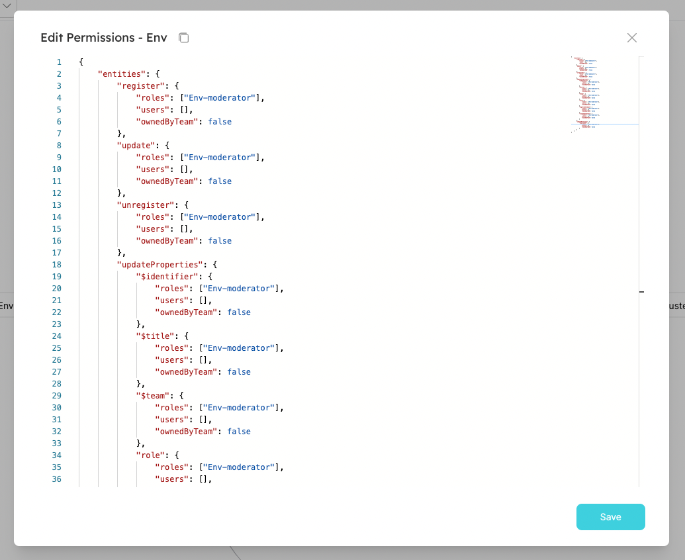

import Tabs from "@theme/Tabs"
import TabItem from "@theme/TabItem"

# Examples

In this section we'll show you a few examples of ways to use permissions in your organization, and how to apply them.

## Use cases

The following configurations, among others, are available when using permissions management:

1. Entities can be made immutable/partially immutable (can only create/delete/modify) for specific users/roles. For example:
   1. `Deployment` entities are immutable for all roles, and `Cluster` entities are editable only by the blueprint **Moderators**.
   2. **Members** can create a new `Microservice` entity, but are not permitted to delete a `Microservice` entity.
2. Each entity property/relation can be immutable separately for specific users/roles. For example, the `repository_link` property can be immutable for all roles (except **Admin**).
3. Allow specific users/roles to modify only entities [owned by their team](#setting-permissions-by-team-ownership). For example, **Members** can edit only `Microservices` that belong to their team.
4. Action execution permissions can be given to specific users or roles. For example, you can allow every **Member** to create a new `Deployment` entity, however only `Deployment` **Moderators** can perform a day-2 action of "adding resources".

## Setting blueprint permissions

To set permissions for a Blueprint, click on the permissions icon of the desired Blueprint in the DevPortal Setup page:


This will open the following window:



As you can see, every operation that can be performed on the blueprint or its entities is listed in the JSON and can be controlled.

### Role examples

<Tabs groupId="blueprint-permissions" defaultValue="register" values={[
{label: "Let member register entity", value: "register"},
{label: "Only let admin update property", value: "only-admin"},
]}>

<TabItem value="register">

If you want to enable **Members** to register entities of a blueprint, you can change the JSON as follows:

```json showLineNumbers
{
  "entities": {
    "register": {
      // highlight-next-line
      "roles": ["Env-moderator", "Member"], // changed from ["Env-moderator"]
      "users": [],
      "ownedByTeam": false
    }
  }
}
```

</TabItem>

<TabItem value="only-admin">

To allow only **Admins** to change the property `slackChannelUrl`, remove the Moderator role:

```json showLineNumbers
{
  "entities": {
    "updateProperties": {
      "slackChannelUrl": {
        // highlight-next-line
        "roles": [], // changed from ["Env-moderator"]
        "users": [],
        "ownedByTeam": false
      }
    }
  }
}
```

</TabItem>

</Tabs>

### User examples

<Tabs groupId="user-permissions" defaultValue="let-user-relation" values={[
{label: "Let user edit relation", value: "let-user-relation"}
]}>

<TabItem value="let-user-relation">

To grant permissions for a specific user to edit the `deployedAt` relation, add him to the users array:

```json showLineNumbers
{
  "entities": {
    "updateRelations": {
      "deployedAt": {
        "roles": ["Env-moderator"],
        // highlight-next-line
        "users": ["some-user@myorg.com"], // changed from []
        "ownedByTeam": false
      }
    }
  }
}
```

</TabItem>

</Tabs>

### Team ownership examples

Some operations have the `ownedByTeam` flag. This allows you to set permissions by team ownership, rather than by roles or direct assignment to users.

For example, the following JSON will allow **every user**, regardless of their role, to perform the action `delete_env` on `Env` entities that belong to a team they are a part of (entities that have the `team` property set):

```json showLineNumbers
{
  "actions": {
    "delete_env": {
      "execute": {
        "roles": ["Env-moderator"],
        "users": [],
        // highlight-next-line
        "ownedByTeam": true // changed from false
      }
    }
  }
}
```

### Global VS granular permissions

When granting write permissions for entities of a blueprint, you have 2 levels of control:

1. Global permissions - create/update an entity as a whole. For example, allow **Member** users to update `Env` entities (all properties and relations).
2. Granular permissions - control which properties and relations a user/role can update when creating or updating an entity. For example, allow **Member** users to only update the property `slackChannelUrl` of `Env` entities.

To apply granular permissions for a blueprint, use the `updateProperties` and `updateRelations` fields in the JSON, see the examples below:

<Tabs groupId="global-granular-permissions" defaultValue="let-user-relation" values={[
{label: "Let user edit relation", value: "let-user-relation"},
{label: "Let user edit entity", value: "let-user-entity"}
]}>

<TabItem value="let-user-relation">

The following change will allow **Member** users to update _only_ the `slackChannelUrl` property of `Env` Entities:

```json showLineNumbers
{
  "entities": {
    "updateProperties": {
      "slackChannelUrl": {
        // highlight-next-line
        "roles": ["Env-moderator", "Member"], // changed from ["Env-moderator"]
        "users": [],
        "ownedByTeam": false
      }
    }
  }
}
```

</TabItem>

<TabItem value="let-user-entity">

If you want to apply global permissions, use the `update` field in the JSON.

The following change will allow **Member** users to update _every_ property/relation of `Env` entities that are owned by their team:

```json showLineNumbers
{
  "entities": {
    "update": {
      "roles": ["Env-moderator"],
      "users": [],
      // highlight-next-line
      "ownedByTeam": true // changed from false
    }
  }
}
```

</TabItem>

</Tabs>

:::caution
Using global permissions override any granular permission that have been set.

If both permission types are set, then the global setting will be used when evaluating permissions.
:::

:::info
`update`, `updateProperties` and `updateRelations` settings apply when registering new entities as well. This means that a user can't register a new entity with a property (or relation) that he doesn't have permissions to edit.  
:::

## Setting action permissions

### Role examples

<Tabs groupId="action-permissions" defaultValue="action-only-admin-moderator" values={[
{label: "Only let admins/moderators run action", value: "action-only-admin-moderator"}
]}>

<TabItem value="action-only-admin-moderator">

By default, **Member** users can execute every action defined on a blueprint. In this example, we allow only **Moderators** (and **Admins**) to only execute the action `clone_env` (and disabling Member's permission to execute it):

```json showLineNumbers
{
  "actions": {
    "clone_env": {
      "execute": {
        // highlight-next-line
        "roles": ["Env-moderator"], // changed from ["Env-moderator", "Member"]
        "users": [],
        "ownedByTeam": false
      }
    }
  }
}
```

</TabItem>

</Tabs>

---

## Pitfalls

In some occasions, it's possible to apply permissions in a way that deadlocks users from interacting with the platform.
While these cases are valid, they might be a little counterintuitive.

Here are a few examples of how can you grant a user permissions, but still not enable him to perform the operation due to other restrictions:

1. If the user has permissions to edit any property, except for a required property of the blueprint - then the user will not be able to register or update entities as a whole because he can't provide a value for the required property;
2. If the `ownedByTeam` setting is enabled for registration, and the user does not have permissions to edit the `team` property - then the user will not be able to register a new entity since he can't select a value for it's team field and mark it as owned by his team.
