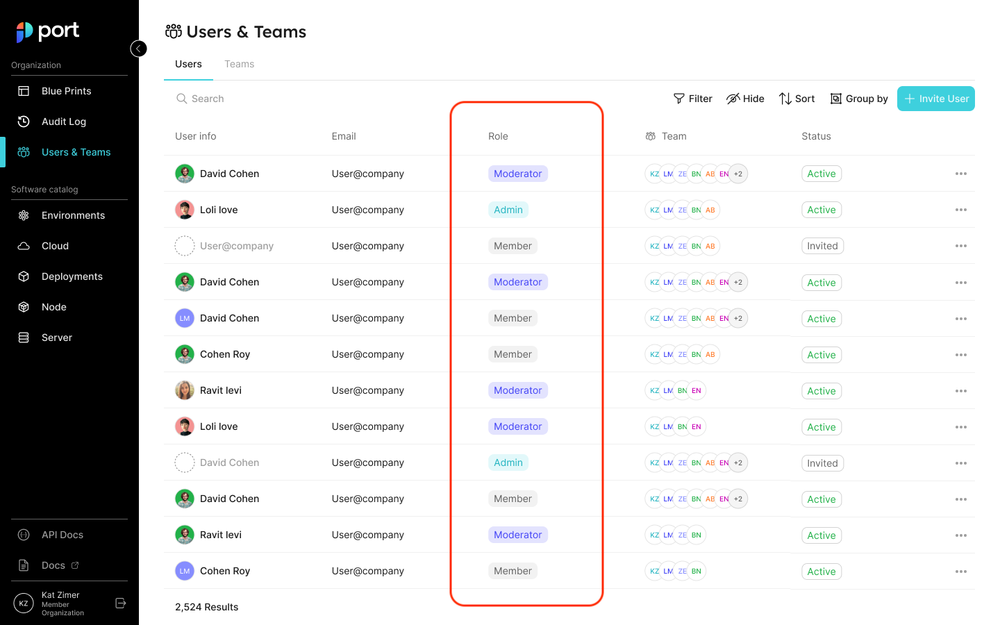

# Set Catalog RBAC

Port provides granular control to make sure every user sees only the parts of the catalog that are relevant for him.

## Use cases

The catalog RBAC allows admins to finely control which users have access to which information from the catalog, for example:

- Show a developer only the services that he owns;
- Allow a user to edit just a specific property on an entity;
- Create a fully read-only view for a developer;
- etc.

## Assigning permissions

In Port, you can assign permissions by using [Roles](#roles) and [Team Ownership](#setting-permissions-by-team-ownership).

### Roles

There are 3 types of roles. Below are their out-of-the-box permissions:

| Role                         | Description                                                                                                      |
| ---------------------------- | ---------------------------------------------------------------------------------------------------------------- |
| **Admin**                    | Perform any operation on the platform                                                                            |
| **Moderator** of a Blueprint | Perform any operation on a specific blueprint and its entities. A user can be a moderator of multiple blueprints |
| **Member**                   | Read-only permissions + permissions to execute actions                                                           |

:::info
The **Moderator** role is automatically created during blueprint creation.
For example, creating the blueprint `Env` will generate a role named `Env-moderator`, which can perform any operation on the `Env` blueprint and its entities.
:::

### Hierarchy

In addition to the permissions designated for each role, permissions are also inherited based on the following hierarchy:

**Admin** > **Moderator** > **Member**

For example, if **Members** are allowed to edit `Cluster` entities, then `Microservices` **Moderators** are also allowed to edit them (**Admins** can edit all entities under all blueprints).

You can view (and edit) each user’s role in the users table:

Refer to the [Users and Teams](../../sso-rbac/rbac/rbac.md) section for more information about the users page

## UI behavior

Configuring user permissions is reflected in Port's UI. The UI also includes indication messages when trying to perform changes. For example:

The `register` and `unregister` buttons will be disabled in the UI, in accordance with the blueprint permissions (unauthorized users/groups will not be able to register or unregister entities).

The `edit property` button will be disabled according to the permissions:

Immutable properties (restricted properties) will be hidden from users when modifying entities.

## Examples

Refer to the [examples](./examples.md) page for practical examples of Port's RBAC.
