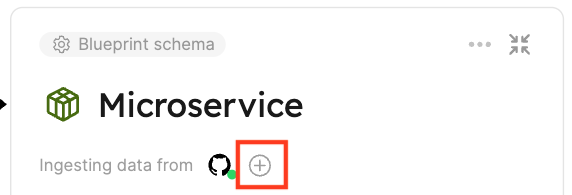
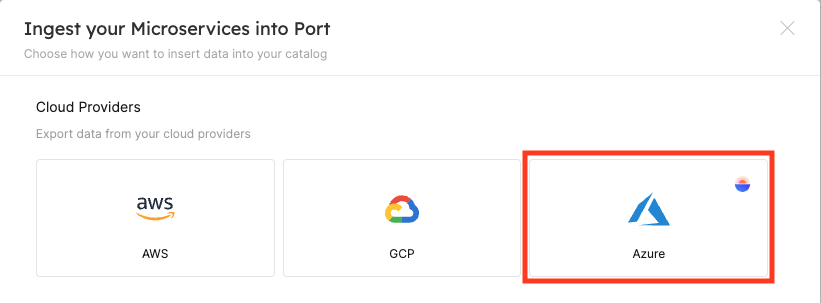
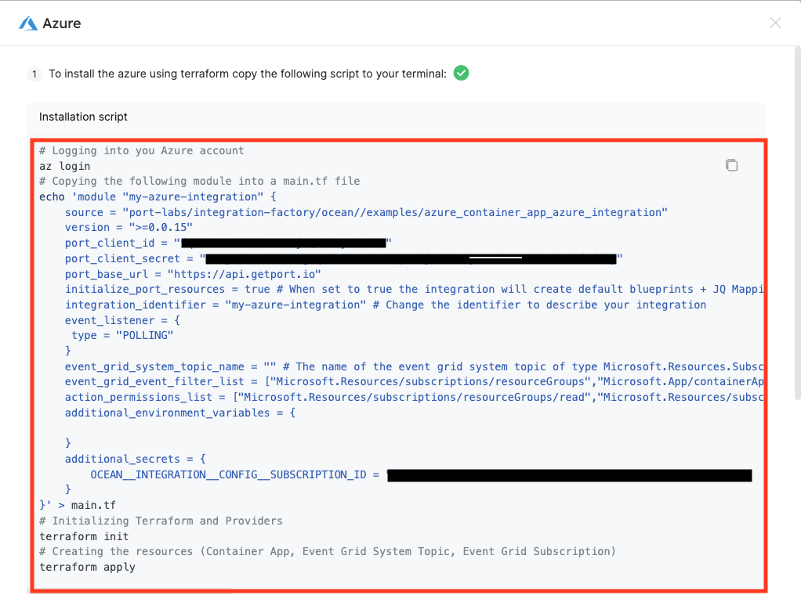
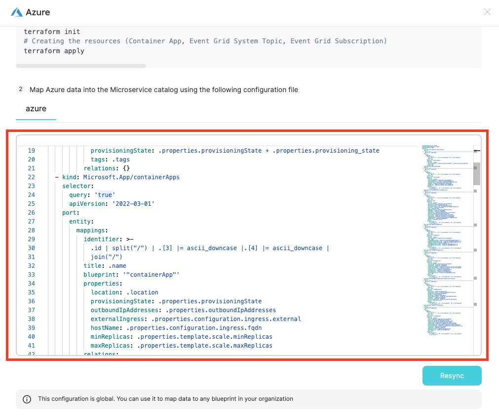

# Installation

The azure exporter is deployed using Terraform on Azure Container App.
It uses our Terraform [Ocean](https://ocean.getport.io) Integration Factory [module](https://registry.terraform.io/modules/port-labs/integration-factory/ocean/latest) to deploy the exporter.

:::tip
Multiple ways to deploy the Azure exporter could be found in the Azure Integration example [README](https://registry.terraform.io/modules/port-labs/integration-factory/ocean/latest/examples/azure_container_app_azure_integration)
:::

## Azure Infrastructure Used by the Azure Exporter

The Azure exporter uses the following Azure infrastructure:

- Azure ContainerApp
- Azure Event Grid (Used for real-time data sync to Port)
  - Azure Event Grid System Topic of type `Microsoft.Resources.Subscriptions`
  - Azure Event Grid Subscription

:::caution
Due to a limitation in Azure **only one** Event Grid System Topic of type `Microsoft.Resources.Subscriptions` can be created per subscription, so if you already have one you'll need to pass it to the integration using `event_grid_system_topic_name=<your-event-grid-system-topic-name>`, otherwise the deployment of the integration will fail due to not being able to create a new one.
:::

## Prerequisites

- [Terraform](https://www.terraform.io/downloads.html) >= 0.15.0
- [Azure CLI](https://docs.microsoft.com/en-us/cli/azure/install-azure-cli) >= 2.26.0

## Installation

1. Login to [Port](https://app.getport.io) and browse to the [builder page](https://app.getport.io/dev-portal)
2. Open the ingest modal by expanding one of the blueprints and clicking the ingest button on the blueprints.

   

3. Click on the Azure Exporter option under the Cloud Providers section:

   

4. Edit and copy the installation command.
   :::tip
   Here is the place where you can adjust what the exporter will be deployed with: `event_grid_system_topic_name` parameter if you already have one.
   - Specify the `event_grid_system_topic_name` parameter if you already have an Event Grid system topic of type `Microsoft.Resources.Subscriptions` in your subscription;
   - Specify the `event_grid_event_filter_list` parameter if you want to listen to more events;
   - Specify the `action_permissions_list` parameter if you want the integration to have more permissions.

:::
     
5. Run the command in your terminal to deploy the Azure exporter.

## Mapping configuration

You can update the exporter's configuration in the integration page, you can use the configuration to add or remove Azure resources that will be ingested from your subscription.

## Further information

- Refer to the [examples](./examples.md) page for practical configurations and their corresponding blueprint definitions.
