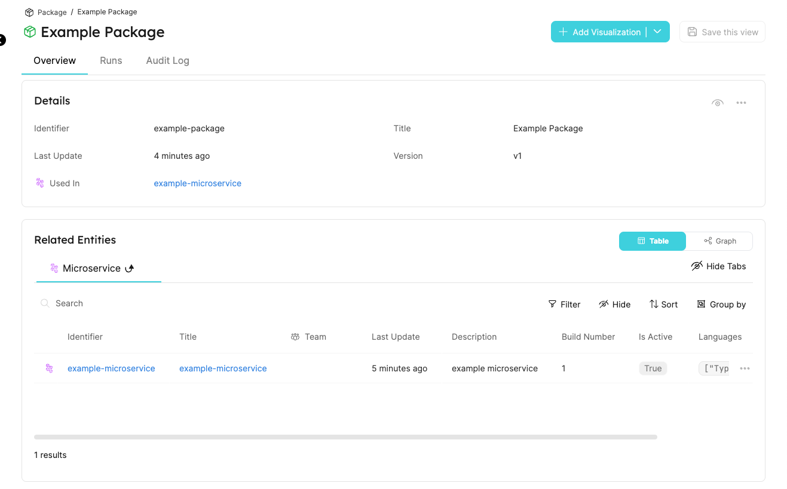

# Codefresh Workflow Template

Our Codefresh workflow template allows you to interact with Entities in Port directly from your Codefresh workflows.

Here you'll find a step-by-step guide for Port's Codefresh workflow template.

## Codefresh workflow template benefits​

- Create new Entities of existing Blueprints and Relations;
- Update existing Entities with new information (title, properties, relations, etc...).
- Get existing Entities.

## Installation

To use Port's Codefresh workflow template you need to perform the following steps:

1. Go to the [workflow template repository](https://github.com/port-labs/port-codefresh-workflow-template) in GitHub;
2. Copy the file [`portWorkflowTemplate.yml`](https://github.com/port-labs/port-codefresh-workflow-template/blob/main/portWorkflowTemplate.yml) to one of your codefresh `git sources` and commit it to your git source;
3. Add the required service account, cluster role and role binding to your codefresh runtime namespace by applying the contents of the [`rbac.yml`](https://github.com/port-labs/port-codefresh-workflow-template/blob/main/rbac.yml) file by using the command: `kubectl apply -f rbac.yml -n YOUR_NAMESPACE`;
4. Add the required secret containing your `PORT_CLIENT_ID` and `PORT_CLIENT_SECRET` after encoding them using base64. You can use [`portCredentials.yml`](https://github.com/port-labs/port-codefresh-workflow-template/blob/main/portCredentials.yml) as an example.

:::tip
If you save the CLIENT_ID and SECRET using the exact format shown in `portCredentials.yml`, you will not need to provide the parameters `PORT_CREDENTIALS_SECRET`, `PORT_CLIENT_ID_KEY` and `PORT_CLIENT_SECRET_KEY` when calling templates from the workflow template.
:::

Once the Codefresh workflow template is installed, you will see in the Codefresh UI by going to CI OPS -> Workflow Templates -> In the name search bar, type `port`.

## Available templates

### get-entity

The `get-entity` template gets an existing Port Entity as part of the workflow, and exposes its values as outputs for later workflow steps.

#### Inputs

- `PORT_CREDENTIALS_SECRET` - name of the secret to get the `CLIENT_ID` and `CLIENT_SECRET` from (default: `port-credentials`)
- `PORT_CLIENT_ID_KEY` - key in the secret where the base64 encoded `PORT_CLIENT_ID` is stored (default: `PORT_CLIENT_ID`);
- `PORT_CLIENT_SECRET_KEY` - key in the secret where the base64 encoded `PORT_CLIENT_SECRET` is stored (default `PORT_CLIENT_SECRET`);
- `BLUEPRINT_IDENTIFIER` - identifier of the blueprint the target entity is from;
- `ENTITY_IDENTIFIER` - identifier of the target entity.

#### Outputs

- `PORT_COMPLETE_ENTITY` - complete entity JSON;
- `PORT_BLUEPRINT_IDENTIFIER` - identifier of the blueprint the target entity is from;
- `PORT_ENTITY_IDENTIFIER` - identifier of the target entity;
- `PORT_ENTITY_TITLE` - title of the entity;
- `PORT_ENTITY_PROPERTIES` - all properties of the entity in JSON format;
- `PORT_ENTITY_RELATIONS` - all relations of the entity in JSON format;

#### Example usage

```yaml
- name: entity-get
  templateRef:
    name: port
    template: entity-get
  arguments:
    parameters:
    - name: PORT_CREDENTIALS_SECRET
       value: "port-credentials"
    - name: PORT_CLIENT_ID_KEY
      value: "PORT_CLIENT_ID"
    - name: PORT_CLIENT_SECRET_KEY
      value: "PORT_CLIENT_SECRET"
    - name: BLUEPRINT_IDENTIFIER
      value: "microservice"
    - name: ENTITY_IDENTIFIER
      value: "morp"
```

To access the workflow outputs, use `{{workflow.outputs.parameters.[OUTPUT_PARAM]}}`

### upsert-entity

The `upsert-entity` template creates or updates an entity with the identifier matching the one provided.

#### Inputes

- `PORT_CREDENTIALS_SECRET` - name of the secret to get the `CLIENT_ID` and `CLIENT_SECRET` from (default: `port-credentials`)
- `PORT_CLIENT_ID_KEY` - key in the secret where the base64 encoded `PORT_CLIENT_ID` is stored (default: `PORT_CLIENT_ID`);
- `PORT_CLIENT_SECRET_KEY` - key in the secret where the base64 encoded `PORT_CLIENT_SECRET` is stored (default `PORT_CLIENT_SECRET`);
- `BLUEPRINT_IDENTIFIER` - identifier of the blueprint to create an entity of;
- `ENTITY_IDENTIFIER` - identifier of the new (or existing) entity. Leave empty to get an auto-generated identifier;
- `ENTITY_TITLE` - Title of the new (or existing) entity;
- `ENTITY_TEAM` - Teams array of the new (or existing) entity;
- `ENTITY_ICON` - Icon of the new (or existing) entity;
- `ENTITY_PROPERTIES` - Properties of the new (or existing) entity;
- `ENTITY_RELATIONS` - Relations of the new (or existing) entity.

#### Outputs

- `ENTITY_IDENTIFIER` - identifier of the new (or existing) entity.

#### Example usage

```yaml
- name: entity-upsert
  templateRef:
    name: port
    template: entity-upsert
  arguments:
    parameters:
    # If you save the CLIENT_ID and CLIENT_SECRET in the same format shown in the portCredentials.yml file, there is no need to provide PORT_CREDENTIALS_SECRET, PORT_CLIENT_ID_KEY, PORT_CLIENT_SECRET_KEY
    - name: BLUEPRINT_IDENTIFIER
      value: "microservice"
    - name: ENTITY_IDENTIFIER
      value: "morp"
    - name: ENTITY_TITLE
      value: "Morp-Argo"
    - name: ENTITY_PROPERTIES
      value: |
      {
          "region": "eu-west-4"
      }
```

To access the workflow output, use `{{workflow.outputs.parameters.ENTITY_IDENTIFIER}}`

## Usage

:::note Prerequisites

- In order to authenticate with Port when using the Codefresh workflow template, you will need to add a secret to your cluster containing your `PORT_CLIENT_ID` and `PORT_CLIENT_SECRET` after encoding them using base64 (see [`portCredentials.yml`](https://github.com/port-labs/port-codefresh-workflow-template/blob/main/portCredentials.yml) for an example).
- In order to make use of the Codefresh workflow template, you will need an existing Blueprint(s) in your Port installation.
  - Moreover, if you want to update related Entities, you will also need existing Relations in your Port installation.

:::

### Basic upsert example

In this example we create a basic Blueprint and then add code that uses Port's Codefresh workflow template to create/update an Entity that belongs to the Blueprint:

<details>
<summary> Example microservice Blueprint </summary>

```json showLineNumbers
{
  "identifier": "microservice",
  "title": "Microservice",
  "icon": "Microservice",
  "schema": {
    "properties": {
      "description": {
        "type": "string",
        "title": "Description"
      },
      "buildNumber": {
        "type": "number",
        "title": "Build Number"
      },
      "isActive": {
        "type": "boolean",
        "title": "Is Active"
      },
      "languages": {
        "type": "array",
        "title": "Languages"
      },
      "versionInEnv": {
        "type": "object",
        "title": "Version In Env"
      }
    },
    "required": ["description"]
  },
  "calculationProperties": {}
}
```

</details>

After creating the Blueprint, you can add the following to your workflow `yml` file to make use of the GitHub action:

```yaml showLineNumbers
- name: entity-upsert
  templateRef:
    name: port
    template: entity-upsert
  arguments:
    parameters:
    - name: PORT_CREDENTIALS_SECRET
       value: "port-credentials"
    - name: PORT_CLIENT_ID_KEY
      value: "PORT_CLIENT_ID"
    - name: PORT_CLIENT_SECRET_KEY
      value: "PORT_CLIENT_SECRET"
    - name: BLUEPRINT_IDENTIFIER
      value: "microservice"
    - name: ENTITY_IDENTIFIER
      value: "example-microservice"
    - name: ENTITY_PROPERTIES
      value: |
      {
        "description": "example microservice",
        "buildNumber": 1,
        "isActive": true,
        "languages": ["TypeScript", "Shell"],
        "versionInEnv": {"prod": "v1.0.0", "staging": "v1.0.1"}
      }
```

:::info
You will need to create a secret containing your `PORT_CLIENT_ID` and `PORT_CLIENT_SECRET` after encoding them using base64.

Then:

- Provide the name of the secret as the value of the `PORT_CREDENTIALS_SECRET` parameter;
- Provide the key containing the PORT_CLIENT_ID as the value of the `PORT_CLIENT_ID_KEY` parameter;
- Provide the key containing the PORT_CLIENT_SECRET as the value of the `PORT_CLIENT_SECRET_KEY` parameter;

:::

### Basic Get Example

The following example gets the `example-microservice` entity from the previous example.

Add the following jobs to your workflow `yml` file:

```yaml showLineNumbers
- name: entity-get
  templateRef:
    name: port
    template: entity-get
  arguments:
    parameters:
    - name: PORT_CREDENTIALS_SECRET
       value: "port-credentials"
    - name: PORT_CLIENT_ID_KEY
      value: "PORT_CLIENT_ID"
    - name: PORT_CLIENT_SECRET_KEY
      value: "PORT_CLIENT_SECRET"
    - name: BLUEPRINT_IDENTIFIER
      value: "microservice"
    - name: ENTITY_IDENTIFIER
      value: "example-microservice"
```

:::tip
For an example showing how to make use of the output from the `entity-get` workflow template, go to [complete example](#complete-example).
:::

### Complete Example

The following example adds another `package` Blueprint, in addition to the `microservice` Blueprint shown in the previous example. In addition, it also adds a `microservice` Relation. The Codefresh workflow template will create or update the Relation between the 2 existing Entities:

<details>
<summary> A package Blueprint (including the `microservice` Relation) </summary>

```json showLineNumbers
{
  "identifier": "package",
  "title": "Package",
  "icon": "Package",
  "schema": {
    "properties": {
      "version": {
        "type": "string",
        "title": "Version"
      }
    },
    "required": []
  },
  "relations": {
    "microservice": {
      "title": "Used In",
      "target": "microservice",
      "required": false,
      "many": false
    }
  },
  "calculationProperties": {}
}
```

</details>

Here is the complete workflow `yml` to create both `microservice` Entity, the `package` Entity and then print the complete JSON of the new package Entity:

```yaml showLineNumbers
apiVersion: argoproj.io/v1alpha1
kind: WorkflowTemplate
metadata:
  name: port.codefresh-complete-example.0.0.1
  annotations:
    port/version: "0.0.1"
    port/description: "This Workflow Template is used to create a package entity, a microservice entity and then print the JSON of the new package"
spec:
  arguments:
    parameters:
  entrypoint: ci-tasks
  templates:
    - name: ci-tasks
      metadata:
        annotations:
      dag:
        tasks:
          - name: entity-upsert-microservice
            templateRef:
              name: port
              template: entity-upsert
            arguments:
              parameters:
                - name: PORT_CREDENTIALS_SECRET
                  value: "port-credentials"
                - name: PORT_CLIENT_ID_KEY
                  value: "PORT_CLIENT_ID"
                - name: PORT_CLIENT_SECRET_KEY
                  value: "PORT_CLIENT_SECRET"
                - name: BLUEPRINT_IDENTIFIER
                  value: "microservicee"
                - name: ENTITY_IDENTIFIER
                  value: "example-microservice"
                - name: ENTITY_PROPERTIES
                  value: |
                    {
                      "description": "example microservice",
                      "buildNumber": 1,
                      "isActive": true,
                      "languages": ["TypeScript", "Shell"],
                      "versionInEnv": {"prod": "v1.0.0", "staging": "v1.0.1"}
                    }
          - name: entity-upsert-package
            dependencies: [entity-upsert-microservice]
            templateRef:
              name: port
              template: entity-upsert
            arguments:
              parameters:
                - name: PORT_CREDENTIALS_SECRET
                  value: "port-credentials"
                - name: PORT_CLIENT_ID_KEY
                  value: "PORT_CLIENT_ID"
                - name: PORT_CLIENT_SECRET_KEY
                  value: "PORT_CLIENT_SECRET"
                - name: BLUEPRINT_IDENTIFIER
                  value: "package"
                - name: ENTITY_IDENTIFIER
                  value: "example-package"
                - name: ENTITY_TITLE
                  value: "Example Package"
                - name: ENTITY_PROPERTIES
                  value: |
                    {
                      "version": "v1"
                    }
                - name: ENTITY_RELATIONS
                  value: |
                    {
                      "microservice": "example-microservice"
                    }
          - name: entity-get
            dependencies: [entity-upsert-microservice, entity-upsert-package]
            templateRef:
              name: port
              template: entity-get
            arguments:
              parameters:
                - name: PORT_CREDENTIALS_SECRET
                  value: port-credentials
                - name: PORT_CLIENT_ID_KEY
                  value: PORT_CLIENT_ID
                - name: PORT_CLIENT_SECRET_KEY
                  value: PORT_CLIENT_SECRET
                - name: BLUEPRINT_IDENTIFIER
                  value: "package"
                - name: ENTITY_IDENTIFIER
                  value: "example-package"
          - name: log-info
            dependencies: [entity-get]
            template: log-info
            arguments:
              parameters:
                - name: INFO
                  value: "{{workflow.outputs.parameters.PORT_COMPLETE_ENTITY}}"

    - name: log-info
      inputs:
        parameters:
          - name: INFO
      script:
        image: alpine:latest
        command: ["/bin/sh"]
        env:
          - name: INFO
            value: "{{ inputs.parameters.INFO }}"
        source: |
          set -e
          echo ${INFO}
```

That's it! The Entity is created or updated and is visible in the UI.



For more information, checkout the [public repository](https://github.com/port-labs/port-codefresh-workflow-template).
