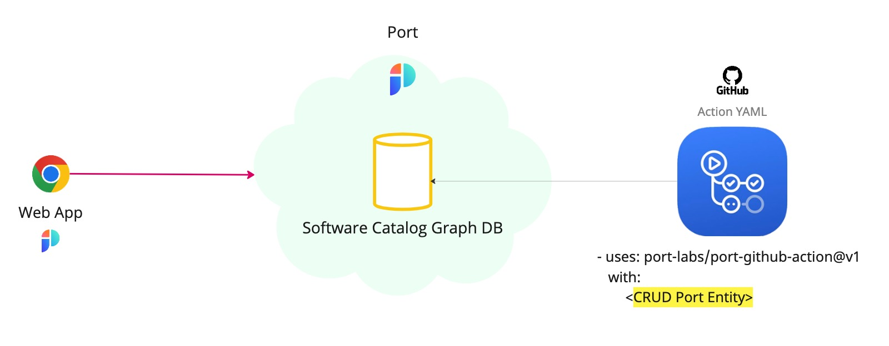

import Tabs from "@theme/Tabs"
import TabItem from "@theme/TabItem"

# GitHub Workflow

Our [GitHub action](https://github.com/marketplace/actions/port-github-action) allows you to create/update and query entities in Port directly from your GitHub workflows.

<br></br>
<br></br>



:::tip public repository
Our GitHub action is open source - see it [**here**](https://github.com/port-labs/port-github-action)
:::

## 💡 Common Github workflow usage

Port's GitHub action provides a native way to integrate Port with your GitHub workflows, for example:

- Report the status of a running **CI job**;
- Update the software catalog about a new **build version** for a **microservice**;
- Get existing **entities**.

## Installation

To install Port's GitHub action, follow these steps:

1. Add the following line as a step in your GitHub workflow:

```yaml showLineNumbers
- uses: port-labs/port-github-action@v1
```

2. Add your Port `CLIENT_ID` and `CLIENT_SECRET` as [GitHub secrets](https://docs.github.com/en/actions/security-guides/encrypted-secrets);
   1. This step is not mandatory, but it is recommended in order to not pass the `CLIENT_ID` and `CLIENT_SECRET` in plaintext in your workflows;
3. Make sure you have an existing blueprint in your Port installation to create/update entities using the GitHub action.

## Usage

Port's GitHub action supports the following methods:

- Create/Update catalog entities - invoked with the `UPSERT` operation, receives the identifier and other properties of a new entity or an entity that needs to be updated;
- Get catalog entities - invoked with the `GET` operation, receives the identifier of an existing entity and retrieves it for use in your CI;
- Delete catalog entities - invoked with the `DELETE` operation, receives the identifier of an existing entity and deletes it;
- Update a running action - invoked with the `PATCH_RUN` operation, receives the identifier of an existing action run along with other properties of the run that need to be updated.

<Tabs groupId="usage" defaultValue="upsert" values={[
{label: "Create/Update", value: "upsert"},
{label: "Get", value: "get"},
{label:"Delete", value: "delete"},
{label: "Update Running Action", value: "patch_run"}
]}>

<TabItem value="upsert">

```yaml showLineNumbers
- uses: port-labs/port-github-action@v1
  with:
    clientId: ${{ secrets.CLIENT_ID }}
    clientSecret: ${{ secrets.CLIENT_SECRET }}
    # highlight-next-line
    operation: UPSERT
    identifier: myEntity
    icon: myIcon
    blueprint: myBlueprint
    team: "['myTeam']"
    properties: |
      {
        "myStringProp": "My value",
        "myNumberProp": 1,
        "myBooleanProp": true,
        "myArrayProp": ["myVal1", "myVal2"],
        "myObjectProp": {"myKey": "myVal", "myExtraKey": "myExtraVal"}
      }
```

</TabItem>
<TabItem value="get">

```yaml showLineNumbers
get-entity:
  runs-on: ubuntu-latest
  outputs:
    entity: ${{ steps.port-github-action.outputs.entity }}
  steps:
    - id: port-github-action
      uses: port-labs/port-github-action@v1
      with:
        clientId: ${{ secrets.CLIENT_ID }}
        clientSecret: ${{ secrets.CLIENT_SECRET }}
        # highlight-next-line
        operation: GET
        identifier: myEntity
        blueprint: myBlueprint
use-entity:
  runs-on: ubuntu-latest
  needs: get-entity
  steps:
    - run: echo '${{needs.get-entity.outputs.entity}}' | jq .properties.myProp
```

</TabItem>

<TabItem value="delete">

```yaml showLineNumbers
- uses: port-labs/port-github-action@v1
  with:
    clientId: ${{ secrets.CLIENT_ID }}
    clientSecret: ${{ secrets.CLIENT_SECRET }}
    # highlight-next-line
    operation: DELETE
    identifier: myEntity
    blueprint: myBlueprint
```

</TabItem>

<TabItem value="patch_run">

```yaml showLineNumbers
- uses: port-labs/port-github-action@v1
  with:
    clientId: ${{ secrets.CLIENT_ID }}
    clientSecret: ${{ secrets.CLIENT_SECRET }}
    # highlight-next-line
    operation: PATCH_RUN
    runId: myRunId
    status: "SUCCESS"
    logMessage: "My log message"
    summary: "My summary"
    link: `["https://mylink.com"]`
```

</TabItem>
</Tabs>

## Examples

Refer to the [examples](./examples.md) page for practical examples of Port's GitHub action.
