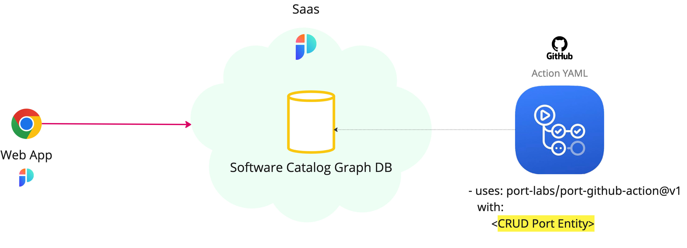

import Tabs from "@theme/Tabs"
import TabItem from "@theme/TabItem"

# Jenkins Deployment

Using Jenkins build, you can easily create/update and query entities in Port.

<br></br>
<br></br>



## 💡 Common Jenkins build usage

Port's API allows for easy integration between Port and your Jenkins builds, for example:

- Report the status of a running **CI job**;
- Update the software catalog about a new **build version** for a **microservice**;
- Get existing **entities**.

## Set up

:::tip
All Port API routes used in this guide can be found in Port's [API documentation](../../../../api-reference/api-reference.mdx).
:::

To interact with Port inside your Jenkins builds, follow these steps:

### Fetching your API token

1. Add your Port `CLIENT_ID` and `CLIENT_SECRET` as [Jenkins Credentials](https://www.jenkins.io/doc/book/using/using-credentials/) and pass them to your build using withCredentials, which utilizes the Plain Credentials plugin to bind credentials to variables. You can also set Port's API url as an environment variable.

Then add the following snippet to fetch your API token:

<details>
  <summary> Get API token </summary>

```js showLineNumbers
pipeline {
  agent any
  environment {
    API_URL = "https://api.getport.io"
  }
...
    withCredentials([
        string(credentialsId: 'port-client-id', variable: 'PORT_CLIENT_ID'),
        string(credentialsId: 'port-client-secret', variable: 'PORT_CLIENT_SECRET')
        ]){
            // Token request body
            auth_body = """
                {
                    "clientId": "${PORT_CLIENT_ID}",
                    "clientSecret": "${PORT_CLIENT_SECRET}"
                }
                """

            // Make a request to fetch Port API's token
            token_response = httpRequest contentType: 'APPLICATION_JSON',
                httpMode: "POST",
                requestBody: auth_body,
                url: "${API_URL}/v1/auth/access_token"

            // Parse the response to get the accessToken
            def slurped_response = new JsonSlurperClassic().parseText(token_response.content)
            def token = slurped_response.accessToken // Use this token for authentication with Port
            ...
        }

```

</details>

### Working with Port's API

2. Add the following code to your Jenkins build, to either create/update an entity, or get an existing one:

<Tabs groupId="usage" defaultValue="upsert" values={[
{label: "Create/Update", value: "upsert"},
{label: "Get", value: "get"}
]}>

<TabItem value="upsert">

```js showLineNumbers
import groovy.json.JsonSlurperClassic
...
    auth_body = """
        {
            "clientId": "${PORT_CLIENT_ID}",
            "clientSecret": "${PORT_CLIENT_SECRET}"
        }
        """
    token_response = httpRequest contentType: 'APPLICATION_JSON',
        httpMode: "POST",
        requestBody: auth_body,
        url: "${API_URL}/v1/auth/access_token"
    def slurped_response = new JsonSlurperClassic().parseText(token_response.content)
    def token = slurped_response.accessToken // Port's access token

    entity_body = """
        {
            "identifier": "example-entity",
            "properties": {
              "myStringProp": "My value",
              "myNumberProp": 1,
              "myBooleanProp": true,
              "myArrayProp": ["myVal1", "myVal2"],
              "myObjectProp": {"myKey": "myVal", "myExtraKey": "myExtraVal"}
            }
        }
    """

    response = httpRequest contentType: "APPLICATION_JSON", httpMode: "POST",
            url: "${API_URL}/v1/blueprints/blueprint/entities?upsert=true&merge=true",
            requestBody: entity_body,
            customHeaders: [
                [name: "Authorization", value: "Bearer ${token}"],
            ]
    println(response.content)
```

</TabItem>
<TabItem value="get">

```js showLineNumbers
import groovy.json.JsonSlurperClassic
...
    auth_body = """
        {
            "clientId": "${PORT_CLIENT_ID}",
            "clientSecret": "${PORT_CLIENT_SECRET}"
        }
        """
    token_response = httpRequest contentType: 'APPLICATION_JSON',
        httpMode: "POST",
        requestBody: auth_body,
        url: "${API_URL}/v1/auth/access_token"
    def slurped_response = new JsonSlurperClassic().parseText(token_response.content)
    def token = slurped_response.accessToken // Port's access token

    response = httpRequest contentType: 'APPLICATION_JSON', httpMode: "GET",
            url: "${API_URL}/v1/blueprints/blueprint/entities/entity-example",
            customHeaders: [
                [name: "Authorization", value: "Bearer ${token}"],
            ]
    println(response.content)
```

</TabItem>
</Tabs>

3. Make sure you have an existing Blueprint in your Port installation to create/update entities.

:::note
This example makes use of the following Plugins:

- [Plain Credentials](https://plugins.jenkins.io/credentials-binding/) (>=143.v1b_df8b_d3b_e48)
- [HTTP Request](https://plugins.jenkins.io/http_request/) (>=1.16)

Also, please make sure the following methods signatures are approved:

```
new groovy.json.JsonSlurperClassic
method groovy.json.JsonSlurperClassic parseText java.lang.String
```

:::

## Examples

Refer to the [examples](./examples.md) page for practical examples for using Port with Jenkins.
