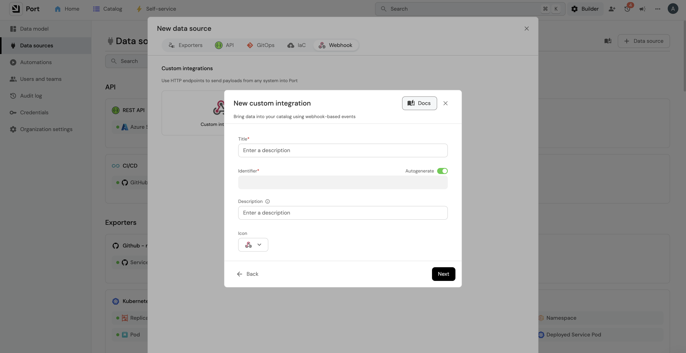

import Tabs from "@theme/Tabs"
import TabItem from "@theme/TabItem"
import CredentialsGuide from "/docs/build-your-software-catalog/custom-integration/api/\_template_docs/\_find_credentials.mdx";
import AzureAppRegistration from "./\_azure_app_registration_guide.mdx"

# Azure multi subscriptions

The Azure multi-subscription sync solution provides a way to periodically sync resources from multiple Azure subscriptions into Port with these key advantages:

- **No infrastructure required** - runs directly via GitHub Actions or locally
- **Multi-subscription support** - sync resources across all your Azure subscriptions from a single deployment
- **Near real-time updates** - incremental syncs every 15 minutes by default
- **Full control** - customize which resource types to include and how they're mapped
- **Zero setup complexity** - ideal for large organizations wanting near real-time data without complex infrastructure

## Overview

This solution:
- Is written in Python using the Azure SDK for Python
- Runs as a GitHub workflow at configurable periodic intervals
- Provides two sync modes:
  - **Incremental**: Syncs recent changes (default: every 15 minutes)
  - **Full**: Complete sync of all resources (recommended for initial setup)
- Prioritizes Azure resources with detailed tracking
- Supports flexible data mapping through Port webhooks
- Can be deployed via:
  - GitHub Actions for automated periodic sync
  - Local installation for development and testing


:::tip Source code
The source code is available in the [port-labs/incremental-sync](https://github.com/port-labs/incremental-sync) repository.
:::

### Azure setup

This integration requires the standard [Azure app registration](https://learn.microsoft.com/en-us/entra/identity-platform/quickstart-register-app?tabs=certificate%2Cexpose-a-web-api) setup.

Keep the following credentials handy after setup:
- `AZURE_CLIENT_ID`: The client ID of the Azure service principal
- `AZURE_CLIENT_SECRET`: The client secret of the Azure service principal
- `AZURE_TENANT_ID`: The tenant ID of the Azure service principal

<AzureAppRegistration/>

### Port setup

The basic Port setup follows the [standard installation guide](/build-your-software-catalog/sync-data-to-catalog/cloud-providers/azure/installation.md#port-setup). However, this integration uses a different webhook configuration for incremental syncing:

#### Port credentials

<CredentialsGuide />

#### Blueprint configuration

:::tip Customizable Blueprints
While these configurations are provided as a starting point, you can customize them based on your specific requirements and the Azure resources you want to track.
:::

Create the following blueprints in Port before syncing:

<details>
<summary>azureSubscription blueprint</summary>

```json
{
  "identifier": "azureSubscription",
  "title": "Azure Subscription",
  "icon": "Azure",
  "schema": {
    "properties": {
      "subscriptionId": {
        "title": "Subscription ID",
        "type": "string"
      },
      "tags": {
        "title": "Tags",
        "type": "object"
      }
    },
    "required": []
  },
  "mirrorProperties": {},
  "calculationProperties": {},
  "aggregationProperties": {},
  "relations": {}
}
```
</details>

<details>
<summary>azureResourceGroup blueprint</summary>

```json
{
  "identifier": "azureResourceGroup",
  "description": "This blueprint represents an Azure Resource Group in our software catalog",
  "title": "Azure Resource Group",
  "icon": "Azure",
  "schema": {
    "properties": {
      "location": {
        "title": "Location",
        "type": "string"
      },
      "tags": {
        "title": "Tags",
        "type": "object"
      }
    },
    "required": []
  },
  "mirrorProperties": {},
  "calculationProperties": {},
  "aggregationProperties": {},
  "relations": {
    "subscription": {
      "title": "Subscription",
      "target": "azureSubscription",
      "required": false,
      "many": false
    }
  }
}
```
</details>

<details>
<summary>azureCloudResources blueprint</summary>

```json
{
  "identifier": "azureCloudResources",
  "description": "This blueprint represents an AzureCloud Resource in our software catalog",
  "title": "Azure Cloud Resources",
  "icon": "Git",
  "schema": {
    "properties": {
      "tags": {
        "title": "Tags",
        "type": "object"
      },
      "type": {
        "title": "Type",
        "type": "string"
      },
      "location": {
        "title": "Location",
        "type": "string"
      }
    },
    "required": []
  },
  "mirrorProperties": {},
  "calculationProperties": {},
  "aggregationProperties": {},
  "relations": {
    "resourceGroup": {
      "title": "Resource Group",
      "target": "azureResourceGroup",
      "required": false,
      "many": false
    }
  }
}
```
</details>

#### Webhook configuration



To set up the webhook in Port:

1. Navigate to the [Data sources](https://app.getport.io/dev-portal/data-sources) page.
2. Click `+ Data Source` and select `Webhook`.
3. Fill in the required fields and create the webhook.
4. Copy the webhook URL (you'll need this for the integration setup).
5. Click Next to go the `Mapping` section.
6. Scroll down to find the `Map the data from the external system into Port` section.


Add the following webhook mapping in the `Map the data from the external system into Port` field:

<details>
<summary>Webhook Mapping Configuration</summary>

```json
[
  {
    "blueprint": "azureCloudResources",
    "operation": "create",
    "filter": ".body.type == 'resource' and .body.operation == 'upsert'",
    "entity": {
      "identifier": ".body.data.resourceId | gsub(\" \";\"_\")",
      "title": ".body.data.name",
      "properties": {
        "tags": ".body.data.tags",
        "type": ".body.data.type",
        "location": ".body.data.location"
      },
      "relations": {
        "resourceGroup": "'/subscriptions/' + .body.data.subscriptionId + '/resourcegroups/' + .body.data.resourceGroup | gsub(\" \";\"_\")"
      }
    }
  },
  {
    "blueprint": "azureCloudResources",
    "operation": "delete",
    "filter": ".body.type == 'resource' and .body.operation == 'delete'",
    "entity": {
      "identifier": ".body.data.resourceId | gsub(\" \";\"_\")"
    }
  },
  {
    "blueprint": "azureResourceGroup",
    "operation": "create",
    "filter": ".body.data.type == 'microsoft.resources/subscriptions/resourcegroups' and .body.operation == 'upsert'",
    "entity": {
      "identifier": ".body.data.resourceId | gsub(\" \";\"_\")",
      "title": ".body.data.name",
      "properties": {
        "tags": ".body.data.tags",
        "location": ".body.data.location"
      },
      "relations": {
        "subscription": "'/subscriptions/' + .body.data.subscriptionId | gsub(\" \";\"_\")"
      }
    }
  },
  {
    "blueprint": "azureResourceGroup",
    "operation": "delete",
    "filter": ".body.data.type == 'microsoft.resources/subscriptions/resourcegroups' and .body.operation == 'delete'",
    "entity": {
      "identifier": ".body.data.resourceId | gsub(\" \";\"_\")"
    }
  },
  {
    "blueprint": "azureSubscription",
    "operation": "create",
    "filter": ".body.data.type == 'microsoft.resources/subscriptions' and .body.operation == 'upsert'",
    "entity": {
      "identifier": ".body.data.resourceId | gsub(\" \";\"_\")",
      "title": ".body.data.name",
      "properties": {
        "subscriptionId": ".body.data.subscriptionId",
        "tags": ".body.data.tags"
      }
    }
  },
  {
    "blueprint": "azureSubscription",
    "operation": "delete",
    "filter": ".body.data.type == 'microsoft.resources/subscriptions' and .body.operation == 'delete'",
    "entity": {
      "identifier": ".body.data.resourceId | gsub(\" \";\"_\")"
    }
  }
]
```

:::note Webhook Mapping Details
- The `body.operation` field is a discriminator for the webhook (not part of Azure resource payload)
- The `body.type` field indicates the Azure resource type:
  - `resource` for Azure resources
  - `resourceContainer` for resource containers (e.g., resource groups, subscriptions)
- The `body.data` field contains the Azure resource payload
- The `body.data.type` field contains specific Azure resource types:
  - `microsoft.resources/subscriptions/resourcegroups` for resource groups
  - `microsoft.resources/subscriptions` for subscriptions
  - `microsoft.network/networksecuritygroups` for network security groups
:::

</details>

## Installation methods

<Tabs groupId="installation-methods" queryString="installation-methods" defaultValue="github">
<TabItem value="github" label="GitHub Actions">

To run the integration using GitHub Actions, follow these steps:

1. Set up the following secrets in your GitHub repository:
   - `AZURE_CLIENT_ID`: The Azure service principal client ID
   - `AZURE_CLIENT_SECRET`: The Azure service principal client secret
   - `AZURE_TENANT_ID`: The Azure service principal tenant ID
   - `PORT_WEBHOOK_INGEST_URL`: The webhook URL for ingesting Azure resources into Port

2. (Optional) Configure the following environment variables:
   - `SUBSCRIPTION_BATCH_SIZE`: Number of subscriptions to sync per batch (default: 1000, max: 1000)
   - `CHANGE_WINDOW_MINUTES`: Time window for checking resource changes (default: 15 minutes)
   - `RESOURCE_TYPES`: Specific Azure resource types to sync (default: All)
     ```bash
     # Example for specific resource types:
     RESOURCE_TYPES='["microsoft.keyvault/vaults","Microsoft.Network/virtualNetworks", "Microsoft.network/networksecuritygroups"]'
     ```

3. Create a GitHub workflow file based on your sync requirements:

<Tabs groupId="sync-type" queryString="sync-type" defaultValue="incremental">
<TabItem value="incremental" label="Incremental Sync">
This workflow runs automatically every 15 minutes to sync recent changes.

Create `.github/workflows/azure-incremental-sync.yml`:

```yaml
name: "Incremental sync of Azure resources to Port"
on:
  schedule:
    - cron: "*/15 * * * *"

jobs:
  sync:
    name: Incremental sync
    runs-on: ubuntu-latest
    steps:
      - name: Setup Python 3.12
        uses: actions/setup-python@v5
        with:
          python-version: "3.12"

      - name: Checkout Repository
        uses: actions/checkout@v2
        with:
          ref: main
          repository: port-labs/incremental-sync

      - name: Install dependencies with Poetry
        run: |
          cd integrations/azure_incremental
          python -m pip install --upgrade pip
          pip install poetry
          make install

      - name: Run incremental sync
        run: |
          cd integrations/azure_incremental
          make run
        env:
          AZURE_CLIENT_ID: ${{ secrets.AZURE_CLIENT_ID }}
          AZURE_CLIENT_SECRET: ${{ secrets.AZURE_CLIENT_SECRET }}
          AZURE_TENANT_ID: ${{ secrets.AZURE_TENANT_ID }}
          PORT_WEBHOOK_INGEST_URL: ${{ secrets.PORT_WEBHOOK_INGEST_URL }}
          CHANGE_WINDOW_MINUTES: 15
```


</TabItem>
<TabItem value="full" label="Full Sync">

This workflow can be triggered manually from the GitHub Actions UI.

:::warning
It's recommended to run the full sync manually as it may take a long time to complete, depending on the number of Azure resources, subscriptions, and resource groups.
:::

Create `.github/workflows/azure-full-sync.yml`:

```yaml
name: "Full sync of Azure resources to Port"
on:
  workflow_dispatch:

jobs:
  sync:
    name: Full sync
    runs-on: ubuntu-latest
    steps:
      - name: Checkout Repository
        uses: actions/checkout@v2
        with:
          ref: main
          repository: port-labs/incremental-sync

      - name: Install dependencies with Poetry
        run: |
          cd integrations/azure_incremental
          python -m pip install --upgrade pip
          pip install poetry
          make install

      - name: Run full sync
        run: |
          cd integrations/azure_incremental
          make run
        env:
          AZURE_CLIENT_ID: ${{ secrets.AZURE_CLIENT_ID }}
          AZURE_CLIENT_SECRET: ${{ secrets.AZURE_CLIENT_SECRET }}
          AZURE_TENANT_ID: ${{ secrets.AZURE_TENANT_ID }}
          PORT_WEBHOOK_INGEST_URL: ${{ secrets.PORT_WEBHOOK_INGEST_URL }}
          SYNC_MODE: full
```

</TabItem>
</Tabs>

</TabItem>

<TabItem value="local" label="Local Installation">

To run the integration locally, follow these steps:

1. Clone the repository:
```bash
git clone https://github.com/port-labs/incremental-sync.git
cd integrations/azure_incremental
```

2. Install dependencies using Poetry:
```bash
pip install poetry
make install
```

3. Set the required environment variables:
```bash
# Required variables
export AZURE_CLIENT_ID="your-azure-client-id"
export AZURE_CLIENT_SECRET="your-azure-client-secret"
export AZURE_TENANT_ID="your-azure-tenant-id"
export PORT_WEBHOOK_INGEST_URL="your-port-webhook-url"

# Optional variables
export SUBSCRIPTION_BATCH_SIZE=1000  # Default: 1000 (max)
export CHANGE_WINDOW_MINUTES=15      # Default: 15 minutes
export RESOURCE_TYPES='["microsoft.keyvault/vaults","Microsoft.Network/virtualNetworks"]'  # Default: All
```

4. Run the integration:
```bash
# For incremental sync
make run

# For full sync
export SYNC_MODE=full
make run
```

:::tip
For development and testing purposes, you can use a smaller `CHANGE_WINDOW_MINUTES` value to sync changes more frequently.
:::

</TabItem>
</Tabs>

## How it works

The integration follows these steps:

1. Fetches Azure subscriptions accessible to the Azure app.
2. Queries changes in Azure resources within these subscriptions.
3. Constructs and ingests resource groups into Port.
4. Processes resource changes (create/update/delete) according to webhook configuration.

## Next Steps

- Refer to the [Resource Templates](/build-your-software-catalog/sync-data-to-catalog/cloud-providers/azure/resource_templates/resource_templates.md) page for templates on how to map Azure resources to Port.
