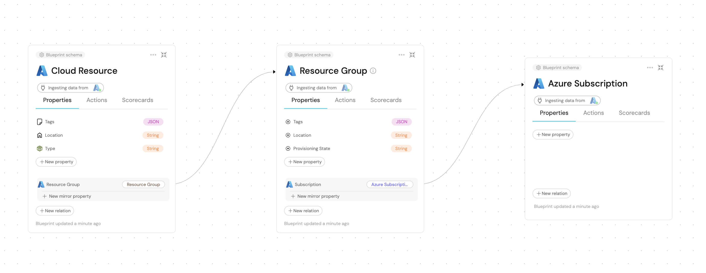

import SubscriptionBlueprint from './subscription/\_subscription_blueprint.mdx'
import SubscriptionAppConfig from './subscription/\_port_app_config.mdx'

import ResourceGroupBlueprint from './resource_group/\_blueprint.mdx'
import ResourceGroupAppConfig from './resource_group/\_port_app_config.mdx'

import CloudResourceBlueprint from './cloud_resource/\_cloud_resource_blueprint.mdx'
import CloudResourceAppConfig from './cloud_resource/\_port_app_config.mdx'

# Resource Templates

This page contains the base examples for mapping Azure resources to Port.

This base example thrives to provide a simpler and more abstract way to map Azure resources to Port.

The simplification is achieved by using the generic `cloudResource` blueprint, which can be used to map any Azure resource to Port. 

## Mapping Azure Subscriptions

In the following example you will ingest your Azure Subscriptions to Port, you may use the following Port blueprint definitions and integration configuration:

<SubscriptionBlueprint/>

<SubscriptionAppConfig/>

Here are the API references we used to create those blueprints and app config:

- [Subscription](https://docs.microsoft.com/en-us/rest/api/resources/subscriptions/list)

## Mapping Resource Groups

:::note Relate subscriptions and resource groups

The Resource Group has a relation to the Subscription, so the creation of the [Subscription blueprint](#mapping-azure-subscriptions) is required.

:::

In the following example you will ingest your Azure Resource Groups to Port, you may use the following Port blueprint definitions and integration configuration:

<ResourceGroupBlueprint/>

<ResourceGroupAppConfig/>

Here are the API references we used to create those blueprints and app config:

- [Resource Group](https://docs.microsoft.com/en-us/rest/api/resources/resourcegroups/list)

## Mapping Cloud Resources

In the following example you will ingest your Azure Resources to Port, you may use the following Port blueprint definitions and integration configuration:

:::note Relate resources and resource groups

The Resources below have a relation to the Resource Group, so the creation of the [Resource Group blueprint](#mapping-resource-groups) is required.

:::

<CloudResourceBlueprint/>

<CloudResourceAppConfig/>

Here are the API references we used to create those blueprints and app config:

- [AKS](https://learn.microsoft.com/en-us/rest/api/aks/managed-clusters/list?tabs=HTTP)
- [Container App](https://learn.microsoft.com/en-us/rest/api/containerapps/stable/container-apps/list-by-subscription?tabs=HTTP)
- [Load Balancer](https://learn.microsoft.com/en-us/rest/api/load-balancer/load-balancers/list-all?tabs=HTTP)
- [Virtual Machine](https://learn.microsoft.com/en-us/rest/api/compute/virtual-machines/list-all?tabs=HTTP)
- [Storage Account](https://docs.microsoft.com/en-us/rest/api/storagerp/storageaccounts/list)

## Mapping Extra Resources

The resources in this page are only a few of the resources that the Azure Exporter supports.

If the resources you want to ingest into Port do not appear in these examples, you can head to the [Mapping Extra Resources](/build-your-software-catalog/sync-data-to-catalog/cloud-providers/azure/resource_templates/mapping_extra_resources.md) page to learn about all of the kinds of Azure resources that are supported by the Azure integration and how to map them into Port.

## Advanced Use Cases

In certain scenarios you may want to model your Azure resources in a more detailed way.

For example, you may want to model a Storage Account and its Containers separately.

For these cases, head to the [Advanced Resource templates](/build-your-software-catalog/sync-data-to-catalog/cloud-providers/azure/resource_templates/advanced.md) page to learn how to model your Azure resources in a more detailed way.

