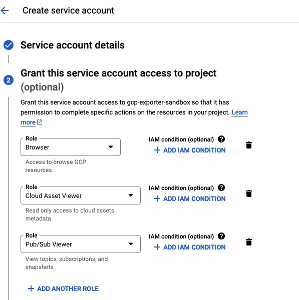
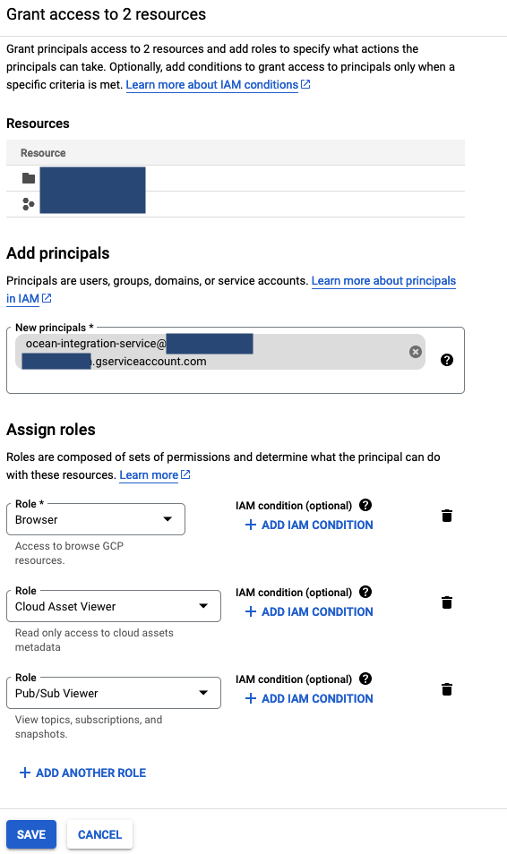

# Creating Deditcated Service Account

The Google Cloud Ocean integration uses ADC (Application Default Credentials) in order to login and perform requests to Google Cloud's Platform. This guide gives more information on how to configure a suitable service account.

## Walkthrough

### Creating a service account

1. Make sure you have your selected project in the top left toggle.
   
2. In the search text box, search for `service accounts`. Click the `IAM & Admin` option.
   
3. Click on `CREATE SERVICE ACCOUNT`.
   
4. Fill up an ID and a description, `continue`.
   
5. Click the `Select a role` dropdown, then search and add the following Roles:
   1. Browser
   2. Cloud Asset Viewer
   3. Pub/Sub Viewer
   
   Should look like this:
   
6. Click on continue -> Done
7. You've successfully finished creating a Service account!
   

### Fetching Key file

There are multiple ways to use the service account we just created. In this guide, we'll use the Service Account Key method.

:::warning
According to Google Cloud, This isn't the preffered way for Production purposes. The Terraform Installation is using Google's native method to authenticate, and is the one we propose for a Production setup.
:::

1. Make sure you have your selected project in the top left toggle.
   
2. In the search text box, search for `service accounts`. Click the `IAM & Admin` option
   
3. Click on the Service account. Should look like this:
   
4. Click on `Keys` -> `Add Key` -> `Create new key` -> `JSON` -> `CREATE`
5. This will download your new Service Account Key configuration file.
6. Done!

### Optional- Scale permissions for a Service account

The above gives a service account permissions in it's Project's scope. You are able to add permissions at other projects/folders/organization level.

1. Make sure you have your selected project in the top left toggle.
   
2. In the search text box, search for `service accounts`. Click the `IAM & Admin` option
   
3. Click on the Service account. Should look like this:
   
4. Copy the service account's email.
5. Switch the top left toggle to your organization
   
6. In the search text box, search for `manage resources`. Click the `IAM & Admin` option.
   
7. In the `Resources` Table, you see all projects+folders connected to your organization.
   
8. Pick your desired scope (organization/folders/projects), using the left checkboxes.
   
9. This will open up a menu on the right side.
    
10. Click on `ADD PRINCIPLE`
11. In the `Add principals` tab add the email to your service account. In the Assign roles, give these three roles to your service account:
    1. Browser
    2. Cloud Asset Viewer
    3. Pub/Sub Viewer
    
    Should look like this:
    
12. Click on `Save`
13. Wait for at least 3 minutes, and you're set!
