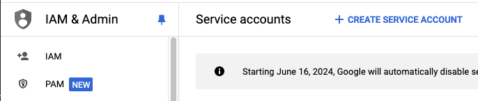
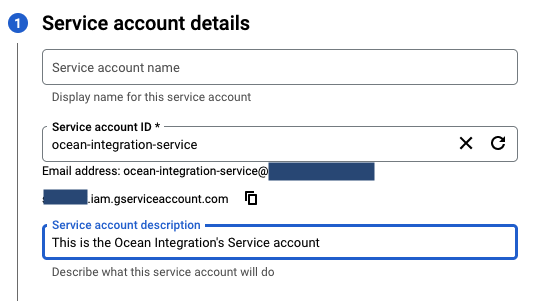
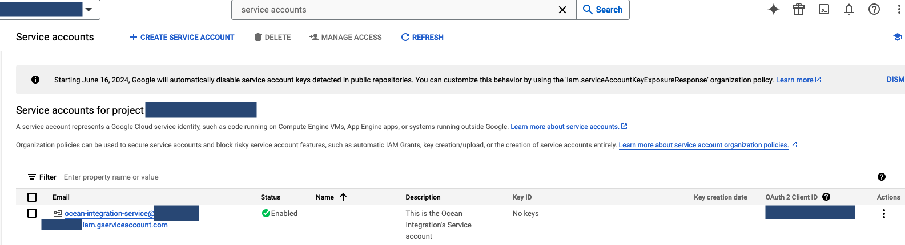
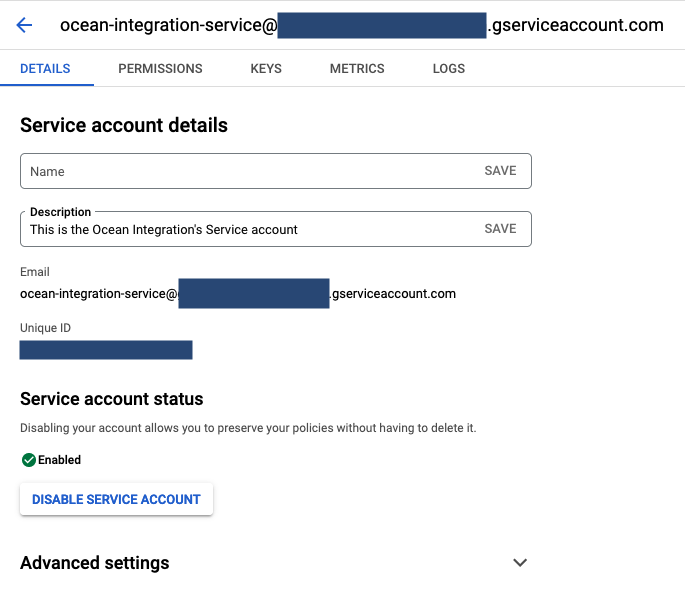
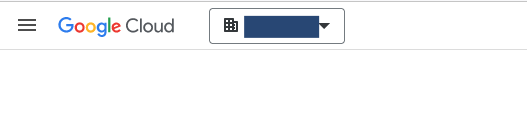
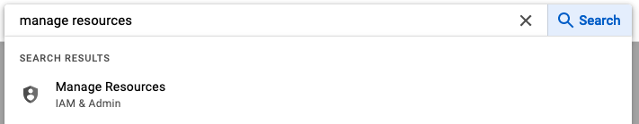
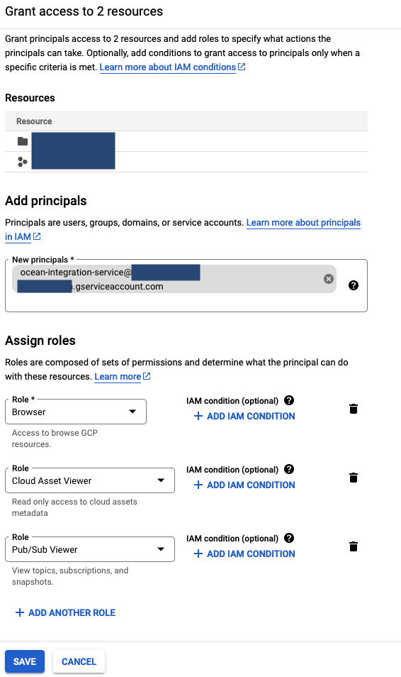

import Tabs from "@theme/Tabs"
import TabItem from "@theme/TabItem"

# Installation

The Google Cloud Ocean integration relies on the Google Cloud Client libraries, which are authenticated using Application Default Credentials. In these guides, you can install the integration in various ways, varying by the authentication method + platform. For Production setup, we recommend using the Terraform Installation method.

Choose one of the following installation methods:
<Tabs groupId="installation-platforms" queryString="installation-platforms">
<TabItem value="helm" label="Helm">
The Ocean Google Cloud integration uses Google's ADC (Application Default Credentials). In order to properly set-up, this guide will be divided into two parts:

1. Creating a service account.
2. Running the Helm Command.

# Creating a service account

1. Make sure you have your selected project in the top left toggle.

   
2. In the search text box, search for `service accounts`. Click the `IAM & Admin` option.

   
3. Click on `CREATE SERVICE ACCOUNT`.

   
4. Fill up an ID and a description, `continue`.

   
5. Click the `Select a role` dropdown, then search and add the following Roles:
   1. Browser
   2. Cloud Asset Viewer
   3. Pub/Sub Viewer

   Should look like this:

   
6. Click on continue -> Done
7. You've successfully finished creating a Service account!

   

## Fetching Key file

There are multiple ways to use the service account we just created. In this guide, we'll use the Service Account Key method.

:::warning
According to Google Cloud, This isn't the preffered way for Production purposes. The Terraform Installation is using Google's native method to authenticate, and is the one we propose for a Production setup.
:::

1. Make sure you have your selected project in the top left toggle.

   
2. In the search text box, search for `service accounts`. Click the `IAM & Admin` option

   
3. Click on the Service account. Should look like this:

   
4. Click on `Keys` -> `Add Key` -> `Create new key` -> `JSON` -> `CREATE`
5. This will download your new Service Account Key configuration file.
6. Done!

# Running the Helm command

:::warning
The Ocean integration doesn't store the encoded file anywhere but locally. It's NOT being sent to Port.
:::

1. Take the service account [key file you create](#fetching-key-file), and run this command:

   ```bash
   echo <new-configuration-file> | base64 | pbcopy
   ```

2. Run the following command:

   ```bash
   helm repo add --force-update port-labs https://port-labs.github.io/helm-charts
   helm upgrade --install gcp port-labs/port-ocean \
   --set port.clientId="$PORT_CLIENT_ID"  \
   --set port.clientSecret="$PORT_CLIENT_SECRET_ID"  \
   --set port.baseUrl="https://api.getport.io"  \
   --set initializePortResources=true  \
   --set sendRawDataExamples=true  \
   --set integration.identifier="ocean-gcp-integration"  \
   --set integration.type="gcp"  \
   --set integration.eventListener.type="KAFKA"  \
   --set integration.eventListener.brokers="b-3-public.publicclusterprod.t9rw6w.c1.kafka.eu-west-1.amazonaws.com:9196\,b-1-public.publicclusterprod.t9rw6w.c1.kafka.eu-west-1.amazonaws.com:9196\,b-2-public.publicclusterprod.t9rw6w.c1.kafka.eu-west-1.amazonaws.com:9196"  \
   --set integration.config.encodedADCConfiguration="<paste_the_encoded_file_content_here>"  \
   ```

# Optional- Scale permissions for a Service account

The above gives a service account permissions in it's Project's scope. You are able to add permissions at other projects/folders/organization level.

1. Make sure you have your selected project in the top left toggle.

   
2. In the search text box, search for `service accounts`. Click the `IAM & Admin` option

   
3. Click on the Service account. Should look like this:

   
4. Copy the service account's email.
5. Switch the top left toggle to your organization

   
6. In the search text box, search for `manage resources`. Click the `IAM & Admin` option.

   
7. In the `Resources` Table, you see all projects+folders connected to your organization.

   
8. Pick your desired scope (organization/folders/projects), using the left checkboxes.

   
9. This will open up a menu on the right side.

    
10. Click on `ADD PRINCIPLE`
11. In the `Add principals` tab add the email to your service account. In the Assign roles, give these three roles to your service account:
    1. Browser
    2. Cloud Asset Viewer
    3. Pub/Sub Viewer
   Should look like this:

    
12. Click on `Save`

</TabItem>
<TabItem value="docker" label="Docker">

The Ocean Google Cloud integration uses Google's ADC (Application Default Credentials). In order to properly set-up, this guide will be divided into two parts:

1. Creating a service account.
2. Running the Docker Command.

# Creating a service account

1. Make sure you have your selected project in the top left toggle.

   
2. In the search text box, search for `service accounts`. Click the `IAM & Admin` option.

   
3. Click on `CREATE SERVICE ACCOUNT`.

   
4. Fill up an ID and a description, `continue`.

   
5. Click the `Select a role` dropdown, then search and add the following Roles:
   1. Browser
   2. Cloud Asset Viewer
   3. Pub/Sub Viewer

   Should look like this:

   
6. Click on continue -> Done
7. You've successfully finished creating a Service account!

   

## Fetching Key file

There are multiple ways to use the service account we just created. In this guide, we'll use the Service Account Key method.

:::warning
According to Google Cloud, This isn't the preffered way for Production purposes. The Terraform Installation is using Google's native method to authenticate, and is the one we propose for a Production setup.
:::

1. Make sure you have your selected project in the top left toggle.

   
2. In the search text box, search for `service accounts`. Click the `IAM & Admin` option

   
3. Click on the Service account. Should look like this:

   
4. Click on `Keys` -> `Add Key` -> `Create new key` -> `JSON` -> `CREATE`
5. This will download your new Service Account Key configuration file.
6. Done!

# Running the Docker command

:::warning
The Ocean integration doesn't store the encoded file anywhere but locally. It's NOT being sent to Port.
:::

1. Take the service account [key file you create](#fetching-key-file), and run this command:

   ```bash
   echo <new-configuration-file> | base64 | pbcopy
   ```

2. Run the following command:

   ```bash
   docker run -i --rm --platform=linux/amd64 \
   -e OCEAN__PORT__CLIENT_ID="$PORT_CLIENT_ID" \
   -e OCEAN__PORT__CLIENT_SECRET="$PORT_CLIENT_SECRET" \
   -e OCEAN__PORT__BASE_URL="https://api.getport.io" \
   -e OCEAN__INITIALIZE_PORT_RESOURCES=true \
   -e OCEAN__SEND_RAW_DATA_EXAMPLES=true \
   -e OCEAN__EVENT_LISTENER='{"type": "ONCE"}' \
   -e OCEAN__INTEGRATION__CONFIG__ENCODED_ADC_CONFIGURATION="<paste_the_encoded_file_content_here>" \
   ghcr.io/port-labs/port-ocean-gcp:latest
   ```

# Optional- Scale permissions for a Service account

The above gives a service account permissions in it's Project's scope. You are able to add permissions at other projects/folders/organization level.

1. Make sure you have your selected project in the top left toggle.

   
2. In the search text box, search for `service accounts`. Click the `IAM & Admin` option

   
3. Click on the Service account. Should look like this:

   
4. Copy the service account's email.
5. Switch the top left toggle to your organization

   
6. In the search text box, search for `manage resources`. Click the `IAM & Admin` option.

   
7. In the `Resources` Table, you see all projects+folders connected to your organization.

   
8. Pick your desired scope (organization/folders/projects), using the left checkboxes.

   
9. This will open up a menu on the right side.

    
10. Click on `ADD PRINCIPLE`
11. In the `Add principals` tab add the email to your service account. In the Assign roles, give these three roles to your service account:
    1. Browser
    2. Cloud Asset Viewer
    3. Pub/Sub Viewer
   Should look like this:

    
12. Click on `Save`

</TabItem>
<TabItem value="terraform" label="Terraform">
The GCP integration is deployed using Terraform on Google Cloud Cloud Run.  
It uses our Terraform [Ocean](https://ocean.getport.io) Integration Factory [module](https://registry.terraform.io/modules/port-labs/integration-factory/ocean/latest) to deploy the integration.

# Prerequisites

- [Terraform](https://www.terraform.io/downloads.html) >= 0.15.0
- [A logged in gCloud CLI](https://cloud.google.com/sdk/gcloud) with enough [Permissions](#required-permissions-to-run-terraform-apply)
- [Artifact Registry Image](#artifact-registry-image)

# Artifact Registry Image

In order to run the Cloud Run Service, it's mandatory to have a working Image. Currently our GHCR based images aren't supported by Google Cloud's Cloud run platform, so a manual installation to Dockerhub\Artifact registry is required. In the guide we specify an Artifact registry approach, but a similar DockerHub approach should yield the same results:  

1. Create an Artifact Registry in GCP.
2. Pull our AMD based image from our GHCR registry

   ```docker pull ghcr.io/port-labs/port-ocean-gcp --platform amd64```
3. Tag this image

   ```docker tag ghcr.io/port-labs/port-ocean-gcp:latest <your_artifact_registry_/_dockerhub>/port-ocean-gcp:<your_version>```
4. Push the image to your artifact registry:

   ```docker push <your_artifact_registry_/_dockerhub>/port-ocean-gcp:<your_version>```

# Required permissions to run terraform apply

In order to successfully deploy the Google Cloud integration, it's crucial to ensure that the user who deploys the integration in the GCP Organization has the appropriate access permissions.

The Google Cloud integration uses the following GCP infrastructure:

- GCP Cloud Run.
- GCP PubSub Topic & Subscription.
- GCP Roles & Service accounts.
- GCP Cloud Assets
  - GCP Cloud Asset Inventory
  - GCP Cloud Asset Feed  (Used for real-time data sync to Port)

:::tip
   Our Terraform module creates a dedicated service account with it's own permissions, and is not related to these permissions.
:::

You can either deploy using your own permissions, or [impersonating a service account](https://cloud.google.com/docs/authentication/provide-credentials-adc#service-account). Either way, the following permissions should be granted:

<details>
<summary> Required Permissions </summary>
```
cloudasset.assets.exportResource
cloudasset.feeds.create
cloudasset.feeds.delete
cloudasset.feeds.get
cloudasset.feeds.list
cloudasset.feeds.update
iam.roles.create
iam.roles.delete
iam.roles.get
iam.roles.undelete
iam.roles.update
iam.serviceAccountKeys.get
iam.serviceAccounts.actAs
iam.serviceAccounts.create
iam.serviceAccounts.delete
iam.serviceAccounts.get
pubsub.subscriptions.consume
pubsub.subscriptions.create
pubsub.subscriptions.delete
pubsub.subscriptions.get
pubsub.subscriptions.list
pubsub.subscriptions.update
pubsub.topics.attachSubscription
pubsub.topics.create
pubsub.topics.delete
pubsub.topics.get
pubsub.topics.list
pubsub.topics.update
resourcemanager.organizations.getIamPolicy
resourcemanager.organizations.setIamPolicy
run.operations.get
run.services.create
run.services.delete
run.services.get
serviceusage.services.use
```
</details>

# Installation walkthrough

Run the following requests.

:::tip
If you want the integration to collect resources from more projects/folders/organization, make sure that you [set up permissions](#optional---scaling-the-permissions) properly.
:::

```bash
echo 'module "gcp" {
source = "port-labs/integration-factory/ocean//examples/gcp_integration_with_real_time" 
version = ">=0.0.25" 
port_client_id = "<your_port_client_id>" 
port_client_secret = "<your_port_client_secret>" 
port_base_url = "https://api.getport.io" 
gcp_ocean_integration_image = "<your_artifact_registry_/_dockerhub>/port-ocean-gcp:<your_version>" 
gcp_organization = "<your_gcp_organization>" 
gcp_ocean_setup_project = "<your_gcp_project>" 
gcp_projects = [<your_gcp_project>] # The Project list that the integration digests resources from. leave empty
integration_identifier = "gcp" 
initialize_port_resources = true # When set to true the integration will create default blueprints + JQ Mappings
event_listener = {
	type = "KAFKA" 
	brokers = ["b-3-public.publicclusterprod.t9rw6w.c1.kafka.eu-west-1.amazonaws.com:9196","b-1-public.publicclusterprod.t9rw6w.c1.kafka.eu-west-1.amazonaws.com:9196","b-2-public.publicclusterprod.t9rw6w.c1.kafka.eu-west-1.amazonaws.com:9196"] 
} 
assets_types_for_monitoring = ["cloudresourcemanager.googleapis.com/Organization","cloudresourcemanager.googleapis.com/Project","storage.googleapis.com/Bucket","cloudfunctions.googleapis.com/CloudFunction","pubsub.googleapis.com/Subscription","pubsub.googleapis.com/Topic","container.googleapis.com/Cluster"] # A list of resources to filter events from Google Cloud.
}' > main.tf
# Initializing Terraform and Providers
terraform init
# Creating the resources (Cloud Run, PubSub Topic + Subscription, Cloud Assets Feed, Service account + Role)
terraform apply
```

# Optional - Scaling the permissions

If you want the integration to collect resources from multiple projects/folders or to have it collect from the entire organization, you need to have permissions to create/view additional resources. Follow these instructions to make sure you are equipped with enough permissions.

1. Make sure you are connected to your Organization.


2. In the search text box, search for `roles`. Click the `IAM & Admin` option.
3. Click on `CREATE ROLE`.
4. Click on `ADD PERMISSIONS`, and select all the [above permissions](#required-permissions-to-run-terraform-apply)
5. In the search text box, search for `manage resources`. Click the `IAM & Admin` option.


6. In the `Resources` Table, you see all projects+folders connected to your organization.


7. Pick your desired scope (organization/folders/projects), using the left checkboxes.


8. This will open up a menu on the right side.


9. Click on `ADD PRINCIPLE`
10. Here, Enter your's or your service account's email, and grant it your newly created `Role`.

</TabItem>
</Tabs>

## Further Examples

Refer to the [examples](/build-your-software-catalog/sync-data-to-catalog/cloud-providers/gcp/examples/) page for practical configurations and their corresponding blueprint definitions.
