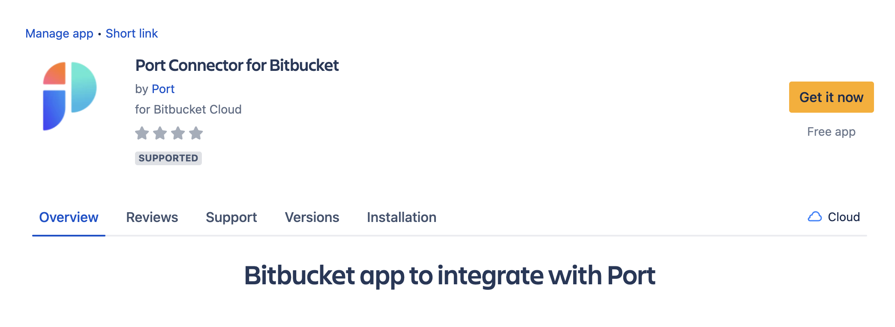
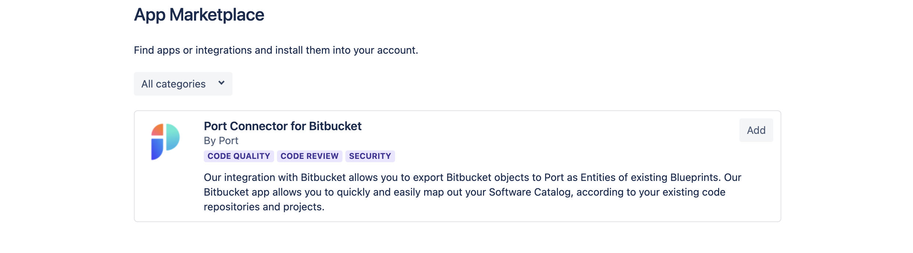

# Installation

## Installing Port's Bitbucket application

:::note Prerequisites

- A registered organization in Port;
- Your Port user role is set to `Admin`.

:::

### Installation

<!-- 1. Go to the add-on management section of your workspace settings by going to the following URL: https://bitbucket.org/<mark>YOUR_WORKSPACE_NAME</mark>/workspace/settings/addon-management.

   :::info
   Remember to replace the highlighted section with your workspace name
   ::: -->

1. Go to [Bitbucket app installation page](https://marketplace.atlassian.com/apps/1229886/port-connector-for-bitbucket?hosting=cloud&tab=overview)

2. Click `Get it now`.

   

3. Click `Add`

   

4. Click `Grant access`.

   

5. You'll be redirected to Port, please **log in**.

6. Once logged in, you will see the success indication in the top of the screen:

   
