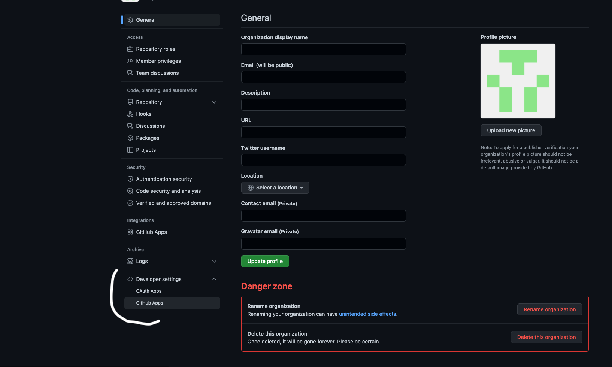

<h2>Prerequisites</h2>

- A GitHub account with permissions to create and manage GitHub Apps in your organization. This typically requires being an **Organization Owner** or having the **[App Manager](https://docs.github.com/en/organizations/managing-programmatic-access-to-your-organization/adding-and-removing-github-app-managers-in-your-organization)** role.
- Your Port user role is set to `Admin`.

<h2>Create a GitHub App</h2>

1. Navigate to your GitHub organization and click on **Settings**.

2. Inside the settings view, click on **Developer Settings** and then select **GitHub Apps**.

3. Click **New GitHub App**.

4. Configure the GitHub App with the following values:

- **GitHub App name**: Choose a unique name for the app. Note that GitHub App names must be globally unique.
- **Homepage URL**: `https://port.io`.
- **Callback URL**: Leave this empty.
- **Setup URL**: Leave this empty.
- Uncheck **Active** under Webhooks. The integration will automatically create the webhook if you configure the `OCEAN__BASE_URL` variable later during deployment.
- **Repository permissions**:
  - Actions: Read-only (for syncing workflows).
  - Checks: Read-only (for syncing `Port.yml`).
  - Contents: Read-only (for reading port configuration files and repository files).
  - Metadata: Read-only.
  - Administration: Read-only (for syncing collaborators).
  - Pull requests: Read-only.
  - Code scanning alerts: Read-only.
  - Dependabot alerts: Read-only.
  - Deployments: Read-only.
  - Environments: Read-only.
- **Organization permissions**:
  - Members: Read-only (for syncing members and teams).
  - Administration: Read-only (for syncing external identities).
  - Webhooks: Read and write (to allow the integration to create webhooks).

Then select **Create GitHub App**.

5. Go to the **Private keys** section at the bottom of the app’s **General** settings page and generate a private key.

Keep the file, you will need it for the deployment step.

<h2>Install the GitHub App</h2>

After you have the app registered in your organization, install it and select the repositories to integrate it with:

1. Navigate to your GitHub organization and click on **Settings**.

2. Inside the settings view, click on **Developer Settings** and then select **GitHub Apps**.

3. Click **Edit** on the GitHub App you created.

4. Go to **Install App** and select the installation button on the organization.

5. Choose the repositories you want the integration to be installed for.

