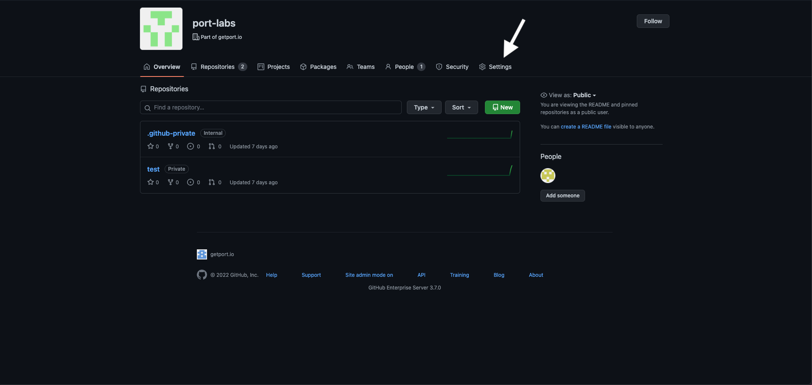

import FindCredentials from "/docs/build-your-software-catalog/custom-integration/api/\_template_docs/\_find_credentials.mdx"
import PortApiRegionTip from "/docs/generalTemplates/\_port_region_parameter_explanation_template.md"

# Github App

:::note Prerequisites

- A registered organization in Port;
- Your Port user role is set to `Admin`.

:::

In organizations that have a self-hosted GitHub installation there is no access to our official public app, therefore there are some extra steps you need to take to install the GitHub integration:

1. [Register](#register-ports-github-integration) Port's GitHub integration in your GitHub organization;
2. [Deploy](#deployment) Port's GitHub integration Docker image inside your VPC;
3. [Install](#installing-ports-github-integration) Port's GitHub integration in your GitHub organization and on select repositories.

## Register Port's GitHub integration

1. Navigate to your Github organization and click on Settings:



2. Inside the settings view, click on **Developer Settings** -> and then select **GitHub Apps**:


3. Click on "New GitHub App":


4. Insert the following properties:

- **GitHub App name:** Choose a unique name for the app. Note that GitHub App names must be globally unique.
- **Homepage URL:** https://port.io
- **Callback URL:** Leave this empty.
- **Setup URL:** Leave this empty.
- Uncheck **Active** under Webhooks. The integration will automatically create the webhook if you configure the `OCEAN__BASE_URL` variable later during deployment.
- **Repository Permissions:**
  - Actions: Read and Write (for executing self-service action using GitHub workflow).
  - Checks: Read and Write (for validating `Port.yml`).
  - Contents: Readonly (for reading port configuration files and repository files).
  - Metadata: Readonly.
  - Pull Request: Read and Write.
- **Organization Permissions:**
  - Webhooks: Read and Write (to allow the integration create webhook).

Then select "Create GitHub App"

5. Go to the settings of the created GitHub app and generate a private key. Save the downloaded file:


Keep the file, you will need it for the deployment step.

## Deployment

:::note Prerequisites

You will need your Port `CLIENT_ID` and `CLIENT_SECRET`.

<FindCredentials/>

:::

:::note Self-Service Actions
To use [Self-Service Actions with GitHub Workflows](https://docs.port.io/actions-and-automations/setup-backend/github-workflow/), you need to install our [public GitHub Cloud App](../../github#setup).
:::


## Installing Port's GitHub integration

After you have the app registered in your organization, you can install it and select the repositories to integrate it with:

1. First, navigate to your organization and click on Settings:


2. Inside the settings view, click on Developer Settings -> and then select GitHub Apps:


3. Click `edit` on the GitHub app created at the step before:


4. Go to Install App -> and select the installation button on your wanted organization;

5. Choose the repositories you want the integration to be installed for:


## Docker

To use our GitHub integration as an app, you will need to deploy our official integration Docker image - providing an app id and an app private key.

It can be deployed on any platform that allows deploying images as containers such as: K8S, ECS, AWS App Runner, etc.

You can pull the Docker image by running:

```bash showLineNumbers
docker pull ghcr.io/port-labs/port-ocean-github-ocean:1.0.5-beta
```

Run the following command to start the app:


```bash showLineNumbers
docker run \
  -e OCEAN__PORT__CLIENT_ID=<PORT_CLIENT_ID> \
  -e OCEAN__PORT__CLIENT_SECRET=<PORT_CLIENT_SECRET> \
  -e OCEAN__PORT__BASE_URL=https://api.getport.io \
  -e OCEAN__BASE_URL=<https.example.com> \ #optional, only required if you want to enable live-events
  -e OCEAN__EVENT_LISTENER__TYPE=POLLING \
  -e OCEAN__INTEGRATION__CONFIG__GITHUB_HOST=<GITHUB_HOST> \ # e.g https://api.github.com
  -e OCEAN__INTEGRATION__CONFIG__GITHUB_ORGANIZATION=<GITHUB_ORGANIZATION> \
  -e OCEAN__INTEGRATION__IDENTIFIER=github-ocean \
  -e OCEAN__INTEGRATION__CONFIG__GITHUB_APP_ID=<GITHUB_APP_ID> \
  -e OCEAN__INTEGRATION__CONFIG__GITHUB_APP_PRIVATE_KEY=<BASE_64_ENCODED_PRIVATEKEY> \
  -p 8000:8000 \
  ghcr.io/port-labs/port-ocean-github-ocean:1.0.5-beta
```


:::tip Docker parameters

The command below contains placeholder values in angle brackets (e.g., `<PORT_CLIENT_ID>`). Be sure to replace them with your actual values before running the command.

:::

:::tip base64 encoding
On MacOS and Linux you can get base64 encoded private key by using:
```sh
base64 -i <path/to/downloaded/private_key.pem>
```

You can accomplish the same on Windows using Powershell:
```powershell
[Convert]::ToBase64String([IO.File]::ReadAllBytes("path\to\downloaded\private_key.pem"))

```

Online:
https://www.base64encode.org/ 
:::

| Env variable                                         | Description                                                                                    | Required |
| ---------------------------------------------------- | ---------------------------------------------------------------------------------------------- | ------ |
| `OCEAN__PORT__CLIENT_ID`                             | Port client id for interacting with the API                                                    | ✅  |
| `OCEAN__PORT__CLIENT_SECRET`                         | Port client secret for interacting with the API                                                | ✅  |
| `OCEAN__PORT__BASE_URL`                              | Port's API Base URL                                                                            | ✅  |
| `OCEAN__BASE_URL`                                    | Integration instance base url, real-time live events will be enabled if this is configured.   |  ❌ | 
| `OCEAN__INTEGRATION__CONFIG__WEBHOOK_SECRET`         | A secret to secure webhooks from GitHub. This is optional but highly recommended for security if you enable live-events. |  ❌ |
| `OCEAN__EVENT_LISTENER__TYPE`                        | Define the appropriate event listener type to handle incoming events and resync requests from Port. This listener will forward the events to the GitHub Ocean integration. For more details, see the [Port Event Listener documentation](https://ocean.getport.io/framework/features/event-listener)                                              | ✅  |
| `OCEAN__INTEGRATION__CONFIG__GITHUB_HOST`         | The API endpoint for your GitHub instance. For GitHub Enterprise, this will be `https://<org_name.ghe.com>`. Defaults to `https://api.github.com` if not provided. | ❌   |
| `OCEAN__INTEGRATION__CONFIG__GITHUB_ORGANIZATION`    | The GitHub organization the integration was installed in.                                      | ✅  |
| `OCEAN__INTEGRATION__IDENTIFIER`                     | A unique identifier for the integration instance. Useful if you are running multiple self-hosted GitHub integrations. Defaults to `github-ocean`. | ✅  |
| `OCEAN__INTEGRATION__CONFIG__GITHUB_APP_ID`          | Application ID. You can find it in the edit GitHub app page.                                   | ✅  |
| `OCEAN__INTEGRATION__CONFIG__GITHUB_APP_PRIVATE_KEY` | A base64 encoded Github app private key. | ✅  |


<PortApiRegionTip/>
