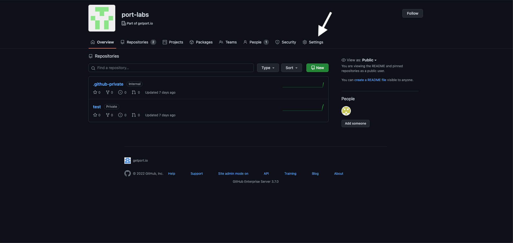
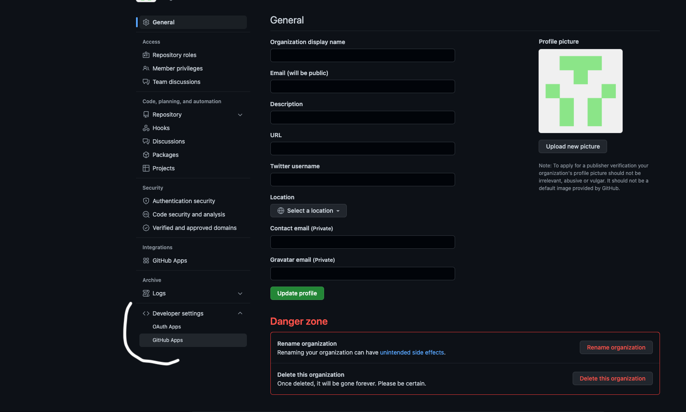
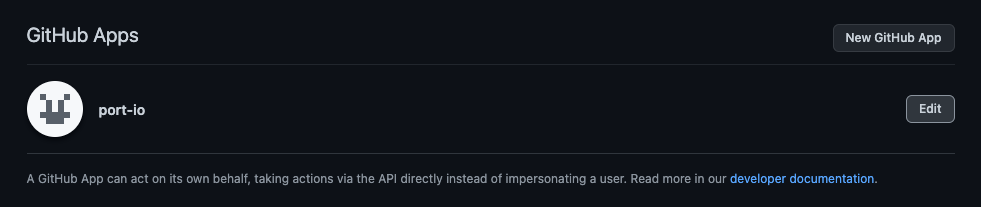
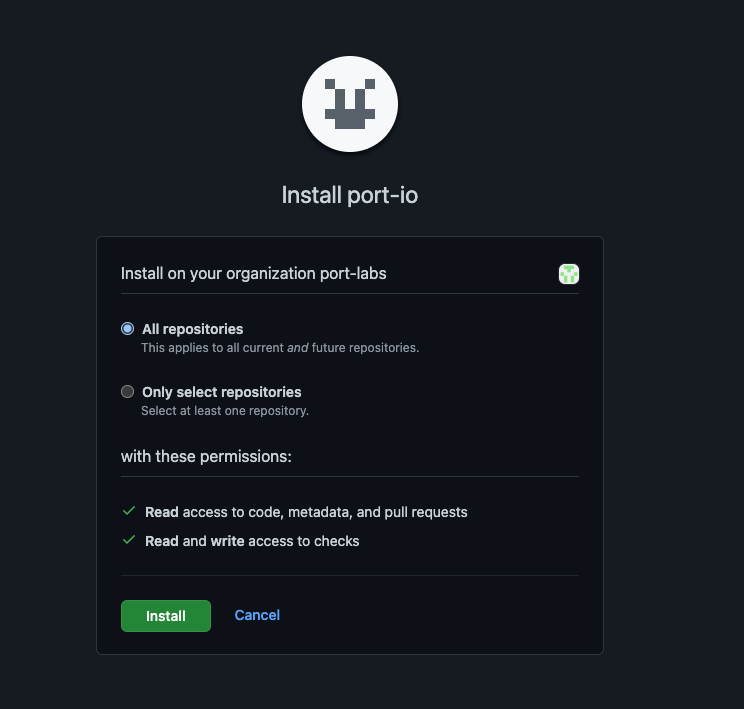

import FindCredentials from "/docs/build-your-software-catalog/custom-integration/api/\_template_docs/\_find_credentials.mdx"
import PortApiRegionTip from "/docs/generalTemplates/\_port_region_parameter_explanation_template.md"
import InstallMethods from "./\_install_methods.mdx"

# Github App

:::note Prerequisites

- A registered organization in Port;
- Your Port user role is set to `Admin`.

:::

In organizations that have a self-hosted GitHub installation there is no access to our official public app, therefore there are some extra steps you need to take to install the GitHub integration:

1. [Register](#register-ports-github-integration) Port's GitHub integration in your GitHub organization;
2. [Deploy](#deployment) Port's GitHub integration Docker image inside your VPC;
3. [Install](#installing-ports-github-integration) Port's GitHub integration in your GitHub organization and on select repositories.

## Register Port's GitHub integration

1. Navigate to your Github organization and click on Settings:

2. Inside the settings view, click on **Developer Settings** -> and then select **GitHub Apps**:

3. Click on "New GitHub App":

4. Insert the following properties:

- **GitHub App name:** Choose a unique name for the app. Note that GitHub App names must be globally unique.
- **Homepage URL:** https://port.io
- **Callback URL:** Leave this empty.
- **Setup URL:** Leave this empty.
- Uncheck **Active** under Webhooks. The integration will automatically create the webhook if you configure the `OCEAN__BASE_URL` variable later during deployment.
- **Repository Permissions:**
  - Actions: Read and Write (for executing self-service action using GitHub workflow).
  - Checks: Read and Write (for validating `Port.yml`).
  - Contents: Readonly (for reading port configuration files and repository files).
  - Metadata: Readonly.
  - Pull Request: Read and Write.
- **Organization Permissions:**
  - Webhooks: Read and Write (to allow the integration create webhook).

Then select "Create GitHub App"

5. Go to the settings of the created GitHub app and generate a private key. Save the downloaded file:

Keep the file, you will need it for the deployment step.

## Deployment

:::note Prerequisites

You will need your Port `CLIENT_ID` and `CLIENT_SECRET`.

<FindCredentials/>

:::

:::note Self-Service Actions
To use [Self-Service Actions with GitHub Workflows](https://docs.port.io/actions-and-automations/setup-backend/github-workflow/), you need to install our [public GitHub Cloud App](../../github#setup).
:::

## Installing Port's GitHub integration

After you have the app registered in your organization, you can install it and select the repositories to integrate it with:

1. First, navigate to your organization and click on Settings:

2. Inside the settings view, click on Developer Settings -> and then select GitHub Apps:

3. Click `edit` on the GitHub app created at the step before:

4. Go to Install App -> and select the installation button on your wanted organization;

5. Choose the repositories you want the integration to be installed for:

<InstallMethods setupName="app" />
