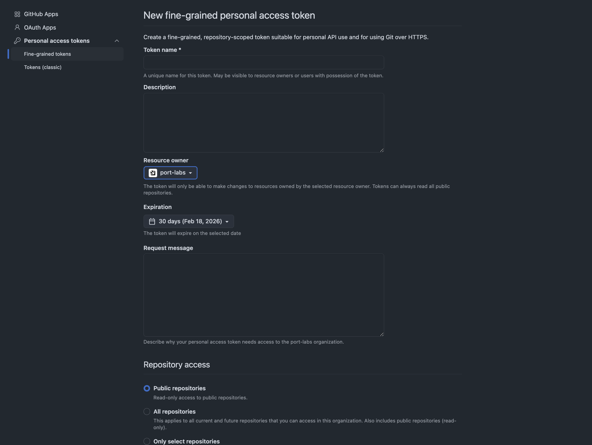
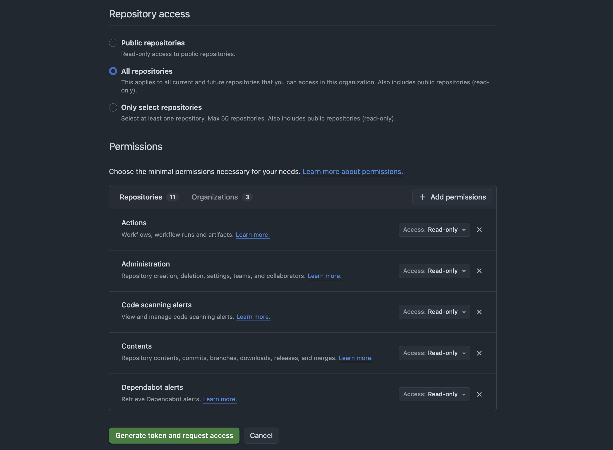
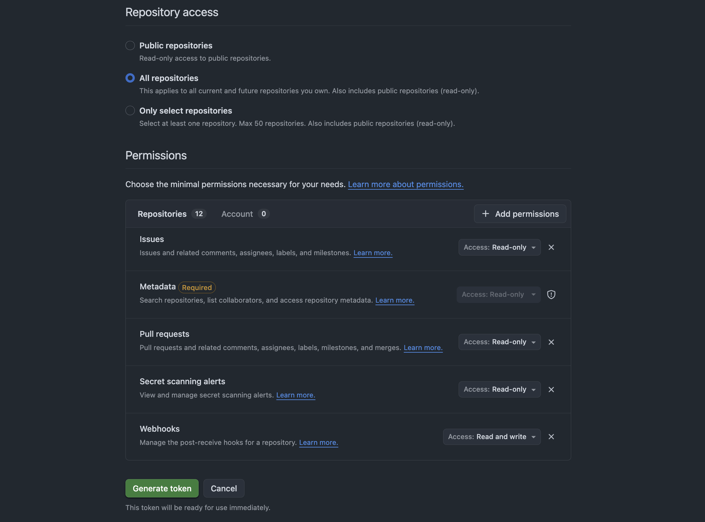
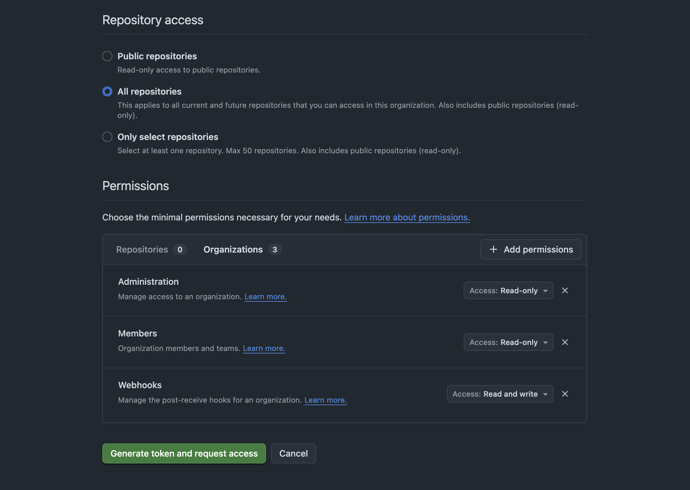
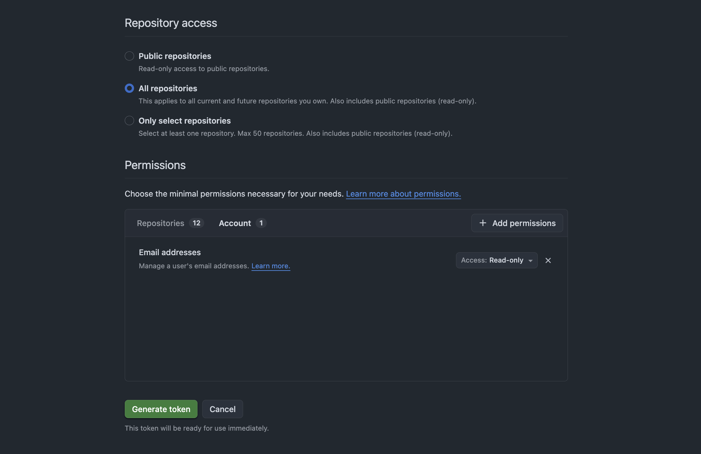
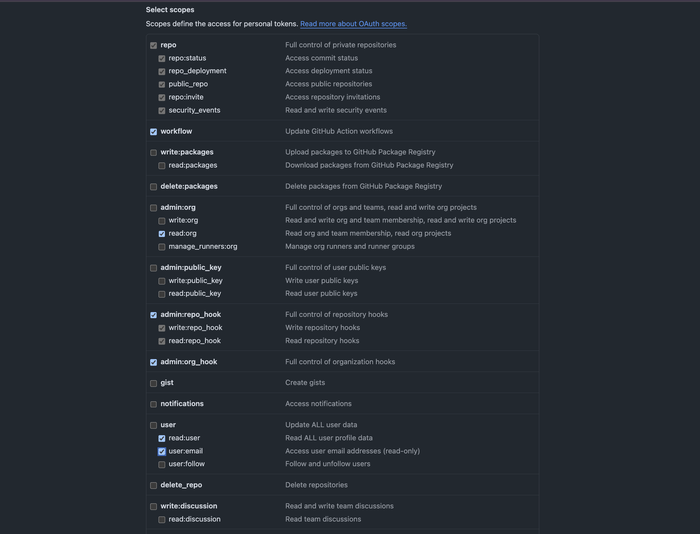

import Tabs from "@theme/Tabs";
import TabItem from "@theme/TabItem";
import InstallMethods from "./_install_methods.mdx";
import GithubAppManualSetupContent from "./_custom_github_app_content.mdx";
import OceanHostedByPortViaPortUi from "/docs/build-your-software-catalog/sync-data-to-catalog/templates/_ocean_hosted_by_port_via_port_ui.mdx";
import GithubAppViaPortRedirectContent from "./_github_app_via_port_redirect_content.mdx";

# Installation

This page details how to install Port's GitHub integration (powered by the Ocean framework).

This page helps you choose an authentication method and then deploy the integration using the installation method that fits your setup.

## Prerequisites

- A GitHub account with permissions to create access tokens.
- Your Port user role is set to `Admin`.

## Choose authentication method

<Tabs groupId="github-ocean-auth" queryString="auth">

<TabItem value="github-app-wizard" label="GitHub App (via Port)" default>

You can create and install a GitHub App directly from Port’s UI using OAuth. This is the recommended approach as it streamlines the entire setup process.

:::info Hosted by Port only
The **GitHub App (via Port)** setup is available **only** as a **Hosted by Port** installation.

**Hosted by Port** means Port runs and manages the integration for you (no Kubernetes/Docker/CI deployment on your side).
:::

<OceanHostedByPortViaPortUi
  dataSourceName="Github"
  redirectContent={<GithubAppViaPortRedirectContent />}
/>

</TabItem>

<TabItem value="pat" label="Personal access token (PAT)">

A Personal Access Token (PAT) is suitable if you are the only one managing the integration and you do not need frequent credential rotation.

To create a PAT, see GitHub’s [managing your personal access tokens](https://docs.github.com/en/authentication/keeping-your-account-and-data-secure/managing-your-personal-access-tokens).

The token must belong to a user with access to the relevant GitHub resources (e.g., repositories, teams) across all organizations you want to sync.

You will use this token as the `githubToken` parameter when deploying the integration below.

<details>
<summary><b>Required permissions (click to expand)</b></summary>
  
This section focuses on the permissions you need to grant (fine-grained PAT vs classic PAT).

<h3>Fine-grained PAT</h3>

To configure permissions for a fine-grained PAT:

- Choose the **resource owner** (organization/user).
  

- Under **Repository access**, choose **All repositories** or **Only select repositories** (and select the relevant repositories).
- **Repositories permissions**:
    - **Actions**: Read-only.
    - **Administration**: Read-only (for syncing repository teams and collaborators).
    - **Code scanning alerts**: Read-only.
    - **Contents**: Read-only (for reading files).
    - **Dependabot alerts**: Read-only.
    - **Deployments**: Read-only.
    - **Environments**: Read-only.
    - **Issues**: Read-only.
    - **Metadata**: Read-only.
    - **Pull requests**: Read-only.
    - **Secret scanning alerts**: Read-only.
    - **Webhooks**: Read and write *(personal accounts only — required to create repository webhooks).*
    
    

- **Organization permissions** (when the resource owner is an organization):
  - **Members**: Read-only (for syncing users and teams).
  - **Administration**: Read-only (for syncing external identities).
  - **Webhooks**: Read and write *(organizations only — required to create organization webhooks).*
    

- **Account permissions** (when the resource owner is a personal account):
  to grant the permissions below.
  - **Email addresses**: Read-only (only if you want to ingest user email addresses).
    

<h3>Classic PAT</h3>

Select the following scopes for classic PAT:
   - `repo`
   - `repo_deployment`
   - `public_repo`
   - `security_events`
   - `workflow`
   - `read:org`
   - `admin:repo_hook` *(required if you intend syncing a personal account — used to create repository webhooks).*
   - `admin:org_hook`
   - `read:user`
   - `user:email`
  
   

</details>

<InstallMethods setupName="classic" showUseCustomSettingsStep />

<h2>Multi GitHub organization support</h2>

Starting from **version 3.0.0-beta**, the GitHub integration supports syncing data from multiple GitHub organizations when you use a classic PAT.

- **Supported credentials**: Multi-organization support is available only when you authenticate using a classic PAT.
- **Multi-organization setup**: Set `organizations: ["org1", "org2", "org3"]` in your mapping.
- **All organizations setup**: If `organizations` is not specified, the integration syncs all organizations the classic PAT has access to.

<details>
<summary><b>Multi-organization mapping example (click to expand)</b></summary>

```yaml showLineNumbers
deleteDependentEntities: true
createMissingRelatedEntities: true
enableMergeEntity: true
organizations:
  - org1
  - org2
# ... rest of your mapping (repositoryType, resources, etc.) ...
```

</details>

**Precedence:**

If `githubOrganization` is set in the environment variables or config and `organizations` are also listed in the Port mapping, the integration prioritizes single-organization behavior and syncs only the `githubOrganization`.

**Performance considerations:**

Syncing multiple organizations increases the number of API calls to GitHub and may slow down the integration. The more organizations you sync, the longer the resync time and the higher the API rate limit consumption.

</TabItem>

<TabItem value="custom-github-app" label="Custom GitHub App">

Use this option if you want GitHub App authentication but you prefer to create and install your own GitHub App (for example, for advanced setups or self-hosted deployments).

<GithubAppManualSetupContent />

<InstallMethods setupName="app" />

</TabItem>

</Tabs>

## Configure parallel processing

Configure multiple workers to handle GitHub webhook events in parallel groups, preventing race conditions while maintaining event ordering for related resources.

Starting with Ocean 0.27, a new parameter was added to the configuration, which adjusts the number of async workers spawned for webhook events.

Set `event_workers_count: 4` in your config (default: 1) to enable parallel group processing.

When `event_workers_count > 1`, related GitHub events get grouped together:

- All PR events (opened, review, status) for PR #123 → same processing group.
- All issue events for issue #456 → same processing group.
- Push events grouped by commit SHA.

<details>
<summary><b>Event grouping behavior (click to expand)</b></summary>
  
**Supported event types:**
- **Pull requests**: Grouped by PR number (`pull_request`, `pull_request_review`, `pull_request_review_comment`).
- **Issues**: Grouped by issue number (`issues`, `issue_comment`).
- **Pushes**: Grouped by commit SHA (`push`).
- **Releases**: Grouped by release ID (`release`).
- **Workflow runs**: Grouped by run ID (`workflow_run`).
- **Status checks**: Grouped by commit SHA (`status`).
  
**Fallback**: If the event type is not recognized, the payload will be scanned for the first `number`, `id`, or `sha` field.

:::note Processing guarantees
Events within the same group are processed sequentially to maintain order and prevent conflicts.
Different groups can be processed in parallel across workers.
With `event_workers_count: 1`, all events are processed sequentially using a simple queue.
:::

</details>

