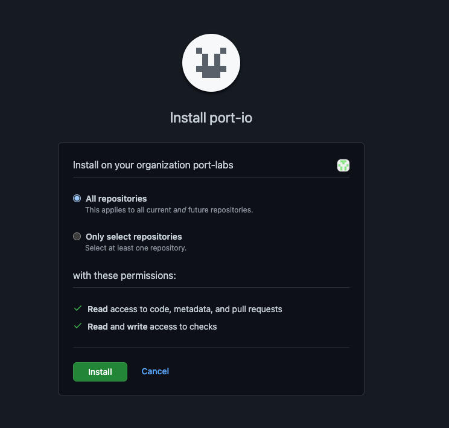

import FindCredentials from "/docs/build-your-software-catalog/custom-integration/api/\_template_docs/\_find_credentials.mdx"

# Self Hosted Installation

:::note Prerequisites

- A registered organization in Port;
- Your Port user role is set to `Admin`.

:::

In organizations that have a self-hosted GitHub installation there is no access to our official public app, therefore there are some extra steps you need to take to install the GitHub app:

1. [Register](#register-ports-github-app) Port's GitHub app in your GitHub organization;
2. [Deploy](#deployment) Port's GitHub app Docker image inside your VPC;
3. [Install](#installing-ports-github-application) Port's GitHub app in your GitHub organization and on select repositories.

## Register Port's GitHub App

1. Navigate to your organization inside your self-hosted GitHub and click on Settings:


2. Inside the settings view, click on Developer Settings -> and then select GitHub Apps:


3. Click on "New GitHub App":


4. Insert the following properties:

- **GitHub App name:** port.io
- **Homepage URL:** https://getport.io
- **Setup URL:** https://app.getport.io
- **Webhook URL:** HTTP Server URL, if you don't yet know the value of this step, leave it blank until you deploy the GitHub backend
- **Webhook secret:** Webhook secret (Any string you would like)
- **Repository Permissions:**
  - Actions: Read and Write (for executing self-service action using GitHub workflow)
  - Checks: Read and Write (for validating `Port.yml`)
  - Contents: Readonly (for reading port configuration files and repository files)
  - Metadata: Readonly
  - Issues: Readonly
  - Pull Request: Read and Write
  - Dependabot alerts: Readonly
  - Administration: Readonly (for syncing github teams)
- **Organization Permissions:**
  - Members: Readonly (for syncing github teams)
- **Repository Events** (required to receive webhook changes from GitHub):
  - Issues
  - Pull Request
  - Push
  - Workflow Run
  - Team
  - Dependabot alerts

Then select "Create GitHub App"

5. Go to the settings of the created GitHub App and generate a private key and save the downloaded file:


Keep the file, you will need it for the deployment step.

## Deployment

:::note Prerequisites

You will need your Port `ORG_ID`, `CLIENT_ID` and `CLIENT_SECRET`.

<FindCredentials/>

:::

In order to make use of [Self-Service Actions using GitHub Workflow](../../../../actions-and-automations/setup-backend/github-workflow/github-workflow.md), please contact us at support@getport.io.

## Docker

To use our GitHub app you will need to deploy our official GitHub app docker image on your VPC.

It can be deployed on any platform that allows deploying images as containers such as: K8S, ECS, AWS App Runner, etc.

You can pull the Docker image by running:

```bash showLineNumbers
docker pull ghcr.io/port-labs/port-self-hosted-github-app:0.16.7
```

Run the following command to start the app:

```bash showLineNumbers
docker run \
  -e APP_ID=<APP_ID from register step> \
  -e WEBHOOK_SECRET=<WEBHOOK_SECRET from previous step> \
  -e GHE_HOST=<GITHUB BASE HOST, ie github.compay.com> \
  -e PORT=<Any PORT> \
  -e PORT_URL=https://api.getport.io \
  -e PORT_ORG_ID=<ORG_ID> \        #For self service actions, requires a Kafka topic
  -e PORT_CLIENT_ID=<CLIENT_ID> \
  -e PORT_CLIENT_SECRET=<CLIENT_SECRET> \
  -e PRIVATE_KEY=<BASE 64 PRIVATEKEY> \
  -p <PORT>:<PORT> \
  ghcr.io/port-labs/port-self-hosted-github-app:0.16.7
```

| Env variable         | Description                                                                         |
|----------------------|-------------------------------------------------------------------------------------|
| `APP_ID`             | Application ID, you can find it in the edit GitHub App page                         |
| `WEBHOOK_SECRET`     | The same string that was used to register the application in the previous step      |
| `GHE_HOST`           | Your organization's self-hosted GitHub hostname                                     |
| `PORT`               | The port that the GitHub App will listen to                                         |
| `PORT_URL`           | Port's API Base URL                                                                 |
| `PORT_ORG_ID`        | Your Port org id (For self service actions, requires a Kafka topic)                 |
| `PORT_CLIENT_ID`     | Port client id for interacting with the API                                         |
| `PORT_CLIENT_SECRET` | Port client secret for interacting with the API                                     |
| `PRIVATE_KEY`        | A base64 encoded private key. You can use a tool like https://www.base64encode.org/ |

## Health check route

A health check is a route that is used to check the health of a repository. It is a means to ensure that the service is running properly and can perform its intended function.

Our GitHub App image exposes a health check route at `https://host:port/health` to monitor its status.

## Installing Port's GitHub application

After you have the app registered in your organization and the Docker is up and running, you can install the app and select the repositories to integrate it with:

1. First, navigate to your organization inside your self-hosted GitHub and click on Settings:


2. Inside the settings view, click on Developer Settings -> and then select GitHub Apps:


3. Click `edit` on the GitHub app created at the step before:


4. Go to Install App -> and select the installation button on your wanted organization;

5. Choose the repositories you want the app to be installed for:



## Limitations

As this is a self-hosted version, there are some limitations due to security considerations and the fact that we don't have access to your GitHub instance

- The configuration must be included as part of the repository, and cannot be configured via Port's UI/API. Refer to the [GitHub Configuration](https://docs.port.io/build-your-software-catalog/sync-data-to-catalog/git/github/?method=github#configuration) for more details.

- To use self-service actions, you will need [Kafka Credentials](/actions-and-automations/setup-backend/webhook/kafka/kafka.md) configured for your organization;
