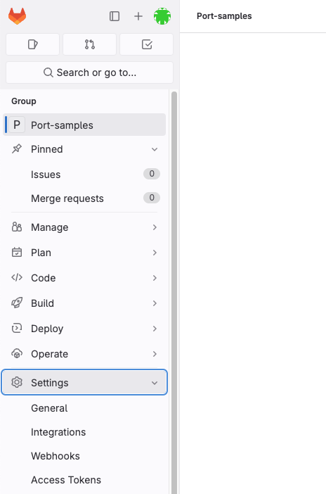
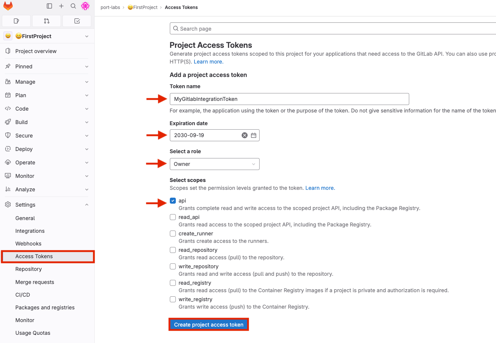
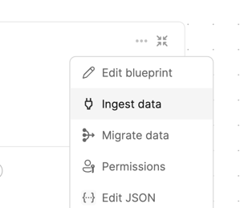
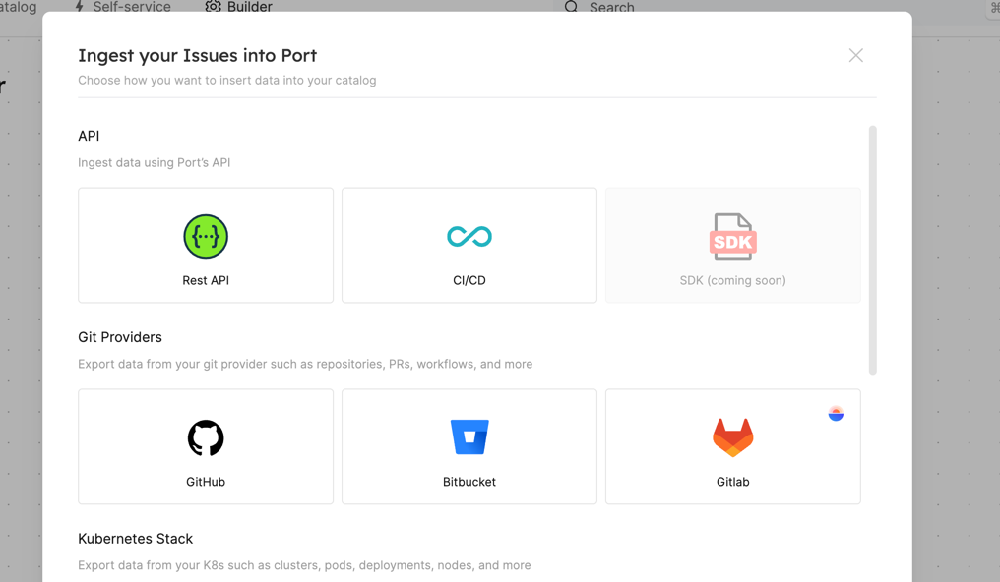

# Installation

:::note Prerequisites

- A gitlab account with admin privileges;
- A gitlab group account with `api` privileges (Refer to the [permissions](./gitlab.md#permissions) section for more information);
- A kubernetes cluster to install the integration on;
- Your Port user role is set to `Admin`.

:::

1. Sign in to GitLab and go to your desired group's settings:

   

2. In the "Access Tokens" section, click "Create access token":

   

3. Fill in the token details: name, expiration (optional), and select `api` scope;
4. Click "Create group access token";
5. Copy the generated token and use it when deploying the integration in the following steps;
6. Click the ingest button in Port Builder Page for the blueprint you want to ingest using GitLab:

   

7. Select GitLab under the Git providers category:

   

8. Copy the helm installation command and set the missing parameters:

   ### tokenMapping

   The GitLab integration support fetching data related to specific paths in your GitLab groups. The integration is also able to fetch data from different GitLab parent groups by providing additional group tokens. In order to do so, you need to map the desired paths to the relevant access tokens.
   The `tokenMapping` parameter supports specifying the paths that the integration will search for files and information in, using [globPatterns](https://www.malikbrowne.com/blog/a-beginners-guide-glob-patterns)[].
   Example: `{"*/MyFirstGitLabProject/**": "<MY_FIRST_GIRLAB_PROJECT_GROUP_TOKEN>", "*/MySecondGitLabProject/*": "<MY_SECOND_GIRLAB_PROJECT_GROUP_TOKEN>"}`

   #### appHost

   In order for the GitLab integration to update the data in Port on every change in the GitLab repository, you need to specify the `appHost` parameter.
   The `appHost` parameter should be set to the `url` of your GitLab integration instance. In addition, your GitLab instance (whether it is GItLab SaaS or a self-hosted version of GitLab) needs to have the option to send webhook requests to the Gitlab integration instance, so please configure your network accordingly.

9. Run the helm command with the updated parameters to install the integration in your Kubernetes cluster.

## Self-hosted GitLab

In case you are using a self-hosted GitLab instance, you need to add the following line to your helm installation command:

```bash
	--set integration.config.gitlabHost="https://you-gitlab-url"
```
