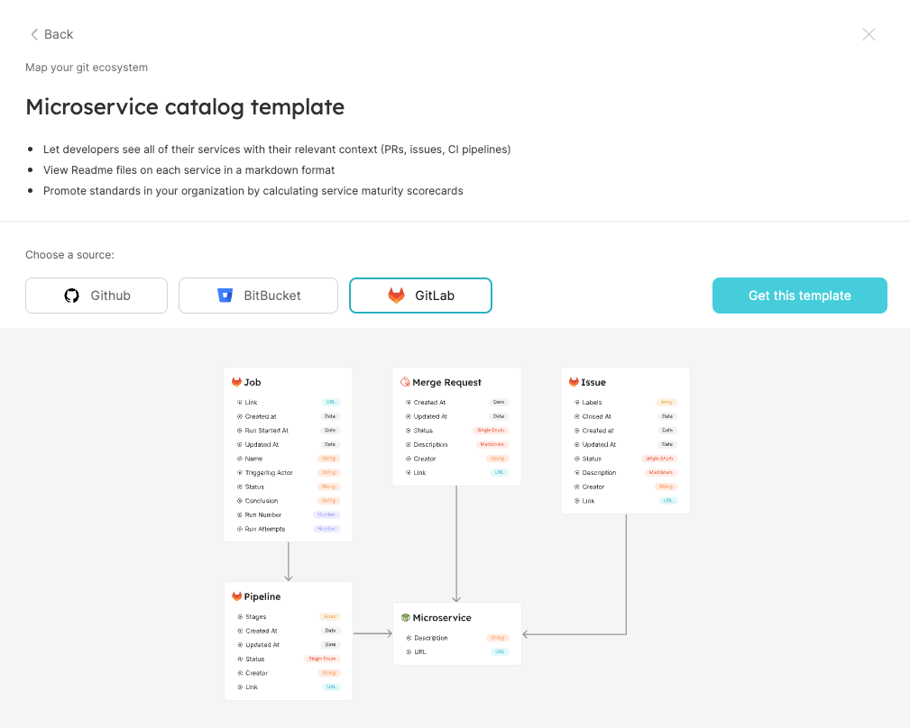

# Installation

## Prerequisites

- A registered organization in Port;
- Your Port user role is set to `Admin`;
- A GitLab `group access token`, the token requires the following roles and scopes:
  - **Role:** Owner;
  - **Scopes:** api;
- Your `Group ID` in GitLab

:::note
In case a GitLab group has subgroups, the parent group's access token can be used to ingest information from the subgroups.
:::

## Installation

1. Head to [Port](https://app.getport.io/dev-portal) and look at the DevPortal Builder page.
2. At the top right corner click the `Add` button and then click `Choose from template`.

   

3. In the template center choose `Map your git ecosystem`.

   

4. Select `GitLab` and click on the `Get this template` button.

   
   In the background, Port will create the relevant [blueprints](../../../define-your-data-model/setup-blueprint/setup-blueprint.md) and [webhook](../../webhook/webhook.md) configurations for the GitLab integration.

5. A codeblock will appear with commands that you need to run in order to setup the integration in GitLab:

   

   The following parameters will be filled automatically by Port:

   - `PORT_CLIENT_ID` - your client ID;
   - `PORT_CLIENT_SECRET` - your client secret;

     You will need to fill in the following parameters:

   - `GITLAB_API_TOKEN` - Your `group access token` from the [prerequisites](#prerequisites);

     In case you are using a self-hosted installation of GitLab, you will also need to fill in the following parameter:

   - `GITLAB_API_URL` - the URL to your GitLab installation (for example, `https://gitlab.getport.io`);

     For each group you can define which projects will be exported to Port catalog.
     Port will get only merge requests, issues, pipeline etc... of the defined project.

   - `GROUPS_TO_REPOS` - A Projects to group mapping

   :::tip
   The complete commands required to run the script are provided here as reference:

   ```bash showLineNumbers
   export PORT_CLIENT_ID="YOUR_CLIENT_ID"
   export PORT_CLIENT_SECRET="YOUR_CLIENT_SECRET"

   # Please enter your GitLab API token and group ID here
   export GITLAB_API_TOKEN=""
   # If your GitLab installation is self-hosted, please enter your GitLab URL here
   # For example - https://gitlab.getport.io
   # If you are using https://gitlab.com, do not edit this field
   export GITLAB_API_URL=""

   # A comma-separated list of projects per group to bring into the catalog
   # For example - "GroupName1:Project1,Project2;GroupName2:*;"
   # GROUPS_TO_REPOS="GroupName:*;" means all projects in the group "GroupName"
   # GROUPS_TO_REPOS="*" means all projects in all groups
   export GROUPS_TO_REPOS="*"

   curl -s https://raw.githubusercontent.com/port-labs/template-assets/main/gitlab/install.sh | bash
   ```

   :::

6. Run the bash commands and that it, you're done!

   Existing repositories (projects), merge requests and other GitLab objects will be mapped as Port entities. In addition, a [GitLab webhook](https://docs.gitlab.com/ee/user/project/integrations/webhooks.html) will be configured, so every update to GitLab objects tracked by the integration will be reflected in Port (for example - new projects, updates to merge requests and more).
