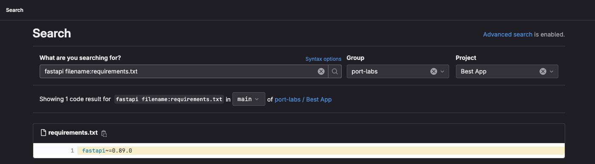
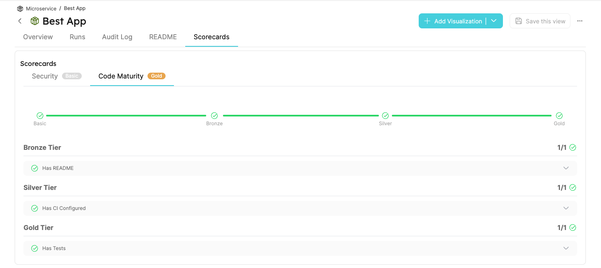

import RepositoryBlueprint from './\_gitlab_exporter_example_repository_blueprint.mdx'

# Mapping Extensions

## Introduction

The default way to map your data to Port is by using [JQ JSON processor](https://stedolan.github.io/jq/manual/) to map and transform your data to Port entities.

However, in some cases you may want to map data to Port in a way that default JQ mapping is not enough.

Possible Use Cases:

- Map your repository README.md file contents into Port;
- Check if a specific file exists in your repository;
- Check if a specific string exists in your repository;
- Check if a specific version of a package is used in your repository;
- Check if a CI/CD pipeline is configured in your repository;

## Mapping file content into Port

In the following example you will define and export your GitLab projects and their **README.md** file contents to Port:

<RepositoryBlueprint/>

As we can see one of the properties is of type markdown, this means that we need to map the **README.md** file contents into Port.

To do so, we will use the `file://` prefix with the path of the file to tell the GitLab exporter that we want to map the contents of a file into Port.

```yaml showLineNumbers
  - kind: project
    selector:
      query: "true"
    port:
      entity:
        mappings:
          identifier: .path_with_namespace | gsub(" "; "")
          title: .name
          blueprint: '"service"'
          properties:
            url: .web_url
            // highlight-next-line
            readme: file://README.md
            description: .description
            namespace: .namespace.name
            fullPath: .namespace.full_path
            defaultBranch: .default_branch
```

## Search checks

We can use the GitLab exporter to perform search checks on our repositories to ensure that they are compliant with our organization's policies and standards.

With Port Scorecards and the search checks feature, organization can define a set of checks that will be performed on each repository, and the results of those checks will be reflected in the repository's scorecard in Port which will help the organization to identify repositories that are not compliant with the organization's policies and standards.

### How it works

The search checks are performed using the [GitLab Advanced Search API](https://docs.gitlab.com/ee/api/search.html).

This means that any search query supported by the GitLab Search API can be used with the GitLab exporter.

### Syntax

- `search://scope=<scope>&&query=<query>`
  - `search://` - This ist the prefix to indicate that the mapping is a search check;
  - `scope` - The scope of the search, currently only `blobs` are supported (searches in the repository files) (see [GitLab Search API](https://docs.gitlab.com/ee/api/search.html#scope) for more details);
  - `query` - The query to search for, expected to be a valid GitLab Advanced Search query (see [GitLab Advanced Search syntax](https://docs.gitlab.com/ee/user/search/advanced_search.html#syntax) for more details).

### Search Checks Examples

- `search://scope=blobs&&query=filename:README.md` - Check whether the project contains a `README.md` file;
- `search://scope=blobs&&query=filename:test_* extension:py` - Check whether the project contains tests;
- `search://scope=blobs&&query=filename:".gitlab-ci.yml` - Check whether the project has gitlab CI configured;
- `search://scope=blobs&&query=fastapi filename:requirements.txt` - Check whether the project uses fastapi in the `requirements.txt` file;

  In the screenshot below we can see that we use the exact same query as gitlab advanced search
  

### Integration Config Example

```yaml showLineNumbers
  - kind: project
    selector:
      query: 'true'
    port:
      entity:
        mappings:
          identifier: .path_with_namespace | gsub(" "; "")
          title: .name
          blueprint: '"service"'
          properties:
            url: .web_link
            description: .description
            namespace: .namespace.name
            fullPath: .namespace.full_path
            defaultBranch: .default_branch
            readme: file://README.md
            // highlight-start
            hasLicense: search://scope=blobs&&query=filename:"LICENSE"
            usingFastapiPackage: search://scope=blobs&&query=fastapi filename:requirements.txt
            hasCI: search://scope=blobs&&query=filename:.gitlab-ci.yml
            usingOldLoggingPackage: search://scope=blobs&&query=logging extension:py
            hasTests: search://scope=blobs&&query=filename:test_* extension:py
            // highlight-end
```

Example of a Scorecard that reflects the results of the search checks:


