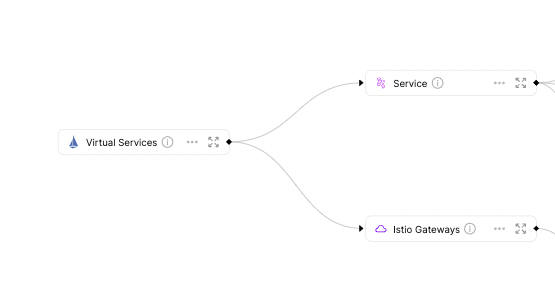

# Istio

[Istio](https://istio.io/latest/docs/setup/getting-started/) is an open-source service mesh that provides a uniform way to connect, manage, and secure microservices.

:::info
The files to this Exporter Template can be found **[here](https://github.com/port-labs/port-k8s-exporter-use-cases/tree/main/istio)**
:::

Using this template, you can easily create `gateway` and `virtualServices` Blueprints, and configure your K8s exporter to query your Istio resources.

:::note
Blueprints created in this template define Relations to Blueprints which are referenced in the [Full Kubernetes Exporter](../../../../complete-use-cases/full-kubernetes-exporter.md) docs.

Specifically the Blueprints in this example are related to the [service](https://github.com/port-labs/k8s-exporter-example/blob/main/terraform/Service.tf) and [namespace](https://github.com/port-labs/k8s-exporter-example/blob/main/terraform/Namespace.tf) Blueprints.

:::

