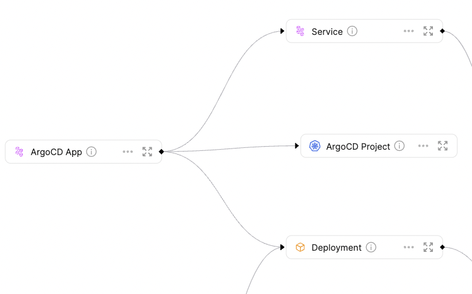

# ArgoCD

An ArgoCD application is an Argo CRD which is responsible for managing different k8s objects, while an ArgoCD project is an Argo CRD which clusters applications.

:::info
You can find the files to this exporter template **[here](https://github.com/port-labs/port-k8s-exporter-use-cases/tree/main/argocd)**
:::

Using this template, you can easily create `argocdApp` and `argocdAppProject` Blueprints, and configure your K8s exporter to query your ArgoCD resources.

:::note
Blueprints created in this template define Relations to Blueprints which are referenced in the [Full Kubernetes Exporter](../../../../complete-use-cases/full-kubernetes-exporter.md) docs.

Specifically the Blueprints in this example are related to the [service](https://github.com/port-labs/k8s-exporter-example/blob/main/terraform/Service.tf) and [deployment](https://github.com/port-labs/k8s-exporter-example/blob/main/terraform/Deployment.tf) Blueprints.

This template covers ArgoCD applications with Relations to deployments and services, like ArgoCD's [Getting Started](https://argo-cd.readthedocs.io/en/stable/getting_started/) application `guestbook-ui`.
:::

