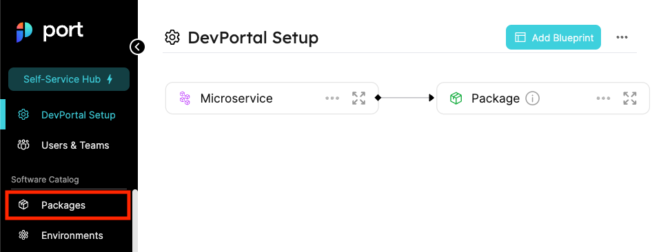
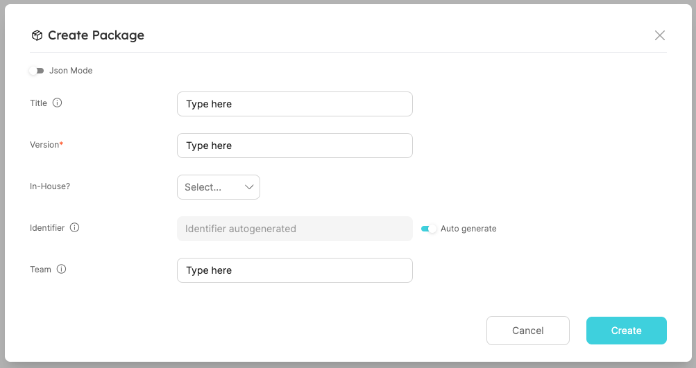
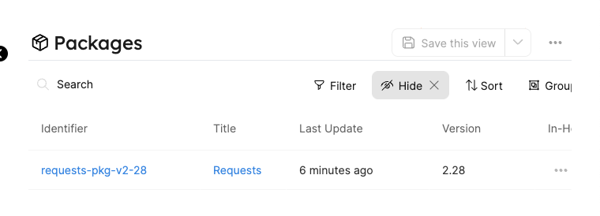
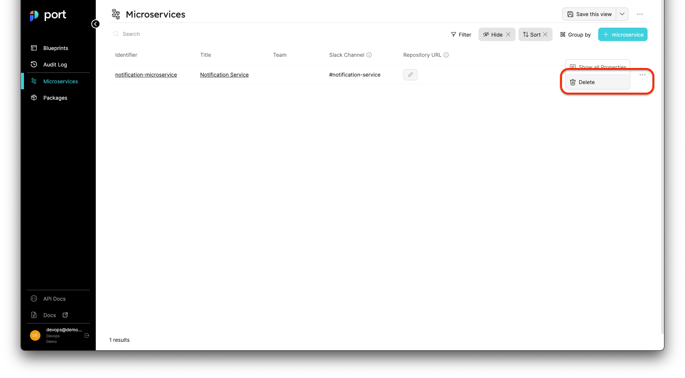

import Tabs from "@theme/Tabs"
import TabItem from "@theme/TabItem"

# Entity Tutorial

## Create entities

There are 2 methods to create entities:

- UI; or
- API.

:::note
An entity page will be created upon the creation of a new entity.
:::

### From the UI

To create an entity from the UI, go to the page that matches the Blueprint you want to add an entity to. You can find the pages list in the sidebar on the left side of Port's UI.

First go to the `Microservices` page:



To create a new `package` click the `+ Package` button:


A UI form will open with the properties we created for the `microservice` blueprint:



#### Creating with the JSON editor

Every entity has a format similar to the one we explained in the [Understanding the structure of an entity](./understand-entities-structure.md#entity-json-structure), which is viewable via the _JSON mode_ button. In order to create your first `package`, paste in the following content:

```json showLineNumbers
{
  "identifier": "requests-pkg-v2-28",
  "title": "Requests",
  "team": "",
  "blueprint": "package",
  "properties": {
    "version": "2.28",
    "inHouse": false
  },
  "relations": {}
}
```

### From the API

:::note
Remember that an access token is needed to make API requests, refer back to [Getting an API token](../../sync-data-to-catalog/api/get-api-token.mdx) if you need to generate a new one.
:::

#### Creating an entity

Let's create a new `package` using the API. Our entity is based on the `package` blueprint structure.

Our first step will be to make a POST request to the URL `https://api.getport.io/v1/blueprints/{blueprint_identifier}/entities`.

:::tip
Note that the URL should contain the blueprint’s identifier, in this case - `package`.
:::

<Tabs groupId="code-examples" defaultValue="python" values={[
{label: "Python", value: "python"},
{label: "Javascript", value: "javascript"},
{label: "cURL", value: "curl"}
]}>

<TabItem value="python">

```python showLineNumbers
# Dependencies to install:
# $ python -m pip install requests

# the access_token variable should already have the token from the previous example

import requests

API_URL = 'https://api.getport.io/v1'

headers = {
    'Authorization': f'Bearer {access_token}'
}

blueprint_id = 'package'

entity = {
  'identifier': 'requests-pkg-v2-28',
  'title': 'Requests',
  'team': '',
  'properties': {
    'version': '2.28',
    'inHouse': False
  },
  'relations': {}
}

response = requests.post(f'{API_URL}/blueprints/{blueprint_id}/entities', json=entity, headers=headers)

# response.json() contains the content of the resulting entity

```

</TabItem>

<TabItem value="javascript">

```javascript showLineNumbers
// Dependencies to install:
// $ npm install axios --save

// the accessToken variable should already have the token from the previous example

const axios = require("axios").default;

const API_URL = "https://api.getport.io/v1";

const blueprintId = "package";

const config = {
  headers: {
    Authorization: `Bearer ${accessToken}`,
  },
};

const entity = {
  identifier: "requests-pkg-v2-28",
  title: "Requests",
  team: "",
  properties: {
    version: "2.28",
    inHouse: false,
  },
  relations: {},
};

const response = await axios.post(
  `${API_URL}/blueprints/${blueprintId}/entities`,
  entity,
  config
);

// response.data contains the content of the resulting entity
```

</TabItem>

<TabItem value="curl">

```bash showLineNumbers
# the access_token variable should already have the token from the previous example

blueprint_id='package'

curl --location --request POST "https://api.getport.io/v1/blueprints/${blueprint_id}/entities" \
	--header "Authorization: Bearer $access_token" \
	--header "Content-Type: application/json" \
	--data-raw "{
    \"identifier\": \"requests-pkg-v2-28\",
    \"title\": \"Requests\",
    \"properties\": {
            \"version\": \"2.28\",
            \"inHouse\": false
    }
}"

# The output of the command contains the content of the resulting entity
```

</TabItem>

</Tabs>

You will have a new entity called `Requests` on the packages page:



## Update entities

You can change any mutable entity, and edit/delete its property values.

### From the UI

- Click the Pencil icon in each of the table columns;
- Click the `...` button at the right side of an Entity listing, then click `show all properties`.


### From the API

The API offers several methods to update an existing entity:

#### POST request

Make an **HTTP POST** request to the URL `https://api.getport.io/v1/blueprints/{blueprint_identifier}/entities?upsert=true`

This request with an `upsert` flag set to `true`, will update a matching entity, if one exists. If no matching entity is found, a new one will be created.

The request body is the same body inserted when creating a new entity, with the exception of an additional flag `upsert=true`.

The **POST** method supports the following query parameters:

| Parameter | Default value |
| --------- | ------------- |
| `upsert`  | `false`       |
| `merge`   | `false`       |

To understand the behavior of the `upsert` and `merge` parameters, refer to the following possible scenarios:

- `upsert=false` - create a new entity, or, fail if an entity with the provided identifier exists;
- `upsert=true & merge=false` - create a new entity, or, update an entity if one with the provided identifier exists (will override existing values with those provided in the request - equivalent to a PUT request);
- `upsert=true & merge=true` - create a new entity, or, update an entity if one with the provided identifier exists (will merge existing values with those provided in the request - equivalent to a PATCH request for each individual field provided).

#### PUT request

Make an **HTTP PUT** request to the URL `https://api.getport.io/v1/blueprints/{blueprint_identifier}/entities/{entity_identifier}`

A PUT request has the same body as a POST request and it will simply overwrite the entity if it exists. It will return an error code if the entity does not exist (based on identifier-match).

#### PATCH request

Make an **HTTP PATCH** request to the URL `https://api.getport.io/v1/blueprints/{blueprint_identifier}/entities/{entity_identifier}`

A PATCH request has a specific format that allows precise changes in an existing entity, for example:

To Edit a specific property, for example: `version`, send a PATCH request with the following body:

```json showLineNumbers
{ "properties": { "version": "2.29" } }
```

### Update entity identifier

There are two methods to change an entity's identifier:

#### From the UI

1. In either the matching Blueprint page or [entity page](../../../customize-pages-dashboards-and-plugins/page/entity-page.md), click the 3 dots (`...`) button and then click the `Edit` button;
2. Update the value of the `identifier` key to the new identifier;
3. Click `Update`.

#### PUT request

Make an HTTP PUT request to the URL `https://api.getport.io/v1/blueprints/{blueprint_identifier}/entities/{old_entity_identifier}` with the following JSON body:

```json showLineNumbers
{
  "identifier": "new_entity_identifier",
  ...ORIGINAL ENTITY DEFINITION
}
```

Entity definition JSON, after updating the value of the `identifier` key in the request body to the new identifier.

#### PATCH request

Make an HTTP PATCH request to the URL `https://api.getport.io/v1/blueprints/{blueprint_identifier}/entities/{old_entity_identifier}` with the following JSON body:

```json showLineNumbers
{
  "identifier": "new_entity_identifier"
}
```

### Remove Relations

#### From the API

The API offers several methods to remove the relations mapping from an existing entity:

:::note
If a blueprint's relation type is `"many": true` - by setting the specific Relation key to `null` on the entity, or sending an empty array (`[]`), the mapped related entities will be removed.
:::

##### POST request **(with upsert: true)**

Make a **HTTP POST** request to the URL `https://api.getport.io/v1/blueprints/{blueprint_identifier}/entities/{entity_identifier}?upsert=true`, for example:

To remove a mapped related entity from a `"many": true` relation (for example: `environment`), send a POST request with the following body:

```json showLineNumbers
{
  "identifier": "requests-pkg-v2-28",
  "title": "Requests",
  "team": "",
  "properties": {
    ...
  },
  "relations": {
    "environment": [/* All the relations identifiers except for the one you want to remove */]
  }
}
```

To remove a mapped related Entity from a `"many": false` relation (for example: `environment`), send a POST request with the following body:

```json showLineNumbers
{
  "identifier": "requests-pkg-v2-28",
  "title": "Requests",
  "team": "",
  "properties": {
    ...
  },
  "relations": {
    "environment": null
  }
}
```

##### PUT request

Make a **HTTP PUT** request to the URL `https://api.getport.io/v1/blueprints/{blueprint_identifier}/entities/{entity_identifier}`, for example:

To remove a mapped related entity from a `"many": true` relation (for example: `environment`), send a PUT request with the following body:

```json showLineNumbers
{
  "identifier": "requests-pkg-v2-28",
  "title": "Requests",
  "team": "",
  "properties": {
    ...
  },
  "relations": {
    "environment": [//All the relations identifiers but the one you want to remove]
  }
}
```

To remove a mapped related entity from a `"many": false` relation (for example: `environment`), send a PUT request with the following body:

```json showLineNumbers
{
  "identifier": "requests-pkg-v2-28",
  "title": "Requests",
  "team": "",
  "properties": {
    ...
  },
  "relations": {
    "environment": null
  }
}
```

##### PATCH request

Make a **HTTP PATCH** request to the URL `https://api.getport.io/v1/blueprints/{blueprint_identifier}/entities/{entity_identifier}`, for example:

To remove a mapped related entity from a `"many": true` relation (for example: `environment`), send a PATCH request with the following body:

```json showLineNumbers
{
  "relations": {
    "environment": [//All the relations identifiers but the one you want to remove]
  }
}
```

To remove a mapped related entity from a `"many": false` relation (for example: `environment`), send a PATCH request with the following body:

```json showLineNumbers
{
  "relations": {
    "environment": null
  }
}
```

## Delete entities

:::danger
An entity cannot be restored after deletion!
:::

To delete an entity you can:

- Click the `...` button at the right end of an entity listing, then click `Delete`.



- Make an **HTTP DELETE** request to the URL `https://api.getport.io/v1/blueprints/{blueprint_identifier}/entities/{entity_identifier}`

### Dependent entities deletion

When a relation is marked as `required: true`, target entities mapped with that relation are dependencies of the source. This means that deleting the target entities is only possible if the source entity is deleted alongside with it.

:::tip
To better understand the concept of dependent entities look at the following scenario:

The blueprints `A` and `B` have a **required** relation:
`A->B`

the entity `aEntity` has a target entity `bEntity` mapped to it using the above required relation.

In this scenario, `bEntity` can only be deleted in one of two cases:

1. `aEntity` is updated such that it's relation points to a different entity from blueprint `B`;
2. `aEntity` is deleted alongside `bEntity`;

:::

To perform the deletion of an entity alongside its dependents, make an **HTTP DELETE** request with the additional query parameter `delete_dependents=true`.

## Next steps

Now that we understand **entities**, we can start creating related entities to model our related data in the infrastructure!

:::tip
Remember that each entity has a page of its own, as seen in the [entity page section](../../../customize-pages-dashboards-and-plugins/page/entity-page.md).
:::

First, let's create another `package` entity.

From the UI or using the API create a `package` entity with the following details:

```json showLineNumbers
{
  "identifier": "sqlAlchemy_v1_4_39",
  "title": "SQL Alchemy v1.4.39",
  "properties": {
    "version": "1.4.39",
    "inHouse": false
  },
  "relations": {}
}
```

Now, let's create a `microservice` entity (Either from the `microservice` page or using Port's API) that uses the `package` entities. Create a `microservice` entity with the following details:

```json showLineNumbers
{
  "identifier": "notification-microservice",
  "title": "Notification Service",
  "properties": {
    "repoUrl": "https://www.github.com/User/notification",
    "slackChannel": "#notification-service"
  },
  "relations": {
    "packages": ["requests-pkg-v2-28", "sqlAlchemy_v1_4_39"]
  }
}
```

:::note
Since `microservice` is **Related** to `package` when creating a new package we will see an additional field(s) representing the relation(s).

- When a Relation is configured `many = false` - selecting a related entity is done according to the entity title (via the UI), or according to the entity identifier (via the JSON editor);
- When a Relation is configured `many = true` - selecting related entities will open up a new JSON editor with an array format where you can type in the identifiers of the related entities.

:::

The result is a `microservice` entity that has 2 different `package` entities related to it:


