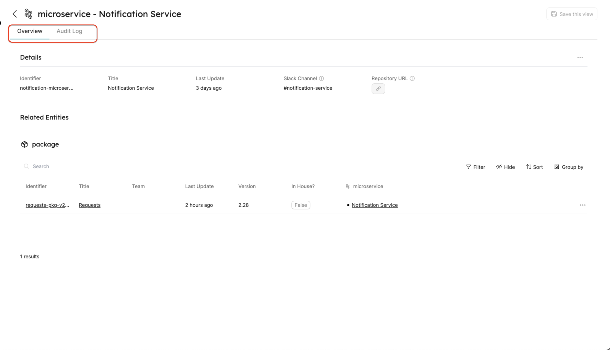

# 🏢 Understand entities structure

## What is an Entity?

An Entity is an object that matches the type defined by a Blueprint, and it represents the data of the software components which is defined by the Blueprint properties.

## Entity JSON structure

This is the basic structure of an Entity:

```json showLineNumbers
{
  "identifier": "unique-ID",
  "title": "Title",
  "team": "",
  "blueprint": "blueprintName",
  "properties": {
    "property1": "",
    "property2": ""
  },
  "relations": {}
}
```

---

## Structure table

| Field        | Type     | Description                                                                                                                                                                                                                                                               |
| ------------ | -------- | ------------------------------------------------------------------------------------------------------------------------------------------------------------------------------------------------------------------------------------------------------------------------- |
| `identifier` | `String` | Unique identifier. <br /> Note that while the identifier is unique, it [can be changed](./tutorial.md#update-entity-identifier) after creation.                                                                                                                           |
| `title`      | `String` | Entity name that will be shown in the UI.                                                                                                                                                                                                                                 |
| `team`       | `Array`  | **Optional Field.** An array of the associated teams. Only available teams can be added. <br /> Note that group permissions are handled according to this array, see [Teams and ownership](#teams-and-ownership).                                                         |
| `blueprint`  | `String` | The name of the [Blueprint](../../define-your-data-model/setup-blueprint/setup-blueprint.md) that this Entity is based on.                                                                                                                                                |
| `properties` | `Object` | An object containing key-value pairs, where each key is a property **as defined in the Blueprint definition**, and each value applies the `type` of the property.                                                                                                         |
| `relations`  | `object` | An object containing key-value pairs.<br /> Each key is the identifier of the [Relation](../../define-your-data-model/relate-blueprints/relate-blueprints.md) that is defined on the blueprint.<br /><br />See more in the [Related entities](#related-entities) section. |

#### Teams and ownership

:::info teams and ownership
The `team` key defines ownership over an Entity and controls who can modify or delete an existing Entity.

To Explore more about Ownership in Port see our [Permissions](../../../sso-rbac/rbac/rbac.md) section.
:::

## Example

<details>
<summary> A microservice entity </summary>
In this example, you can see how a `microservice` Entity is defined:

```json showLineNumbers
{
  "identifier": "my-service",
  "title": "My Service",
  "team": "Infra",
  "blueprint": "microservice",
  "properties": {
    "repo-link": "https://github.com/port-labs/my-service",
    "health-status": "Ready"
  },
  "relations": {}
}
```

:::note
This Entity is based on the following Blueprint definition:

```json showLineNumbers
{
    "identifier": "microservice",
    "title": "microservice",
    "icon": "Microservice",
    "calculationProperties": {},
    "schema": {
        "properties": {
            "repo-link": {
                "type": "string",
                "format": "url"
                "title": "Repo URL"
            },
            "health-status": {
                "type": "string",
                "enum": [
                        "Ready",
                        "Down"
                ],
                "title": "Service Health Status"
            }
        },
        "required": [
            "repo-link"
        ]
    }
}
```

:::

</details>

## Related entities

When two Blueprints are connected, creating an Entity of the `source` Blueprint will show an additional option - a `Relation`.

This option is shown under the `relations` section as follows:

### Entity Relation example - `many = false`

When a Relation between Blueprints is configured with `many = false`, you can add a Relation to an Entity by adding the `relationIdentifier` as key, and the `relatedEntityIdentifier` as value:

```json showLineNumbers
"relations": {
    "relation-identifier": "relatedEntityIdentifier"
}
```

### Entity Relation example - `many = true`

When a Relation between Blueprints is configured with `many = true`, you can add a Relation to an Entity by adding the `relationIdentifier` as key, and an array of `relatedEntityIdentifier`(s) as value:

```json showLineNumbers
"relations": {
    "relation-identifier": ["relatedEntityIdentifier1", "relatedEntityIdentifier2"]
}
```

:::tip
Click for more details about [**relations**](../../define-your-data-model/relate-blueprints/relate-blueprints.md).
:::

### Relation mapping example

Let's assume we have a Relation between the `deployment` and `microservice` Blueprints named `microservice`.

One of our microservices is called `Notification Service` with the identifier `notificationService`.

In order to map this `microservice` to our `notificationServiceDeploymentV1` `deployment` we will use the following `relations` key (In the `notificationServiceDeploymentV1` Entity JSON):

```json showLineNumbers
"relations": {
    "microservice": "notificationService"
}
```

Specifying the `notificationService` under the Relation maps the connection between our `notificationServiceDeploymentV1` Entity and the `notificationService` Entity, so that when you view the `notificationServiceDeploymentV1` entity you will also see the related `notificationService` entity.

In addition, you will be able to use [Mirror Properties](../../define-your-data-model/setup-blueprint/properties/mirror-property/mirror-property.md) to map additional properties from the `microservice` Blueprint to the `deployment` Entity

## Entity page

Each Entity has a specific page that contains two tabs (by default).

The first tab is the `Overview` tab, which shows two widgets: the Entity details and a table(s) of its related Entity(ies). The second tab is an `Audit Log` tab that contains a full-page table widget.

:::note Relations within an entity page
**Related entities** of an Entity are presented on the Entity page as a list of table widgets containing the related Entity(ies) data.
:::



## Next Steps

[Explore How to Create, Edit, and Delete Entities with basic examples](./tutorial)

[Dive into advanced operations on Entities with our API ➡️ ](../../../api-reference/api-reference.mdx)
