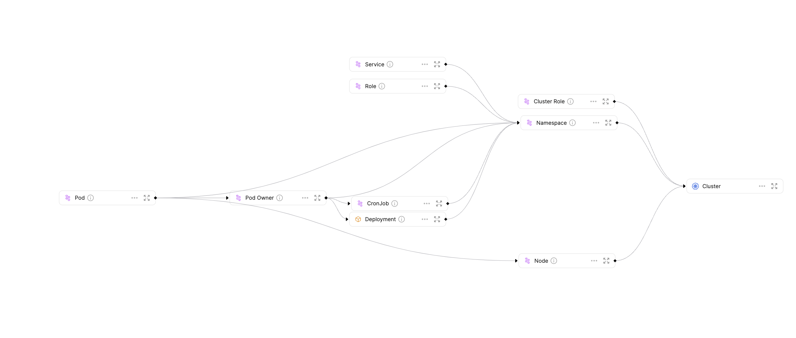

# Mapping Kubernetes resources

Kubernetes has become one of the most popular ways to deploy microservice based applications. As the number of your microservices grow, and more clusters are deployed across several regions, it becomes complicated and tedious to keep track of all of your deployments, services, and jobs.

Using Port's Kubernetes Exporter, you can keep track of your K8s resources and export all of the data to Port. We will use K8s' built in metadata to create Entities in Port and keep track of their state.

## Prerequisites

- [Terraform CLI](https://learn.hashicorp.com/tutorials/terraform/install-cli);
- [Helm](https://helm.sh) must be installed to use the chart. Please refer to
  Helm's [documentation](https://helm.sh/docs) to get started;
- Create `PORT_CLIENT_ID` and `PORT_CLIENT_SECRET` secrets in your Github Repo, to use in your Github Workflows.

:::tip
All relevant files and resources for this guide are available **[here!](https://github.com/port-labs/k8s-exporter-example)**
:::

## Setting up your Blueprints

### Creating Blueprints with Terraform

To set up your Blueprints, use Port's [Terraform provider](../build-your-software-catalog/sync-data-to-catalog/iac/terraform.md).

After setting up your `main.tf` file under the `terraform/` directory, create the required `.tf` files, which will represent your Port Blueprints.

:::tip
Be sure to use the example repository listed above for a complete example of the structure and base file contents required to implement this use case.
:::

In the Git repository, you can find 10 `.tf` files which will create the following Blueprints:

- Cluster
- ClusterRole
- CronJob
- Deployment
- Namespace
- Node
- Pod
- PodOwner \*
- Role
- Service \*

:::note
`PodOwner` is an abstraction of Kubernetes objects which create and manage pods. By creating this Blueprint, we can avoid creating a dedicated Blueprint per Pod Owner type, all of which will likely look pretty similar.
Here is the list of kubernetes objects `PodOwner` will replace:

- ReplicaSet
- StatefulSet
- DaemonSet
- Job

`Service` uses selectors to route traffic to pods. Since this is not a direct mapping, relating a service to a specific pod is only possible either by activley mapping pods to their service, or using a strict naming convention. In this use case, you we will only map the service's selectors.
:::

### Updating Blueprints using Github Workflows

Now that you have set your foundations for managing your Blueprints using Terraform, let's make it automatic.

Create the following workflow:

```yaml showLineNumbers
name: Update Port Blueprints

on:
  push:
    paths:
      - "terraform/*.tf"

jobs:
  update-port-blueprints:
    runs-on: ubuntu-latest
    steps:
      - uses: actions/checkout@v3
        with:
          persist-credentials: true
      - uses: hashicorp/setup-terraform@v2
      - name: Apply tf Blueprints
        env:
          PORT_CLIENT_ID: ${{ secrets.PORT_CLIENT_ID }}
          PORT_CLIENT_SECRET: ${{ secrets.PORT_CLIENT_SECRET }}
        run: |
          cd terraform/
          terraform init
          terraform apply -auto-approve
```

This workflow will monitor file changes under `terraform/*.tf`, and on a change the workflow will run and apply the new or changed Blueprints to Port.



## Exporting your Kubernetes cluster

### Set up the Kubernetes exporter

Now it is time to populate you Port environment with Entities using Port's Kubernetes Exporter.

:::tip
Get to know the basics of our Kubernetes exporter [here!](../build-your-software-catalog/sync-data-to-catalog/kubernetes/quickstart.md)
:::

Create a `config.yaml` with your relevant queries and Blueprints.
In the Git repository under `exporter-config/config.yaml`, you can find a pre-made `config.yaml` which is configured to match the Blueprints we created earlier using Terraform. This `config.yaml` maps resources from all of the namespaces which dont start with "kube", and some cluster-scope resources.

<details>
  <summary>Here is the config.yaml we will be using.</summary>

```yaml showLineNumbers
resources: # List of K8s resources to list, watch, and export to Port.
  - kind: v1/namespaces # group/version/resource (G/V/R) format
    selector:
      query: .metadata.name | startswith("kube") | not # JQ boolean query. If evaluated to false - skip syncing the object.
    port:
      entity:
        mappings: # Mappings between one K8s object to one or many Port Entities. Each value is a JQ query.
          - identifier: .metadata.name
            title: .metadata.name
            blueprint: '"Namespace"'
            properties:
              creationTimestamp: .metadata.creationTimestamp
              labels: .metadata.labels
            relations:
              Cluster: '"educator-cluster"'

  - kind: batch/v1/jobs
    selector:
      query: .metadata.namespace | startswith("kube") | not
    port:
      entity:
        mappings:
          - identifier: .metadata.name +  "-" + .metadata.namespace + "-" + "Job"
            title: .metadata.name
            blueprint: '"PodOwner"'
            properties:
              creationTimestamp: .metadata.creationTimestamp
              type: '"Job"'
              status: .status.conditions[-1].type // "Running"
              startTime: .metadata.creationTimestamp
              endTime: .status.completionTime
            relations:
              CronJob: .metadata.ownerReferences[0].name + "-" + .metadata.namespace
              Namespace: .metadata.namespace

  - kind: apps/v1/deployments
    selector:
      query: .metadata.namespace | startswith("kube") | not
    port:
      entity:
        mappings:
          - identifier: .metadata.name + "-" + .metadata.namespace
            title: .metadata.name
            icon: '"Deployment'
            blueprint: '"Deployment"'
            properties:
              creationTimestamp: .metadata.creationTimestamp
              replicas: .spec.replicas
              strategy: .spec.strategy.type
              availableReplicas: .status.availableReplicas
              labels: .metadata.labels
              containers: (.spec.template.spec.containers | map({name, image, resources}))
            relations:
              Namespace: .metadata.namespace

  - kind: apps/v1/replicasets
    selector:
      query: (.metadata.namespace | startswith("kube") | not ) and (.metadata.ownerReferences != null)
    port:
      entity:
        mappings:
          - identifier: .metadata.name + "-" + .metadata.namespace + "-" + "ReplicaSet"
            title: .metadata.name
            blueprint: '"PodOwner"'
            properties:
              creationTimestamp: .metadata.creationTimestamp
              availableReplicas: .status.availableReplicas
              replicas: .spec.replicas
              type: '"ReplicaSet"'
            relations:
              Deployment: .metadata.ownerReferences[0].name + "-" + .metadata.namespace

  - kind: apps/v1/replicasets
    selector:
      query: (.metadata.namespace | startswith("kube") | not ) and (.metadata.ownerReferences == null)
    port:
      entity:
        mappings:
          - identifier: .metadata.name + "-" + .metadata.namespace + "-" + "ReplicaSet"
            title: .metadata.name
            blueprint: '"PodOwner"'
            properties:
              creationTimestamp: .metadata.creationTimestamp
              availableReplicas: .status.availableReplicas
              replicas: .spec.replicas
              type: '"ReplicaSet"'
            relations:
              Namespace: .metadata.namespace

  - kind: apps/v1/daemonsets
    selector:
      query: .metadata.namespace | startswith("kube") | not
    port:
      entity:
        mappings:
          - identifier: .metadata.name + "-" + .metadata.namespace + "-" + "DaemonSet"
            title: .metadata.name
            blueprint: '"PodOwner"'
            properties:
              creationTimestamp: .metadata.creationTimestamp
              replicas: .spec.replicas
              availableReplicas: .status.availableReplicas
              type: '"DaemonSet"'
            relations:
              Namespace: .metadata.namespace

  - kind: apps/v1/statefulsets
    selector:
      query: .metadata.namespace | startswith("kube") | not
    port:
      entity:
        mappings:
          - identifier: .metadata.name + "-" + .metadata.namespace + "-" + "StatefulSet"
            title: .metadata.name
            blueprint: '"PodOwner"'
            properties:
              creationTimestamp: .metadata.creationTimestamp
              replicas: .spec.replicas
              availableReplicas: .status.availableReplicas
              type: '"StatefulSet"'
            relations:
              Namespace: .metadata.namespace

  - kind: v1/pods
    selector:
      query: (.metadata.namespace | startswith("kube") | not ) and (.metadata.ownerReferences != null)
    port:
      entity:
        mappings:
          - identifier: .metadata.name + "-" + .metadata.namespace
            title: .metadata.name
            icon: '"Microservices"'
            blueprint: '"Pod"'
            properties:
              startTime: .status.startTime
              phase: .status.phase
              labels: .metadata.labels
              containers: (.spec.containers | map({image, resources})) + .status.containerStatuses | group_by(.image) | map(add)
              conditions: .status.conditions
            relations:
              PodOwner: .metadata.ownerReferences[0].name + "-" + .metadata.namespace + "-" + .metadata.ownerReferences[0].kind
              Node: (.spec.nodeName) | (split(".")|join("_"))

  - kind: v1/pods
    selector:
      query: (.metadata.namespace | startswith("kube") | not ) and (.metadata.ownerReferences == null)
    port:
      entity:
        mappings:
          - identifier: .metadata.name + "-" + .metadata.namespace
            title: .metadata.name
            blueprint: '"Pod"'
            properties:
              startTime: .status.startTime
              phase: .status.phase
              labels: .metadata.labels
              containers: (.spec.containers | map({image, resources})) + .status.containerStatuses | group_by(.image) | map(add)
              conditions: .status.conditions
            relations:
              Node: (.spec.nodeName) | (split(".")|join("_"))
              Namespace: .metadata.namespace

  - kind: v1/services
    selector:
      query: .metadata.namespace | startswith("kube") | not
    port:
      entity:
        mappings:
          - identifier: .metadata.name + "-" + .metadata.namespace
            title: .metadata.name
            icon: '"Service"'
            blueprint: '"Service"'
            properties:
              creationTimestamp: .metadata.creationTimestamp
              labels: .metadata.labels
              type: .spec.type
              selectors: .spec.selector
            relations:
              Namespace: .metadata.namespace

  - kind: v1/nodes
    port:
      entity:
        mappings:
          - identifier: (.metadata.name) | (split(".")|join("_"))
            title: .metadata.name
            icon: '"Node"'
            blueprint: '"Node"'
            properties:
              creationTimestamp: .metadata.creationTimestamp
              availableCpu: .status.allocatable.cpu
              available_memory: .status.allocatable.memory
              labels: .metadata.labels
              ready: .status.conditions[] | select(.type == "Ready") | .status
            relations:
              Cluster: '"educator-cluster"'

  - kind: batch/v1/cronjobs
    selector:
      query: .metadata.namespace | startswith("kube") | not
    port:
      entity:
        mappings:
          - identifier: .metadata.name + "-" + .metadata.namespace
            title: .metadata.name
            blueprint: '"CronJob"'
            properties:
              creationTimestamp: .metadata.creationTimestamp
              labels: .metadata.labels
              schedule: .spec.schedule
              lastSuccessfulRun: .status.lastSuccessfulTime
              lastRun: .status.lastScheduleTime
              suspended: .spec.suspend

  - kind: rbac.authorization.k8s.io/v1/roles
    selector:
      query: .metadata.namespace | startswith("kube") | not
    port:
      entity:
        mappings:
          - identifier: .metadata.name + "-" + .metadata.namespace
            title: .metadata.name
            blueprint: '"Role"'
            properties:
              creationTimestamp: .metadata.creationTimestamp
              labels: .metadata.labels
              rules: .rules
            relations:
              Namespace: .metadata.namespace

  - kind: rbac.authorization.k8s.io/v1/clusterroles
    port:
      entity:
        mappings:
          - identifier: .metadata.name | split(":")  | join("-") | split(".") | join("-")
            title: .metadata.name
            blueprint: '"ClusterRole"'
            properties:
              creationTimestamp: .metadata.creationTimestamp
              labels: .metadata.labels
              rules: .rules
            relations:
              Cluster: '"educator-cluster"'
```

</details>

### Updating the exporter using Github Workflows

To keep the mapping of cluster resources to Port up-to-date, you can use a GitHub Workflow to update the `config.yml` file applied to your K8s cluster whenever you make an update. On change to the `config.yml` file, the GitHub workflow will update the K8s exporter config deployed to your cluster.
This can be achieved by using the following workflow:

```yaml showLineNumbers
name: Update K8s Exporter

on:
  push:
    paths:
      - "exporter-config/config.yaml"
  workflow_dispatch:

jobs:
  update-k8s-exporter:
    runs-on: ubuntu-latest
    steps:
      - uses: actions/checkout@v3
        with:
          persist-credentials: true
      - uses: azure/setup-helm@v3
        with:
          token: ${{ secrets.GITHUB_TOKEN }} # only needed if version is 'latest'
      - uses: azure/setup-kubectl@v3
        with:
          version: "v1.24.0" # default is latest stable
      - name: Configure AWS Credentials 🔒
        id: aws-credentials
        uses: aws-actions/configure-aws-credentials@v1
        with:
          aws-access-key-id: ${{ secrets.AWS_ACCESS_KEY_ID }}
          aws-secret-access-key: ${{ secrets.AWS_SECRET_ACCESS_KEY }}
          aws-region: ${{ secrets.AWS_REGION }}
      - name: Update Exporter
        env:
          AWS_ACCESS_KEY_ID: ${{ secrets.AWS_ACCESS_KEY_ID }}
          AWS_SECRET_ACCESS_KEY: ${{ secrets.AWS_SECRET_ACCESS_KEY }}
          AWS_DEFAULT_REGION: ${{ secrets.AWS_REGION }}
          AWS_DEFAULT_OUTPUT: json
        run: |
          // highlight-next-line
          # Replace this command with your method of fetching the kubeconfig file for your cluster
          aws eks update-kubeconfig --name ${{ secrets.EKS_CLUSTER_NAME }}

          helm repo add port-labs https://port-labs.github.io/helm-charts
          helm repo update

          helm upgrade my-port-k8s-exporter port-labs/port-k8s-exporter \
          --create-namespace --namespace port-k8s-exporter \
          --set secret.secrets.portClientId=${{ secrets.PORT_CLIENT_ID }} --set secret.secrets.portClientSecret=${{ secrets.PORT_CLIENT_SECRET }} \
          --set-file configMap.config=./exporter-config/config.yaml --install
```

:::note
The example above is for K8s clusters managed using AWS EKS, if you’re using a different K8s provider, you will need to change the method used to fetch your kubeconfig file inside the workfow
:::

This workflow will check for changes in the `exporter-config/config.yaml` file, whenever a change occurs the updated Kubernetes exporter config will be deployed to your cluster.

## Summary

In this use-case, you implemented a complete GitOps based flow for exporting data from a Kubernetes cluster to Port, using Port's K8s Exporter and Terraform provider. You now have a comprehensive mapping of your Kubernetes cluster in Port, that updates in real-time according to the state of your Kubernetes cluster and allowes you to view information directly from Port such as replica counts for your deployments, node readiness and job run statuses.
