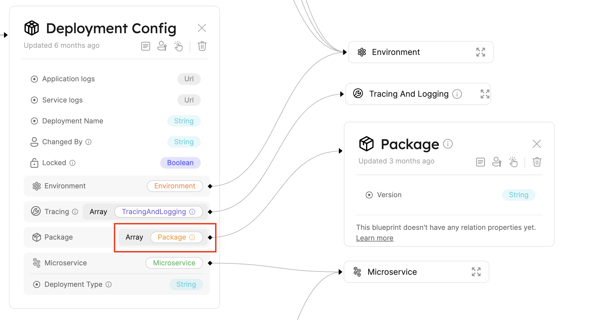
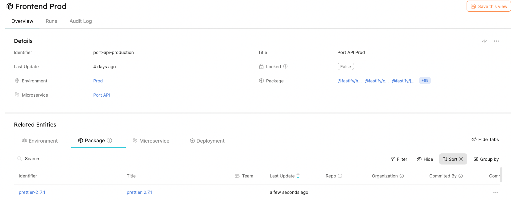

# Microservice dependency mapping

Using Port, it is very easy to implement and track package dependency mapping for your microservices. That can be useful, for example, while trying to investigate a dependency related issue or bug, or while checking for security issues.

:::tip
All relevant files and resources for this guide are available [**HERE**](https://github.com/port-labs/demo-node-project) for the `yarn.lock` use-case, and [**HERE**](https://github.com/port-labs/demo-node-poject-npm) for the `package-lock.json` use-case.
:::

## Goal

In this guide you will implement a package dependency mapping between your microservices and the code packages and libraries they use.

## Example

In this example we will review two use-cases for maintaining package dependencies for a Microservice.

1. [A mono-repo](#mapping-yarn-dependencies), multi-microservice Node project which is managed by [yarn v2+](https://yarnpkg.com/getting-started).
2. [A single-microservice](#mapping-npm-dependencies) Node project managed by npm.

### Use-case setup

Let's review our Blueprints and repository structure so we can better understand what this use-case will accomplish.

#### Blueprints

<details>
<summary>DeploymentConfig Blueprint</summary>

Please notice the 'relations' seciton at the bottom of the Blueprint

```json showLineNumbers
{
  "identifier": "DeploymentConfig",
  "title": "Deployment Config",
  "icon": "Service",
  "schema": {
    "properties": {
      "locked": {
        "type": "boolean",
        "title": "Locked",
        "default": false,
        "description": "Are deployments currently allowed for this configuration",
        "icon": "Lock"
      },
      "deploymentName": {
        "type": "string",
        "title": "Deployment Name"
      }
    },
    "required": []
  },
  "mirrorProperties": {},
  "formulaProperties": {},
  "relations": {
    "package": {
      "title": "Package",
      "target": "Package",
      "required": false,
      "many": true
    }
  }
}
```

</details>

<details>
<summary>Package Blueprint</summary>

```json showLineNumbers
{
  "identifier": "Package",
  "title": "Package",
  "icon": "Package",
  "schema": {
    "properties": {
      "version": {
        "title": "Version",
        "type": "string"
      },
      "inHouse": {
        "title": "In-House?",
        "type": "boolean"
      }
    },
    "required": ["version"]
  },
  "mirrorProperties": {},
  "formulaProperties": {},
  "relations": {}
}
```

</details>

Let's have a look at our new relation!



For more information about DeploymentConfig and it's uses, click [here](./software-catalog#deployment-config-bp).

As we can see in the image above, two Blueprints were created: `DeploymentConfig` and `Package`. Notice that the `Package` property is the Relation we created. It consists of an array of packages (this is thanks to the `"many": true` property of the Relation), since each microservice, and respectively, each DeploymentConfig can depend on multiple Packages.

Since both of the use-cases we are learning contain a DeploymentConfig-to-Package relation, we can use these Blueprints in both cases.

### Mapping Yarn dependencies

#### Repository structure

Here is a [link](https://github.com/port-labs/demo-node-project) to the Git repository we will be working on in this use-case.

Directory tree:

```showLineNumbers
.
├── README.md
├── package.json
├── apps
│   ├── frontend/
│   ├── backend/
│   └── db/
├── scripts
│   ├── scan-yarn-lock.py
│   └── scan_requirements.txt
├── .github
│   └── workflows
│       └── update-packages.yml
└── yarn.lock
```

As stated before, in this example we will learn about a mono-repo use-case. In this repository, Microservices are positioned in the 'apps/' directory, which we will refer to as `MICROSERVICE_PATH`.

We will also presume that the directory names in `MICROSERVICE_PATH` match the names of the different Microservices we are managing and tracking (i.e. apps/frontend will be 'frontend' which matches a Microservice named `frontend`).

Since we are working with DeploymentConfigs - which are configured by a Microservice and Runtime (Environment) - we will have to take into account which `runtime` we are managing packages for. This will be passed on to us from the workflow call.

#### Automating Entity creation

Let's begin by creating a Python script to handle scanning the `yarn.lock` file. We will also implement package Entity creation and update the existing DeploymentConfigs with their related package dependencies.

[This Python script](https://github.com/port-labs/demo-node-project/blob/main/scripts/scan-yarn-lock.py) has some useful functions with which we interact with Port.
Have a look at:

```python
get_port_api_token()
    ...
create_port_entity(blueprint, entity_json, token)
    ...
get_port_entity(blueprint, identifier, token)
    ...
```

Environment variables:

:::note
Environment variables required for the script will be provided by the calling GitHub workflow, and will be loaded using `os.environ.get()`.
:::

```python showLineNumbers
MICROSERVICE_PATH = os.environ.get("MICROSERVICE_PATH")

# ../../yarn.lock relative path to script
YARN_LOCK_PATH = os.path.join(os.path.dirname(os.path.dirname(
    os.path.dirname(__file__))), 'yarn.lock')

# Port Client Secret and ID
CLIENT_ID = os.environ.get("PORT_CLIENT_ID")
CLIENT_SECRET = os.environ.get("PORT_CLIENT_SECRET")

# Port's API url
API_URL = 'https://api.getport.io/v1'

# The environment's runtime (i.e 'production', 'test', 'staging')
RUNTIME = os.environ.get("RUNTIME")

```

#### Triggering a run using GitHub Workflows

In our environment, a "change in main" means a change in the `Production` environment. Let's create a workflow that monitors changes in Production.
In order to monitor the `yarn.lock` file, we will create a GitHub workflow which watches the lock file on the `main` branch.

When the `yarn.lock` file changes in the main branch, the workflow will be triggered. If necessary, the Python scanner script will run.

Let's walk through the [workflow](https://github.com/port-labs/demo-node-project/blob/main/.github/workflows/update-packages.yml).

```yaml showLineNumbers
name: Update Packages in Port

on:
  # Trigger this workflow when yarn.lock file changes on main branch
  push:
    branches:
      - "main"
    paths:
      - "yarn.lock"

  # Trigger workflow when manually called - We keep this in case we want to manually re-sync packages with Port for some reason
  workflow_dispatch:

jobs:
  update-microservices:
    name: "Run yarn.lock scanner"
    runs-on: ubuntu-latest
    env:
      RUNTIME: "production" # main branch indiciates this is a change in production environment.
    steps:
      - uses: actions/checkout@v3
      - uses: actions/setup-python@v4
        with:
          python-version: "3.x"
          cache: "pip"
          cache-dependency-path: ".github/scripts/scan_requirements.txt"

      # Install python requirements
      - run: |
          pip install -r .github/scripts/scan_requirements.txt

      # Run python scanner script with necessary env vars
      - name: Run scanner script
        env:
          PORT_CLIENT_ID: ${{ secrets.PORT_CLIENT_ID }}
          PORT_CLIENT_SECRET: ${{ secrets.PORT_CLIENT_SECRET }}
          MICROSERVICE_PATH: "apps/"
        run: |
          python .github/scripts/scan-yarn-lock.py
```

After setting up the Workflow, we are done!

Let's see our workflow in action.
Try installing a new package and push it to main:

```bash showLineNumbers
yarn workspace backend add prettier
git add -u
git commit -m "Add prettier package to backend and update yarn.lock"
git push
```

Now merge the code to main and witness the magic!


The workflow runs automatically, and when it finishes, we will see the new packages created and mapped to the relevant microservice deployment config.



### Mapping NPM dependencies

While most of the steps to achieving our goal are the same in an NPM managed environment, let's state the slight differences.

:::tip  
Click [**HERE**](https://github.com/port-labs/demo-node-poject-npm) for the relevant files for this use-case.
:::

First of all, in this scenario we will be mapping our `package-lock.json` file, as opposed to our `yarn.lock` file. There are also some small differences in the project structure.

Since this is a single-microservice project use-case, we removed the `MICROSERVICE_PATH` parameter and changed the logic of the scanner to match the different file structures and formats.

## Summary

Port simplifies implementations and easy-to-maintain package dependency mapping. Using our RESTful API and GitHub Workflows, you are able to create a block in your CI/CD pipeline which keeps track of your Microservices' packages and their versions.
