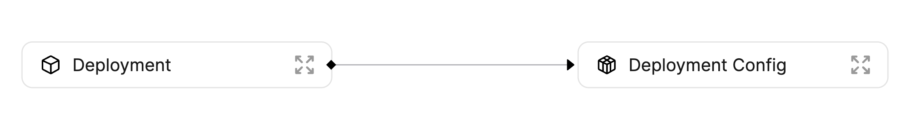

# Service Locking

Using Port, it is very simple to implement convenient service locking for services in your different development and production environments.

:::tip
All relevant files and resources for this guide are available [**HERE**](https://github.com/port-labs/resource-catalog-microservice-repo/tree/docs-version)
:::

## Goal

In this guide you will implement a service locking mechanism using Port's [GitHub Action](../build-your-software-catalog/sync-data-to-catalog/ci-cd/github-workflow/github-workflow.md).

The environment we're going to use includes 2 [Blueprints](../build-your-software-catalog/define-your-data-model/setup-blueprint/setup-blueprint.md) with a [Relation](../build-your-software-catalog/define-your-data-model/relate-blueprints/relate-blueprints.md) between them:



Let's go over the different Blueprints shown above and how we'll create [Entities](../build-your-software-catalog/sync-data-to-catalog/sync-data-to-catalog.md#entity-json-structure) for each one of them:

- **Deployment Config** - a deployment config is a representation of the current “live” version of a service running in a specific environment. It will include references to the service, environment, and deployment, as well as real-time information such as status, uptime, and any other relevant metadata.
  - In this example deployment configs will be reported manually.
- **Deployment** - a deployment could be described as an object representing a CD job. It includes the version of the deployed service and a link to the job itself. Unlike other objects, the deployment is an immutable item in the software catalog. It is important to keep it immutable to ensure the catalog remains reliable.
  - In this example deployments will be reported using Port's GitHub Action as part of the deployment process.

Now that you know the end result of this guide, let's start by creating the Blueprints and Relations.

## Blueprints and Relations

Below you can find the JSON for all of the Blueprints you require for the following guide:

:::note
The Blueprint JSON provided below already includes the Relations between the different Blueprints, so please create them in the order that they appear.
:::

<details>
<summary>Deployment Config Blueprint JSON</summary>

```json showLineNumbers
{
  "identifier": "deploymentConfig",
  "title": "Deployment Config",
  "icon": "Service",
  "schema": {
    "properties": {
      "locked": {
        "type": "boolean",
        "title": "Locked",
        "default": false,
        "description": "Are deployments currently allowed for this configuration",
        "icon": "Lock"
      }
    },
    "required": []
  },
  "mirrorProperties": {},
  "calculationProperties": {},
  "relations": {}
}
```

</details>

<details>
<summary>Deployment Blueprint JSON</summary>

```json showLineNumbers
{
  "identifier": "deployment",
  "title": "Deployment",
  "icon": "Deployment",
  "schema": {
    "properties": {
      "jobUrl": {
        "type": "string",
        "format": "url",
        "title": "Job URL"
      },
      "deployingUser": {
        "type": "string",
        "title": "Deploying User"
      },
      "imageTag": {
        "type": "string",
        "title": "Image Tag"
      },
      "commitSha": {
        "type": "string",
        "title": "Commit SHA"
      }
    },
    "required": []
  },
  "mirrorProperties": {},
  "calculationProperties": {},
  "relations": {
    "deploymentConfig": {
      "title": "Deployment Config",
      "target": "deploymentConfig",
      "required": false,
      "many": false
    }
  }
}
```

</details>

:::note
Our deployment config Blueprint has a property called `locked` with a boolean value. We will use the value of that field to determine whether new deployments of the service are allowed.
:::

Now that you have your Blueprints created, connected and ready to go, time to create your Entities:

## Entities

### Deployment Config - Port API

A deployment config is used to represent a service deployment in a specific environment in your infrastructure. A deployment config has multiple `deployments` tied to it, each representing a new version of the deployed code of the matching service, in its matching environment.

A deployment config is also just what it sounds like - a `config`, which means it is a good place to store runtime variables and values, links to logging, tracing, or dashboard tools, and more static data that does not change between deployments.

Let's manually create a deployment config Entity for the `Notification Service` service in the Production environment:

```json showLineNumbers
{
  "identifier": "notification-service-prod",
  "title": "Notification Service Production",
  "properties": {
    "locked": true
  },
  "relations": {}
}
```

Below is a `python` code snippet to create this deployment config:

<details>
<summary>Click here to see the code</summary>

```python showLineNumbers
import requests

CLIENT_ID = 'YOUR_CLIENT_ID'
CLIENT_SECRET = 'YOUR_CLIENT_SECRET'

API_URL = 'https://api.getport.io/v1'

target_blueprint = 'deploymentConfig'

credentials = {'clientId': CLIENT_ID, 'clientSecret': CLIENT_SECRET}

token_response = requests.post(f'{API_URL}/auth/access_token', json=credentials)

access_token = token_response.json()['accessToken']

headers = {
    'Authorization': f'Bearer {access_token}'
}

entity = {
    "identifier": "notification-service-prod",
    "title": "Notification Service Production",
    "properties": {
        "locked": True
    },
    "relations": {}
}


response = requests.post(f'{API_URL}/blueprints/{target_blueprint}/entities', json=entity, headers=headers)

print(response.json())
```

</details>

Now let's use the deployment config Entity to lock the `Notification Service` for new deployments.

## Reading the `locked` field during deployment

In order to use the `locked` field on your deployment config, you will use Port's [GitHub Action](../build-your-software-catalog/sync-data-to-catalog/ci-cd/github-workflow/github-workflow.md).

Here is the deployment check flow:

1. New code is pushed to the `main` branch of the `Notification Service` Git repository;
2. A [GitHub workflow](https://docs.github.com/en/actions/using-workflows) is triggered by the push event;
3. The Github workflow calls a [callable workflow](https://docs.github.com/en/actions/using-workflows/reusing-workflows) with parameters matching the `locked` field check of the `Notification Service`;
4. If the value of the `locked` field is `true`, the deployment check will fail, with an error message indicating that the service is locked, and no deployment will be attempted;
5. If the value of the `locked` field is `false`, the deployment check will succeed and a new deployment Entity will be created in Port;

Let's go ahead and create a [GitHub workflow](https://docs.github.com/en/actions/using-workflows) file in a GitHub repository meant for the `Notification Service` microservice:

- Create a GitHub repository (or use an existing one);
- Create a `.github` directory;
  - Inside it create a `workflows` directory.

Inside the `/.github/workflows` directory create a file called `check-service-lock.yml` with the following content:

```yml showLineNumbers
name: Check Service Lock

on:
  workflow_call:
    inputs:
      SERVICE_NAME:
        required: true
        type: string
        default: notification-service
      RUNTIME:
        required: true
        type: string
        default: production
    secrets:
      PORT_CLIENT_ID:
        required: true
      PORT_CLIENT_SECRET:
        required: true

jobs:
  get-entity:
    runs-on: ubuntu-latest
    outputs:
      entity: ${{ steps.port-github-action.outputs.entity }}
    steps:
      - id: port-github-action
        name: Get entity from Port
        uses: port-labs/port-github-action@v1
        with:
          clientId: ${{ secrets.PORT_CLIENT_ID }}
          clientSecret: ${{ secrets.PORT_CLIENT_SECRET }}
          identifier: ${{ inputs.SERVICE_NAME }}-${{ inputs.RUNTIME }}
          blueprint: deploymentConfig
          operation: GET
  check-lock-status:
    runs-on: ubuntu-latest
    needs: get-entity
    steps:
      - name: Get entity lock status
        run: echo "LOCK_STATUS=$(echo '${{needs.get-entity.outputs.entity}}' | jq -r .properties.locked)" >> $GITHUB_ENV
      - name: Check lock status 🚧
        if: ${{ env.LOCK_STATUS == 'true' }}
        run: |
          echo "Service ${{ inputs.SERVICE_NAME }} in environment ${{ inputs.RUNTIME }} is locked, stopping deployment"
          exit 1
```

The workflow in `check-service-lock.yml` is a [callable workflow](https://docs.github.com/en/actions/using-workflows/reusing-workflows), you can use it in any of your deployment workflows using parameters provided in the _calling_ workflow, thus saving you the need to duplicate the same workflow logic over and over.

Inside the `/.github/workflows` directory create a file called `deploy-notification-service.yml` with the following content:

```yml showLineNumbers
name: Report Deployment

on:
  push:
    branches:
      - "main"

jobs:
  check-lock-status:
    uses: ./.github/workflows/check-service-lock.yml
    with:
      SERVICE_NAME: notification-service
      RUNTIME: prod
    secrets:
      PORT_CLIENT_ID: ${{ secrets.PORT_CLIENT_ID }}
      PORT_CLIENT_SECRET: ${{ secrets.PORT_CLIENT_SECRET }}

  report-deployment:
    name: Report new deployment Entity
    needs: [check-lock-status]
    runs-on: ubuntu-latest
    steps:
      - name: Extract SHA short
        run: echo "SHA_SHORT=${GITHUB_SHA:0:7}" >> $GITHUB_ENV
      - name: "Report deployment Entity to port 🚢"
        uses: port-labs/port-github-action@v1
        with:
          clientId: ${{ secrets.PORT_CLIENT_ID }}
          clientSecret: ${{ secrets.PORT_CLIENT_SECRET }}
          identifier: notification-service-prod-${{ env.SHA_SHORT }}
          title: Notification-Service-Production-${{ env.SHA_SHORT }}
          blueprint: deployment
          properties: |
            {
               "jobUrl": "${{ github.server_url }}/${{ github.repository }}/actions/runs/${{ github.run_id }}",
               "deployingUser": "${{ github.actor }}",
               "imageTag": "latest",
               "commitSha": "${{ env.SHA_SHORT }}"
            }
          relations: |
            {
               "deploymentConfig": "notification-service-prod"
            }
```

:::tip
For security reasons it is recommended to save the `CLIENT_ID` and `CLIENT_SECRET` as [GitHub Secrets](https://docs.github.com/en/actions/security-guides/encrypted-secrets), and access them as shown in the example above.
:::

The workflow in `deploy-notification-service.yml` is triggered every time a push is made to the `main` branch of the repository.

The workflows has 2 configured jobs:

- check-lock-status;
- report-deployment.

the `report-deployment` job is configured with a `needs` key whose value is `[check-lock-status]`, meaning the `report-deployment` step will only start when `check-lock-status` has finished.

If you try to push code to your repository when the deployment config `locked` field is set to `true`, the deployment will stop:


When you will look at the step that failed, you will see that the failure is due to the value of the `locked` field:


If you set the value of the `locked` field to `false`, the workflow will perform the deployment without any issue:


## Summary

This was just a single example of Port's GitHub Action value in your CI/CD pipelines. By querying and creating Entities during your CI process, you can make your CI jobs even more dynamic and responsive, without having to edit `yml` files and push new code to your repository.

If you're using a different CI/CD provider, be sure to checkout the rest of our [CI/CD integrations](../build-your-software-catalog/sync-data-to-catalog/ci-cd/ci-cd.md) to find the integration that fits your use-case.
