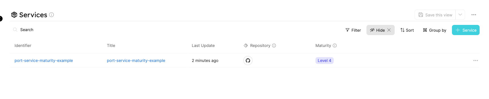
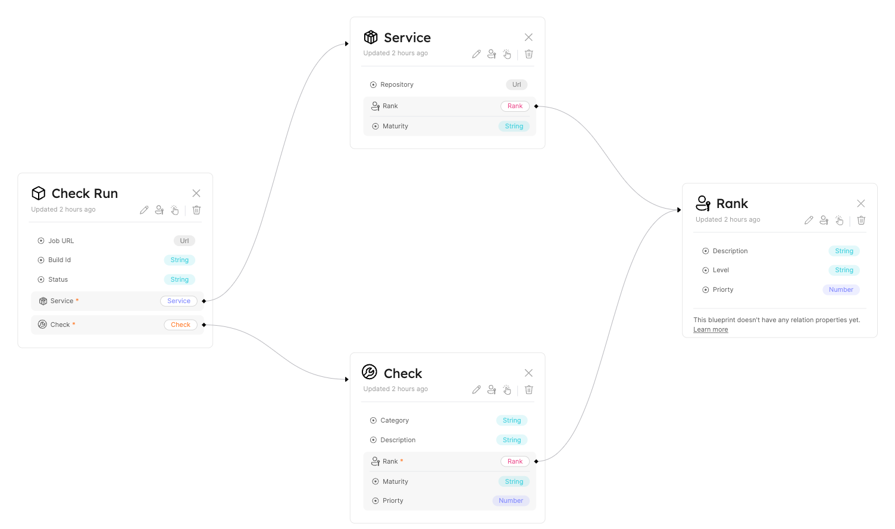
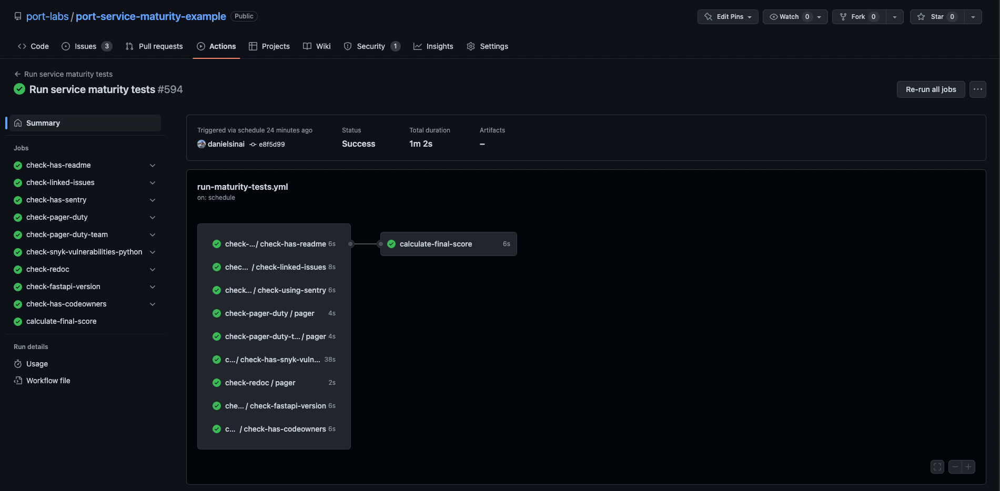

# Service Maturity

Using Port, it is very simple to implement, calculate and track service maturity checks for services in your organization.

:::tip
All relevant files and resources for this guide are available [**HERE**](https://github.com/port-labs/port-service-maturity-example)
:::

## Goal

In this guide, you will implement a service maturity model using Port's [GitHub Action](../api-providers/github-action.md).

After you finish the tutorial, you will have a well-defined service maturity environment that will use customized `Checks` that run periodically. They determine each `Service`'s maturity within the organization:

Services


Checks


## Environment Structure

The environment we're going to use includes 4 [Blueprints](../software-catalog/blueprint/blueprint.md) with multiple [Relations](../software-catalog/relation/relation.md) between them.

Let's go over the different Blueprints shown below and how we'll create [Entities](../software-catalog/entity/entity.md) for each one of them:



- **Service** - the object that we would like to estimate its maturity. For example - payment service, order service, parsing service etc;
  - **Repository** - URL of the git repository of the service.
- **Check** - the check definition. For example - snyk vulnerabilities check, readme check etc..;
  - **Category** - in which domain the check applies (Service Ownership, security, reliability, etc);
  - **Description** - a small description of the check and its purpose.
- **Check Run** - actual job run of the `Check` definition on a specific Service;
  - **Job URL** - link to the job URL of the actual GitHub check run;
  - **Build Id** - the `buildId` the check ran for;
  - **Status** - check run result `failure` or `success`.
- **Rank** - the object defines the level of a `Check` or `Service` (Levels 1 - 5). The higher the level, the higher the maturity;
  - **Level** - Rank level (Level 1, Level 2 etc...)
  - **Priority** - Rank importance 1 - 5
  - **Description** - explanation of what `Checks` or `Services` need to reach this level.

:::note

In this article, we are using `Levels` to define the service maturity following a [Levels Model](https://spiresearch.com/psmaturitymodel/service-maturity-levels.html).

But, the `priority` property is made to support any custom naming convention you would like, and it won't affect the actual calculation of the Maturity behind the scenes.

For example, You can rename `Level 1` - `Level 5` to `Bronze` - `Gold` without any changes required in the checks or workflows
:::

## Workflow explained

In the [repository of this example](https://github.com/port-labs/port-service-maturity-example) there is a `.github/workflows` folder that contains a file named `run-maturity-tests.yml`, to calculate services maturity we will run this `GitHub Workflow` file and it will be in charge of initiating the maturity tests and then calculating the maturity result.

### `run-maturity-tests.yml` workflow structure

1. At the top of the `workflow` file, there is a `schedule` trigger for this `workflow`. In our example, at minute 0 of every hour (12:00, 13:00, 14:00, etc.) a `workflow run` will be triggered:

```yaml showLineNumber
schedule:
  - cron: "0 * * * *"
```

2. After the `workflow` has been triggered we have to run all the `Checks` defined in the workflow
3. For each `Check`, we will create a new `CheckRun` Entity inside of Port via the API that describes whether the test succeeded or failed
4. The last step of the workflow will search for all the latest `Check Runs` and calculate the Service level and update the relation of it to the right `Rank` entity. for example, if a service passes all of the `Level 1` checks, it will automatically be promoted to `Level 2` and so on until it fails. If a service fails a check in some level it will stay in that level until all checks of the specific level have passed.

:::tip

Scheduled runs doesn't always fit the needs of the service maturity within the organization.
With that in mind, you can always add a `pull_request` trigger to your `workflow file`

For instance:

```yaml showLineNumber
on:
  pull_request:
    types:
      - "opened"
      - "synchronize"
      - "reopened"
      - "ready_for_review"
      - "converted_to_draft"
```

:::

## Setup

:::note

For this section, you will need to have the `PORT_CLIENT_ID` and `PORT_CLIENT_SECRET`

To find your Port API credentials go to [Port](https://app.getport.io), click on `Credentials` at the bottom left corner and you will be able to view and copy your `Client ID` and `Client Secret`:

<center>


</center>
:::

### Blueprints & Entities

In the [example repo](https://github.com/port-labs/port-service-maturity-example) there is a `setup.tf` file that will help us set the environment for this tutorial easily.

:::caution

Before continuing, if you don't have Snyk & Pager Duty account, remove `check-snyk-vulnerabilities-python.yml`, `check-pager-duty.yml` and `check-pager-duty-team.yml` from `run-maturity-tests.yml` file because they require an API token to integrate to those services and perform the checks.

In addition, remove these resources from the `setup.tf` file:
`resource "port-labs_entity" "pager-check"`
`resource "port-labs_entity" "pager-team-check"`
`resource "port-labs_entity" "snyk-check"`
:::

1. Follow this simple [Terraform CLI installation guide](https://learn.hashicorp.com/tutorials/terraform/install-cli);
2. Fork & clone the example [repository](https://github.com/port-labs/port-service-maturity-example);
3. Remove and add as many `Checks` as you would like inside the `setup.tf` file;
4. Create a file named `.env` file in the root directory and put these contents in there:

```
PORT_CLIENT_ID=<YOUR PORT CLIENT ID>
PORT_CLIENT_SECRET=<YOUR PORT CLIENT SECRET>
```

5. Run `terraform init`;
6. Run `terraform apply` and write yes in the prompt.

:::note

If you have removed and/or added any Checks, please remember to add/or delete the corresponding `workflow` file inside the `.github/workflows`
:::

### GitHub workflow

Now after all the Blueprints and Entities exist in Port, we should configure the GitHub workflow to integrate with your Port environment. To do that please add the following [GitHub Action Secrets](https://docs.github.com/en/actions/security-guides/encrypted-secrets) for use with the Forked workflow:

- `PORT_CLIENT_ID`;
- `PORT_CLIENT_SECRET`;
- `SNYK_TOKEN` (only if you haven't deleted the Snyk `Check`);
- `PAGER_DUTY_TOKEN` (only if you haven't deleted the Pager Duty `Check`).

### Test service maturity

Congratulations that's it! when you finish the setup steps above whenever the scheduled workflow triggers, you should see a scheduled `workflow run` that updates the maturity of your service in Port!



Now you can head to [Port](https://app.getport.io/Services) and see your service's maturity `Level`


## Customizing Checks

Let's take a look at the README `Check` that came with the repository:

`check-has-readme.yml`

```yml showLineNumbers
name: Check if service has readme

on:
  workflow_call:
    secrets:
      PORT_CLIENT_ID:
        required: true
      PORT_CLIENT_SECRET:
        required: true
jobs:
  check-has-readme:
    runs-on: ubuntu-latest
    steps:
      - uses: actions/checkout@master
      - name: "Check file existence"
        id: is-readme-exist
        uses: andstor/file-existence-action@v1
        with:
          files: "README.md"
      - name: "Determine status"
        id: determine-status
        run: |
          if [ "${{ steps.is-readme-exist.outputs.files_exists }}" = "true" ]; then
            echo "::set-output name=status::success"
          else
            echo "::set-output name=status::failure"
          fi
      - name: "Update check run result"
        uses: port-labs/port-github-action@v1
        with:
          clientId: ${{ secrets.PORT_CLIENT_ID }}
          clientSecret: ${{ secrets.PORT_CLIENT_SECRET }}
          title: readme-${{ github.event.repository.name }}
          blueprint: CheckRun
          properties: |
            {
               "status": "${{ steps.determine-status.outputs.status }}",
               "url": "${{ github.server_url }}/${{ github.repository }}/actions/runs/${{ github.run_id }}",
               "buildId": "${{ github.run_id }}"
            }
          relations: |
            {
              "service": "${{ github.event.repository.name }}",
              "check": "readme"
            }
```

The flow of the `workflow` file above is:

1. Run the action `andstor/file-existence-action` to check whether a README.md file exists in the repository;
2. Take the output of the action to determine if the check passed;
3. Create a new `Check Run` Entity with the corresponding status that has a Relation to the `service` (the repo name) and the `check` (readme in this case)

To create any custom `Check` as above, all you need to do is the following:

- Register a new Port entity that describes the check

  - Via the terraform `setup.tf` file;
  - Or via the UI (click on the `+ Check` blue button on the right top corner):
    

- Create a new `workflow` file like the `check-has-readme.yml` in the example above and change it accordingly.

:::note

Please make sure to add the workflow call to the `run-maturity-tests.yml` workflow. Otherwise the workflow will never be called by the scheduled run
:::

## Contributing Checks

The [example repo](https://github.com/port-labs/port-service-maturity-example) is open for pull requests!

Feel free to open pull requests that include your `Checks` to extend the capabilities of this example!

## Summary

Service maturity can help you a lot in following up on the progress of services in your organization while ensuring best practices on them.

By using Port as your Developer Portal & utilizing Port's Github Action, you can ramp up the innovation process in your organization.
