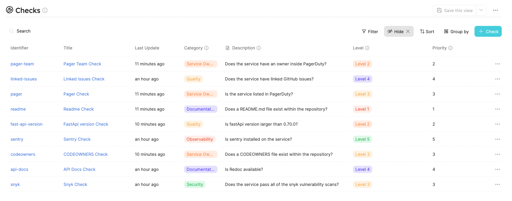

# Service Maturity

Using Port, it is very simple to implement convenient service maturity for services in your organization.

## Goal

In this guide, you will implement a service maturity model using Port's [GitHub Action](../integrations/github/github-action.md).

When finishing this tutorial, you will have a well-defined service maturity environment that will use customized `Checks` that run periodically that determines each `Service`'s maturity within the organization:

Services


Checks


## Environment Structure

The environment we're going to use includes 4 [Blueprints](../platform-overview/port-components/blueprint.md) with multiple [Relations](../platform-overview/port-components/relation.md) between them.

Let's go over the different Blueprints shown below and how we'll create [Entities](../platform-overview/port-components/entity.md) for each one of them:


- **Service** - service is the object that we would like to estimate its maturity i.e Payment Service, Order Service etc...
  - **Repository** - the URL of the git repository
- **Check** - a check is the definition of the Check responsibility
  - **Category** - in which domain the check applies to (Service Ownership, security, reliability etc..)
  - **Description** - a small description of the check and its purpose
- **Check Run** - a check run is the actual Job Run of the Check definition on a specific Service
  - **Job URL** - a link to the Job URL of the actual GitHub run
  - **Build Id** - an identifier to the `buildId` of the check run to identify multiple check runs of the same build
  - **Status** - check run result `failure` or `success`
- **Rank** - a rank is a collection of properties that defines what a rank is a `Check` blueprint is connected to it to define how important the `Check` is, while the `Service` blueprint is connected to it to define the service maturity
  - **Level** - The level of the Rank (Level 1, Level 2 etc...)
  - **Priority** - The importance of the Rank 1 - 5
  - **Description** - An explanation of how service in this Rank is supposed to look like

:::note

In this article we are using `Levels` to define the service maturity
But, the `priority` property is made to support any custom naming convention you would like, and it won't affect the actual calculation of the Maturity behind the scenes.

For example, You can rename `Level 1` - `Level 5` to `Bronze` - `Gold` without any problem or required changes
:::

## Workflow explained

In the [repository of this example](https://github.com/port-labs/port-service-maturity-example) there is a `.github/workflows` folder that contains a file named `run-maturity-tests.yml`, to calculate services maturity we will run this `GitHub Workflow` file and it will be charged for running the service maturity calculation.

### run-maturity-tests.yml workflow structure

1. At the top of the `workflow` file, there is a `schedule` trigger for this `workflow`, in our example, every 1 hour we will trigger a `workflow run`

```
  schedule:
   - cron:  '0 * * * *'
```

2. After the `workflow` has been triggered we have to run all the `Checks` defined in the workflow
3. For each `Check`, we will create a new `CheckRun` Entity inside of Port via the API that describes whether the test succeeded or failed
4. The last step of the workflow will search for all the latest `Check Runs` and calculate the Service level and update the relation of it to the right `Rank` entity. for example, if a service passes all of the `Level 1` checks, he is automatic will get to `Level 2` and so on until he fails, if he fails in some level he stays in this level until this `Check` passes

## Setup

:::note

For this section, you will need to have the `PORT_CLIENT_ID` and `PORT_CLIENT_SECRET`

To find your Port API credentials go to [Port](https://app.getport.io), click on `Credentials` at the bottom left corner and you will be able to view and copy your `Client ID` and `Client Secret`:

<center>


</center>
:::

### Blueprints & Entities

In the [example repo](https://github.com/port-labs/port-service-maturity-example) there is a `setup.tf` file that will help us set the environment for this tutorial easily.

:::caution

Before continuing, if you don't have Snyk & Pager Duty account, remove `check-snyk-vulnerabilities-python.yml`, `check-pager-duty.yml` and `check-pager-duty-team.yml` because they require API token to integrate to

also, remove those entities from the `setup.tf` file:
`resource "port-labs_entity" "pager-check"`
`resource "port-labs_entity" "pager-team-check"`
`resource "port-labs_entity" "snyk-check"`
:::

1. follow this simple [Terraform CLI installation guide](https://learn.hashicorp.com/tutorials/terraform/install-cli)
2. fork & clone the example [repository](https://github.com/port-labs/port-service-maturity-example)
3. remove and add as many `Checks` as you would like inside the `setup.tf` file
4. create a file named `.env` file in the root directory and put these contents in there

```
PORT_CLIENT_ID=<YOUR PORT CLIENT ID>
PORT_CLIENT_SECRET=<YOUR PORT CLIENT SECRET>
```

5. run `terraform init`
6. run `terraform apply` and write yes in the prompt

:::note

If you have removed and/or added any Checks, please remind to add/or delete the corresponding `workflow` file inside the `.github/workflows`
:::

### GitHub workflow

Now after all the blueprints and entities exist in Port, we should configure the GitHub workflow to integrate with your Port environment

For that to happen please add the following [GitHub Action Secret](https://docs.github.com/en/actions/security-guides/encrypted-secrets) for the Forked workflow

- `PORT_CLIENT_ID`
- `PORT_CLIENT_SECRET`
- `SNYK_TOKEN` (only if you haven't deleted the Snyk `Check`)
- `PAGER_DUTY_TOKEN` (only if you haven't deleted the Pager Duty `Check`)

### Test service maturity

Congratulations that's it! when you finish the setup steps above whenever the `schedule` of the workflow reaches, you should see a scheduled `workflow run` that updates your service at Port!


Now you can head to [Port](https://app.getport.io/Services) and see your service maturity `Level`


## Customizing Checks

Let's take a look at the readme `Check` that came along with the repository:

`check-has-readme.yml`

```yml showLineNumbers
name: Check if service has readme

on:
  workflow_call:
    secrets:
      PORT_CLIENT_ID:
        required: true
      PORT_CLIENT_SECRET:
        required: true
jobs:
  check-has-readme:
    runs-on: ubuntu-latest
    steps:
      - uses: actions/checkout@master
      - name: "Check file existence"
        id: is-readme-exist
        uses: andstor/file-existence-action@v1
        with:
          files: "README.md"
      - name: "Determine status"
        id: determine-status
        run: |
          if [ "${{ steps.is-readme-exist.outputs.files_exists }}" = "true" ]; then
            echo "::set-output name=status::success"
          else
            echo "::set-output name=status::failure"
          fi
      - name: "Update check run result"
        uses: port-labs/port-github-action@v1
        with:
          clientId: ${{ secrets.PORT_CLIENT_ID }}
          clientSecret: ${{ secrets.PORT_CLIENT_SECRET }}
          title: readme-${{ github.event.repository.name }}
          blueprint: CheckRun
          properties: |
            {
               "status": "${{ steps.determine-status.outputs.status }}",
               "url": "${{ github.server_url }}/${{ github.repository }}/actions/runs/${{ github.run_id }}",
               "buildId": "${{ github.run_id }}"
            }
          relations: |
            {
              "service": "${{ github.event.repository.name }}",
              "check": "readme"
            }
```

The flow of the `workflow` file above is:

1. Running the action `andstor/file-existence-action` to validate whether a README.md file exists in the repository
2. Taking the output of that action we are validating if the check passed or not
3. Creating a new `Check Run` entity with the corresponding status that has a relation to the `service` (the repo name) and the `check` (readme in that case)

To create any custom `Check` as above, all you need to do is the following:

- Register a new Port entity that describes that check

  - Via the terraform `setup.tf` file
  - Via the UI (click on the `+ Check` blue button on the right top corner)
    

- Create a new `workflow` file like the `check-has-readme.yml` in the example above and change it accordingly

:::note

Please make sure to add the workflow call to the `run-maturity-tests.yml` workflow. If you won't the workflow will never be called by the schedule run
:::

## Summary

Service maturity can help you a lot in following up on the progress of services in your organization while ensuring best practices on them.

By using Port as your Developer Portal & Github Action, you can ramp up the innovation process in your organization.
