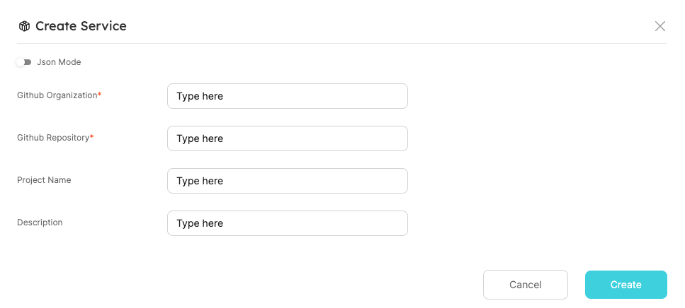

# Software Templates

A software template allows you to generate a customized skeleton of a new resource (e.g. service), usually based on community best practices.

There are a few open source projects out there that enable you to create a project from a software template, such as [Cookiecutter](https://github.com/cookiecutter/cookiecutter).

In the next section we are going to present an example.

:::tip
All relevant files and resources for this guide are available [**HERE**](https://github.com/port-labs/port-cookiecutter-example)
:::

## Example - create a new service repository

The following example utilizes Port [webhook-actions](../self-service-actions/port-execution-architecture/port-execution-webhook.md) to create a new service repository from a software template.

First, you need to create a simple `Service` Blueprint.

<details>
<summary>Service Blueprint JSON</summary>

```json showLineNumbers
{
  "identifier": "service",
  "title": "Service",
  "icon": "Service",
  "schema": {
    "properties": {
      "description": {
        "type": "string",
        "title": "Description"
      },
      "url": {
        "type": "string",
        "format": "url",
        "title": "URL"
      }
    },
    "required": []
  },
  "mirrorProperties": {}
}
```

</details>

Then, add `Create` Self-Service Actions to the Blueprint, in order to support the creation of multiple services from different frameworks.

In this case, we add actions to provision [Django](https://github.com/cookiecutter/cookiecutter-django), [C++](https://github.com/DerThorsten/cpp_cookiecutter) and [Go](https://github.com/lacion/cookiecutter-golang) services.

The action will receive the following user inputs:

- GitHub organization and repository to host the created service project;
- Template specific parameters, such as `project_name` and `description`.

:::note
In the following JSON, you need to replace the `<WEBHOOK_URL>` placeholders with your URL.

For local setup, look at this [example](../self-service-actions/webhook/local-debugging-webhook.md#creating-the-vm-create-action).
:::

<details>
<summary>Self-Service Actions JSON</summary>

```json showLineNumbers
[
  {
    "identifier": "CreateDjangoService",
    "title": "Create Django",
    "icon": "Service",
    "userInputs": {
      "properties": {
        "github_organization": {
          "type": "string"
        },
        "github_repository": {
          "type": "string"
        },
        "project_name": {
          "type": "string"
        },
        "description": {
          "type": "string"
        }
      },
      "required": ["github_organization", "github_repository"]
    },
    "invocationMethod": {
      "type": "WEBHOOK",
      "url": "<WEBHOOK_URL>"
    },
    "trigger": "CREATE",
    "description": "Creates a new Django service"
  },
  {
    "identifier": "CreateCPPService",
    "title": "Create C++",
    "icon": "Service",
    "userInputs": {
      "properties": {
        "github_organization": {
          "type": "string"
        },
        "github_repository": {
          "type": "string"
        },
        "project_name": {
          "type": "string"
        },
        "description": {
          "type": "string"
        }
      },
      "required": ["github_organization", "github_repository"]
    },
    "invocationMethod": {
      "type": "WEBHOOK",
      "url": "<WEBHOOK_URL>"
    },
    "trigger": "CREATE",
    "description": "Creates a new C++ service"
  },
  {
    "identifier": "CreateGoService",
    "title": "Create Go",
    "icon": "Service",
    "userInputs": {
      "properties": {
        "github_organization": {
          "type": "string"
        },
        "github_repository": {
          "type": "string"
        },
        "app_name": {
          "type": "string"
        },
        "project_short_description": {
          "type": "string"
        }
      },
      "required": ["github_organization", "github_repository"]
    },
    "invocationMethod": {
      "type": "WEBHOOK",
      "url": "<WEBHOOK_URL>"
    },
    "trigger": "CREATE",
    "description": "Creates a new Go service"
  }
]
```

</details>

Next, in order to listen to the webhook events, you need to set up a simple backend.

Within the backend, you are going to generate the project from the Cookiecutter template (with the provided user parameters), and push it to the GitHub repository you specified.

A full example with a backend, can be found [here](https://github.com/port-labs/port-cookiecutter-example).

:::info
The above example also creates a new Service Entity in Port, and updates the action run details.

These steps are highly recommended to keep track, over time, of the Self-Service Action run and created resources.
:::

That's it! You should be ready to use the provisioned actions, as shown here:



## Summary

Software templates are extremely useful, in order to keep a high velocity of development while maintaining high quality.

Using Port Self-Service Actions, you can conveniently create and record new projects from public or private templates.
