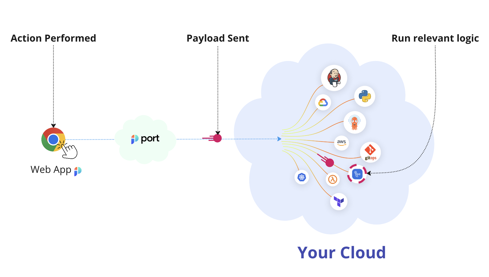
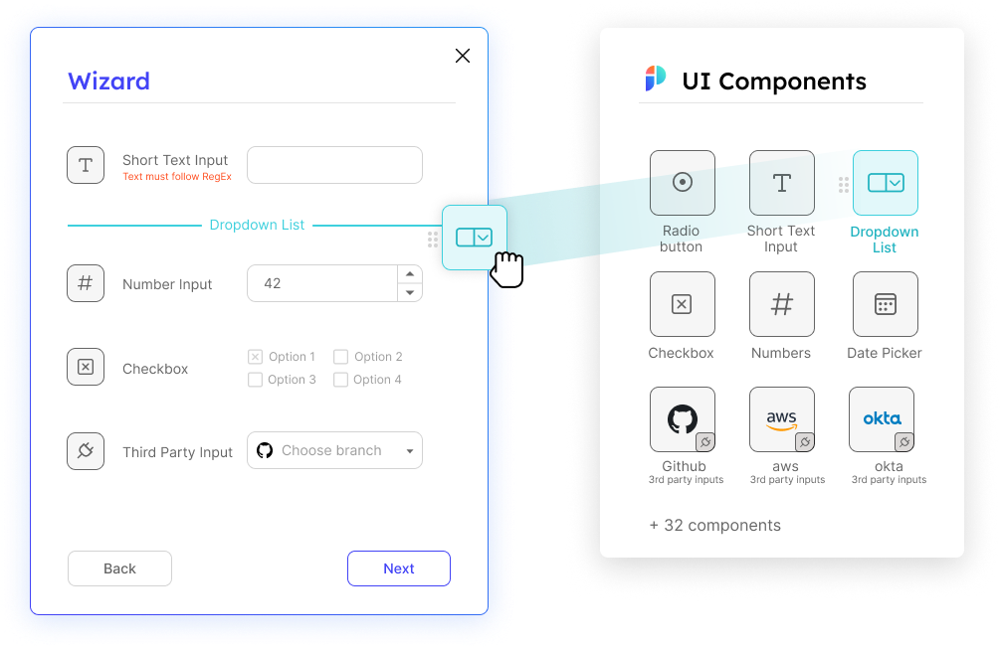
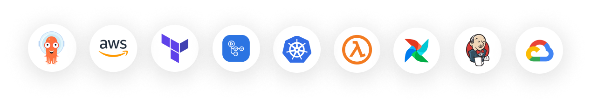

# ⚡️ Create Self-Service Experiences

<iframe width="60%" height="400" src="https://www.youtube.com/embed/KHuGBQlErWo" title="YouTube video player" frameborder="0" allow="accelerometer; autoplay; clipboard-write; encrypted-media; gyroscope; picture-in-picture; web-share" allowfullscreen allow="fullscreen;"></iframe>

Drive developer productivity by allowing developers to run free and use self-service actions like scaffolding a service or provisioning a cloud resource. Developer self-service brings consistency and repeatability and ensures that developers do the right thing because it’s intuitive and clear, all with guardrails like manual approvals or consumption policies to comply with organizational standards.

1. **Not Opinionated** - set any Self-Service action UI with low-code UI components;
2. **Async**;
3. **Leverages existing infrastructure** and automations as the backend of the defined action;
4. **Loosely coupled** to your infrastructure and architecture;
5. **Stateful** - every invoked action affects the software catalog by adding/modifying/deleting one or more entities;
6. **Secure by design** - does not require keys to sensitive infrastructure by using an event-based model, all actions are audited, embedded guardrails like manual approval and TTL are baked inside.

## 💡 Common self-service actions

- **Scaffold** a new service;
- **Open** a terraform PR to create a cloud account;
- **Launch** a jupyter notebook;
- **Create** cloud resource;
- **Scaffold** new in-house package;
- **Provision** temporary DevEnv;
- **Redeploy** an image tag;
- **Rollback** a running service;
- **Change** replica count.

In this [live demo](https://demo.getport.io/self-serve) example, we can see examples to self-service experiences. 🎬

## How does it work?

1. A user **performs an action** from Port's UI interface;
2. **A payload** that includes the user inputs and relevant action metadata is **sent** to your infrastructure;
3. **A job is triggered** and the **user gets a continuous indication** about its progress;
4. Once the action is running, you can use Port's API to update Port on its status and provide information such as logs and links to the resulting handlers.

## Steps to enable an action from Port

Creating a self-service experience in port is very similar to a traditional frontend-backend model.
Port gives you no-code components to create the experience you want for your users and integrates with existing workflows and automations provided by you.

### Step 1 - setup action

Choose what is the name of the action, the icon, and the user inputs you would like the user to fill out.
Port supports various input types, including constructing wizards with conditions and steps to best fit the experience you want for your users.

### Step 2 - setup backend

Setup the logic responsible to handle the action upon form submission.

The backend logic is yours, so it can do whatever you need it to do:

- Create a pull request for a IaC file with injected values;
- Trigger a Github Workflow or custom Python/Bash script;
- Make an API call to one of your internal APIs;
- etc.

Port supports many different backends for actions, offering a secure and compliant architecture.

As part of your backend and its logic implementation, you are able to keep the software catalog up to date by sending API requests or ingesting new data that is tied to the performed action (for example, adding a new service entity once the scaffold process has finished)

### Step 3 - reflect action progress

Port lets you update your users with a rich indication on the current state of the action's progress.
Including a success/in-progress/failure status, live logs, ChatOps notification, friendly and indicative error messages and more.

### Optional Step - ✋🏼 set guardrails

Port supports a variety of ways to add manual approvals, policies, and TTL for consumed actions to make sure specific actions are allowed with organizational standards in mind.
