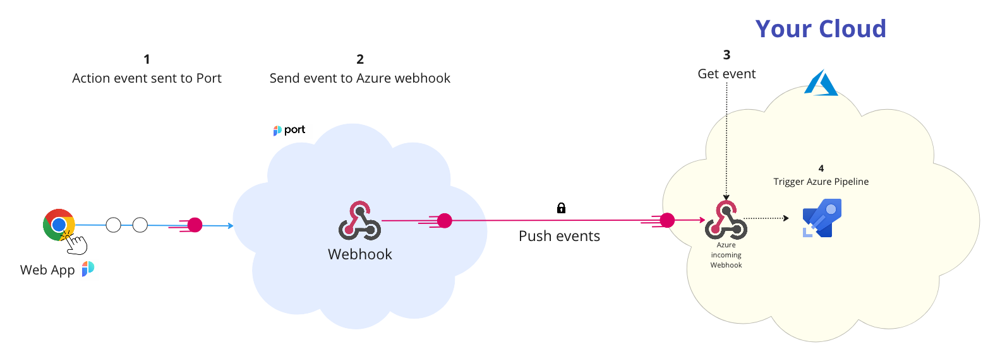

# Azure Pipelines Self-Service Actions

Port can trigger [Azure pipelines](https://azure.microsoft.com/en-us/products/devops/pipelines) using [incoming webhooks triggers](https://learn.microsoft.com/en-us/azure/devops/pipelines/process/resources?view=azure-devops&tabs=schema#define-a-webhooks-resource).



The steps shown in the image above are as follows:

1. An action is invoked in Port;
2. Port signs the action payload using SHA-1 with the [`clientSecret`](../../../build-your-software-catalog/sync-data-to-catalog/api/api.md#find-your-port-credentials) value and puts it in the `X-Port-Signature` request header.

   :::info WEBHOOK SECURITY
   Verifying the webhook request using the request headers provides the following benefits:

   - Ensures that the request payload has not been tampered with
   - Ensures that the sender of the message is Port
   - Ensures that the received message is not a replay of an older message

   :::

3. Port publishes an invoked `WEBHOOK` via a `POST` request to `https://dev.azure.com/{org_name}/_apis/public/distributedtask/webhooks/{webhook_name}?api-version=6.0-preview`

An example flow would be:

1. A developer asks to run an Azure pipeline;
2. Port sends a `POST` request with the action payload to the Azure webhook `URL`;
3. The Azure webhook receives the new action request;
4. The Azure webhook triggers the pipeline;

## Define Incoming Webhook in Azure

To define an incoming webhook in Azure, follow the steps below:

1. Create a **Service connection** of type **Incoming WebHook**;
2. Put your Port `clientSecret` value in the **Secret** key field;
3. Put the header `X-Port-Signature` in the `Headers` field;
4. Enter the service connection name in the `Service connection name` field;
5. Add the service connection resources in the Azure pipeline yaml:
   ```yaml
   resources:
     webhooks:
       - webhook: { webhookName }
         connection: { Service connection name }
   ```
   The complete documentation showing how to configure Azure incoming webhooks can be found [here](https://learn.microsoft.com/en-us/azure/devops/pipelines/process/resources?view=azure-devops&tabs=schema#define-a-webhooks-resource).

## Define Azure pipeline actions in Port

To define the Azure pipelines invocation method in Port, follow the steps below:

1. Go to the blueprint you want to configure an action on;
2. Add the a new action as described in the [actions](../../../create-self-service-experiences/setup-ui-for-action/#action-structure) page;
3. In the `invocationMethod` key, add the following information:

```json showLineNumbers
{
  ...
  "userInputs": {
    ...
  },
  // highlight-start
  "invocationMethod": {
    "type": "AZURE-DEVOPS",
    "org": "<AZURE-DEVOPS-ORG>",
    "webhook": "<AZURE-DEVOPS-WEBHOOK-NAME>"
  },
  // highlight-end
  "trigger": "CREATE"
  ...
}
```

:::tip

- `<AZURE-DEVOPS-ORG>` - your Azure DevOps organization name, can be found in your Azure DevOps URL: `https://dev.azure.com/{AZURE-DEVOPS-ORG}`;
- `<AZURE-DEVOPS-WEBHOOK-NAME>` - the name you gave to the webhook resource in the Azure yaml pipeline file.

:::

## Examples

Refer to the [examples](./examples/examples.md) page for practical self-service actions using Azure pipelines.
