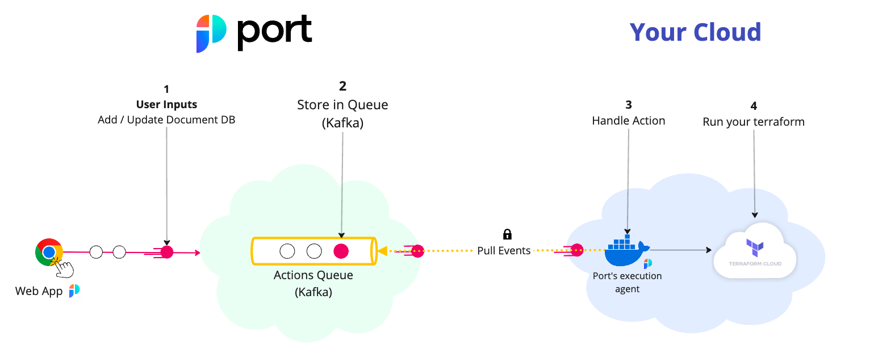

# Circle CI Actions

Port's Circle CI Action can trigger
a [new pipeline](https://circleci.com/docs/api/v2/index.html?utm_source=google&utm_medium=sem&utm_campaign=sem-google-dg--emea-en-dsa-tCPA-auth-nb&utm_term=g_-_c__dsa_&utm_content=&gclid=Cj0KCQiAmNeqBhD4ARIsADsYfTeWb6EyzetX9OD0cFdfR--Tt8oOEf8CXnhyoRT46HMCGgbbVytPWG0aAloJEALw_wcB#operation/triggerPipeline)
using a customer provided input
and [`port_payload`](../../self-service-actions-deep-dive/self-service-actions-deep-dive.md#action-message-structure).



The steps shown in the image above are as follows:

1. Port publishes an invoked `Action` message containing the pipeline details to a topic;
2. A secure topic (`ORG_ID.runs`) holds all the action invocations;
3. Port's execution agent pulls the new trigger event from your Kafka topic, and triggers your Circle CI pipeline.

## Prerequisites

- [Helm](https://helm.sh) must be installed to use the chart. Please refer to
  Helm's [documentation](https://helm.sh/docs) for further details on the installation;
- The connection credentials to Kafka are provided to you by Port;
- If you want to trigger a Circle CI pipeline, you need to have a Circle
  CI [personal API token](https://app.circleci.com/settings/user/tokens).

## Further steps

- See the [Triggering example](#Triggering-example) for Circle CI.
- Contact us through Intercom to set up a Kafka topic for your organization.
- [Install the Port execution agent to trigger the Circle CI pipeline](#Installation).

## Triggering example

Create the following blueprint, action and mapping to trigger a Circle CI pipeline.

<details>
<summary>Blueprint</summary>

```json showLineNumbers
{
  "identifier": "circle_ci_project",
  "title": "CircleCI Project",
  "icon": "CircleCI",
  "schema": {
    "properties": {
      "project_slug": {
        "title": "Slug",
        "type": "string"
      }
    },
    "required": ["project_slug"]
  },
  "mirrorProperties": {},
  "calculationProperties": {},
  "relations": {}
}
```

</details>

<details>
<summary>Action</summary>

```json showLineNumbers
[
  {
    "identifier": "trigger_circle_ci_pipeline",
    "title": "Trigger CircleCI pipeline",
    "icon": "CircleCI",
    "userInputs": {
      "properties": {},
      "required": [],
      "order": []
    },
    "invocationMethod": {
      "type": "WEBHOOK",
      "agent": true,
      "synchronized": false,
      "method": "POST",
      "url": "https://circleci.com"
    },
    "trigger": "DAY-2",
    "requiredApproval": false
  }
]
```

</details>

<details>
<summary>Mapping - (Should be saved as a file named `invocations.json`)</summary>

:::info
To read more about the `controlThePayload` configuration, please refer to
the [Control the payload](../port-execution-agent/control-the-payload.md) documentation.
:::

```json
[
  {
    "enabled": ".action == \"trigger_circle_ci_pipeline\"",
    "url": "(env.CIRCLE_CI_URL // \"https://circleci.com\") as $baseUrl | .payload.entity.properties.project_slug | @uri as $path | $baseUrl + \"/api/v2/project/\" + $path + \"/pipeline\"",
    "headers": {
      "Circle-Token": "env.CIRCLE_CI_TOKEN"
    },
    "body": {
      "branch": ".payload.properties.branch // \"main\"",
      "parameters": ".payload.action.invocationMethod as $invocationMethod | .payload.properties | to_entries | map({(.key): (.value | tostring)}) | add | if $invocationMethod.omitUserInputs then {} else . end"
    }
  }
]
```

</details>

## Installation

1. Add Port's Helm repo by using the following command:

```sh showLineNumbers
helm repo add port-labs https://port-labs.github.io/helm-charts
```

:::note
If you already added this repo earlier, run `helm repo update` to retrieve
the latest versions of the charts. You can then run `helm search repo port-labs` to see the charts.
:::

2. Create a JSON file named `invocations.json` with the mapping above.

3. Install the `port-agent` chart by using the following command after filling in the required values:

```sh showLineNumbers
helm install my-port-agent port-labs/port-agent \
    --create-namespace --namespace port-agent \
    --set env.normal.STREAMER_NAME=KAFKA \
    --set env.normal.KAFKA_CONSUMER_AUTHENTICATION_MECHANISM=SCRAM-SHA-512 \
    --set env.normal.KAFKA_CONSUMER_AUTO_OFFSET_RESET=earliest \
    --set env.normal.KAFKA_CONSUMER_SECURITY_PROTOCOL=SASL_SSL \
    --set-file controlThePayloadConfig=./invocations.json \
    --set env.normal.PORT_ORG_ID=YOUR_ORG_ID \
    --set env.normal.KAFKA_CONSUMER_GROUP_ID=YOUR_KAFKA_CONSUMER_GROUP \
    --set env.secret.KAFKA_CONSUMER_USERNAME=YOUR_KAFKA_USERNAME \
    --set env.secret.KAFKA_CONSUMER_PASSWORD=YOUR_KAFKA_PASSWORD \
    --set env.normal.KAFKA_CONSUMER_BROKERS=PORT_KAFKA_BROKERS \
    --set env.secret.CIRCLE_CI_TOKEN=YOUR_CIRCLE_CI_PERSONAL_TOKEN
```
