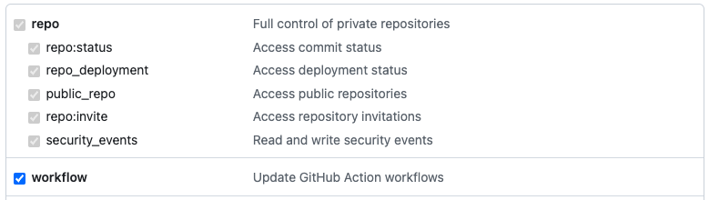

# Create GitHub Secret

This example demonstrates how to create [GitHub Secrets](https://docs.github.com/en/actions/security-guides/using-secrets-in-github-actions) in your GitHub repository via Port Actions.

In this example we are using a pre-defined GitHub Action from GitHub Marketplace called [Create GitHub Secret Action](https://github.com/marketplace/actions/create-github-secret-action).

## Example - Create GitHub Secret

Follow these steps to get started:

1. Create the following GitHub Action secrets:

   1. `PERSONAL_ACCESS_TOKEN` - a [Classic Personal Access Token](https://github.com/settings/tokens) with the following scopes:

      

   2. `PORT_CLIENT_ID` - Port Client ID [learn more](../../../../build-your-software-catalog/custom-integration/api/#get-api-token).
   3. `PORT_CLIENT_SECRET` - Port Client Secret [learn more](../../../../build-your-software-catalog/custom-integration/api/#get-api-token).

2. Install Port's GitHub app by clicking [here](https://github.com/apps/getport-io/installations/new).

3. Create a Port blueprint with the following properties:

:::tip
Keep in mind this can be any blueprint you would like and this is just an example.
:::

```json showLineNumbers
{
  "identifier": "githubsecret",
  "title": "GitHubSecret",
  "icon": "Github",
  "schema": {
    "properties": {
      "secret_key": {
        "icon": "DefaultProperty",
        "title": "Secret Key",
        "type": "string",
        "description": "All Uppercase",
        "pattern": "^[^a-z]*$"
      },
      "secret_value": {
        "icon": "DefaultProperty",
        "title": "Secret Value",
        "type": "string"
      }
    },
    "required": ["secret_key", "secret_value"]
  },
  "mirrorProperties": {},
  "calculationProperties": {},
  "relations": {}
}
```

4. Create a Port action using the following JSON definition:

<details>
:::tip Modification Required
Make sure to replace the placeholders for `<GITHUB_ORG_NAME>` and `<GITHUB_REPO_NAME>` in your Port Action to match your GitHub environment.
:::

<summary>Port Action (click to expand)</summary>

```json showLineNumbers
{
  "identifier": "service_create_github_secret",
  "title": "Create GitHub Secret",
  "icon": "Github",
  "description": "Creates a GitHub secret in my repository",
  "trigger": {
    "type": "self-service",
    "operation": "CREATE",
    "userInputs": {
      "properties": {
        "secret_key": {
          "icon": "DefaultProperty",
          "title": "Secret Key",
          "type": "string",
          "pattern": "^[^a-z]*$"
        },
        "secret_value": {
          "icon": "DefaultProperty",
          "title": "Secret Value",
          "type": "string",
          "encryption": "aes256-gcm"
        }
      },
      "required": [
        "secret_key",
        "secret_value"
      ],
      "order": [
        "secret_key",
        "secret_value"
      ]
    },
    "blueprintIdentifier": "githubsecret"
  },
  "invocationMethod": {
    "type": "GITHUB",
    "org": "<GITHUB_ORG_NAME>",
    "repo": "<GITHUB_REPO_NAME>",
    "workflow": "create-repo-secret.yml",
    "workflowInputs": {
      "{{if (.inputs | has(\"ref\")) then \"ref\" else null end}}": "{{.inputs.\"ref\"}}",
      "{{if (.inputs | has(\"secret_key\")) then \"secret_key\" else null end}}": "{{.inputs.\"secret_key\"}}",
      "{{if (.inputs | has(\"secret_value\")) then \"secret_value\" else null end}}": "{{.inputs.\"secret_value\"}}",
      "port_payload": {
        "action": "{{ .action.identifier[(\"service_\" | length):] }}",
        "resourceType": "run",
        "status": "TRIGGERED",
        "trigger": "{{ .trigger | {by, origin, at} }}",
        "context": {
          "entity": "{{.entity.identifier}}",
          "blueprint": "{{.action.blueprint}}",
          "runId": "{{.run.id}}"
        },
        "payload": {
          "entity": "{{ (if .entity == {} then null else .entity end) }}",
          "action": {
            "invocationMethod": {
              "type": "GITHUB",
              "omitPayload": false,
              "omitUserInputs": false,
              "reportWorkflowStatus": true,
              "org": "<GITHUB_ORG_NAME>",
              "repo": "<GITHUB_REPO_NAME>",
              "workflow": "create-repo-secret.yml"
            },
            "trigger": "{{.trigger.operation}}"
          },
          "properties": {
            "{{if (.inputs | has(\"secret_key\")) then \"secret_key\" else null end}}": "{{.inputs.\"secret_key\"}}",
            "{{if (.inputs | has(\"secret_value\")) then \"secret_value\" else null end}}": "{{.inputs.\"secret_value\"}}"
          },
          "censoredProperties": "{{.action.encryptedProperties}}"
        }
      }
    },
    "reportWorkflowStatus": true
  },
  "requiredApproval": false,
  "publish": true
}
```

</details>

5. Create a workflow file under `.github/workflows/create-repo-secret.yml` with the following content:

<details>

<summary>GitHub Workflow (click to expand)</summary>

```yml showLineNumbers
name: Create Repository Secret

on:
  workflow_dispatch:
    inputs:
      secret_key:
        type: string
        description: Name of the secret's key
      secret_value:
        type: string
        description: value of the secret
      run_id:
        type: string
        required: true
      blueprint:
        type: string
        required: true
jobs:
  create_secret:
    runs-on: ubuntu-latest
    steps:
      - name: Inform starting of creating secret key
        uses: port-labs/port-github-action@v1
        with:
          clientId: ${{ secrets.PORT_CLIENT_ID }}
          clientSecret: ${{ secrets.PORT_CLIENT_SECRET }}
          operation: PATCH_RUN
          runId: ${{ inputs.run_id }}
          logMessage: |
            Setting secret, "${{ inputs.secret_key }}" in repository

      - uses: gliech/create-github-secret-action@v1
        id: set_secret_key
        with:
          name: ${{ inputs.secret_key }}
          value: ${{ inputs.secret_value }}
          pa_token: ${{ secrets.PERSONAL_ACCESS_TOKEN }}
      
      - name: Inform completion of setting key
        if: steps.set_secret_key.outcome == 'success'
        uses: port-labs/port-github-action@v1
        with:
          clientId: ${{ secrets.PORT_CLIENT_ID }}
          clientSecret: ${{ secrets.PORT_CLIENT_SECRET }}
          operation: PATCH_RUN
          runId: ${{ inputs.run_id }}
          logMessage: |
            Setting secret, "${{ inputs.secret_key }}" has been set in repository 💪🏿

      - name: Inform upserting entity
        if: steps.set_secret_key.outcome == 'success'
        uses: port-labs/port-github-action@v1
        with:
          clientId: ${{ secrets.PORT_CLIENT_ID }}
          clientSecret: ${{ secrets.PORT_CLIENT_SECRET }}
          operation: PATCH_RUN
          runId: ${{ inputs.run_id }}
          logMessage: |
            Updating Port blueprint catalogue with newly added secret...

      - name: UPSERT Entity
        uses: port-labs/port-github-action@v1
        id: upsert_entity
        with:
          identifier: ${{ inputs.secret_key }}
          title: ${{ inputs.secret_key }}
          team: "[]"
          icon: DefaultBlueprint
          blueprint: ${{ inputs.blueprint }}
          properties: |-
            {
              "secret_key": "${{ inputs.secret_key }}",
              "secret_value": "${{ inputs.secret_value }}"
            }
          relations: "{}"
          clientId: ${{ secrets.PORT_CLIENT_ID }}
          clientSecret: ${{ secrets.PORT_CLIENT_SECRET }}
          operation: UPSERT
          runId: ${{ inputs.run_id }}
      
      - name: Inform completion of upserting entity
        if: steps.upsert_entity.outcome == 'success'
        uses: port-labs/port-github-action@v1
        with:
          clientId: ${{ secrets.PORT_CLIENT_ID }}
          clientSecret: ${{ secrets.PORT_CLIENT_SECRET }}
          operation: PATCH_RUN
          runId: ${{ inputs.run_id }}
          logMessage: |
            Operation completed, success 🔥
```
</details>

6. Trigger the action from the [Self-service](https://app.getport.io/self-serve) tab of your Port application.
