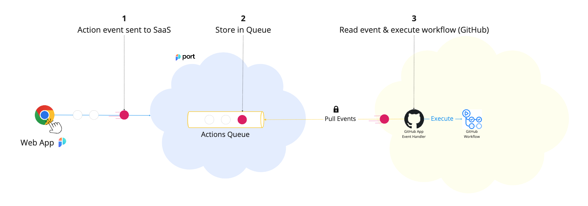

# GitHub Workflow Self-Service Actions

[Port's GitHub application](../../../build-your-software-catalog/sync-data-to-catalog/git/github/installation.md) can trigger a [GitHub workflow](https://docs.github.com/en/actions/using-workflows) using a customer provided input and [`port_payload`](/create-self-service-experiences/reflect-action-progress/#action-run-json-structure).

:::tip
Self-service actions using GitHub workflows are available both with the standard Port [GitHub app](../../../build-your-software-catalog/sync-data-to-catalog/git/github/github.md), and with the [self-hosted version](../../../build-your-software-catalog/sync-data-to-catalog/git/github/self-hosted-installation.md)
:::

The steps shown in the image above are as follows:

1. Port publishes an invoked `Action` message to a topic;
2. A secure topic (`ORG_ID.github.runs`) holds all the action invocations;
3. A listener implemented on Port's GitHub application receives the new topic message and runs GitHub workflow defined by the DevOps team.

An example flow would be:

1. A developer asks to deploy a new version of an existing `Microservice`;
2. The `create` action is sent to the `github.runs` topic;
3. Port's GitHub application event handler is triggered by this new action message;
4. Port's GitHub application triggers the GitHub workflow that deploys a new version of the service;
5. As part of the workflow, the new microservice `Deployment` is reported back to Port;
6. When the workflow is done, Port's GitHub application reports back to Port about the status of the action run (`SUCCESS` or `FAILURE`), according to workflow's `conclusion`.

:::info triggering workflow chains
A workflow triggered using the `workflow_dispatch` trigger is self-contained. This means its actions and effects over the repository cannot trigger other automatic workflows.

1. A developer invokes a "provision new microservice in monorepo" workflow;
2. The workflow opens a new PR in the target repository based on a pre-defined template;
3. The repository also has a workflow which is automatically triggered using the `on: pull_request: types: "opened"` trigger;
4. In this instance, the automatic PR workflow will not be triggered.

:::

## Examples

See the [examples](/create-self-service-experiences/setup-backend/github-workflow/examples/) page for implementations of various use-cases using a Github workflow backend.  

Additional examples can be found in our [action examples Github repository](https://github.com/port-labs/self-service-actions-examples).
