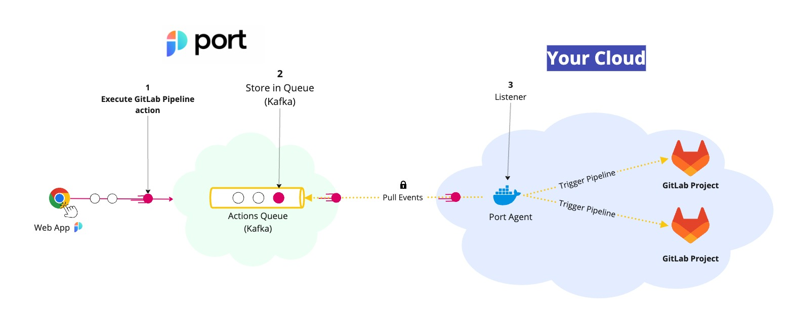

# GitLab Pipelines Actions

Port's GitLab Pipeline Action can trigger a [GitLab Pipeline](https://docs.gitlab.com/ee/ci/pipelines/) using a customer provided input and [`port_payload`](../../self-service-actions-deep-dive/self-service-actions-deep-dive.md#action-message-structure).



The steps shown in the image above are as follows:

1. Port publishes an invoked `Action` message containing the pipeline details to a topic;
2. A secure topic (`ORG_ID.runs`) holds all the action invocations;
3. Port's execution agent pulls the new trigger event from your Kafka topic, and triggers your GitLab Pipeline.

:::important IMPORTANT
In order to trigger GitLab Pipelines through the Port agent, you'll need to [create a GitLab Pipeline trigger token](https://docs.gitlab.com/ee/ci/triggers/).

You can trigger pipelines accross multiple GitLab projects, as long as you have a trigger token with the required permissions.

Trigger tokens are loaded to the Port agent as environment variables.
:::

## Create a deployment Blueprint

Let’s configure a `Deployment` Blueprint. Its base structure is:

```json showLineNumbers
{
  "identifier": "deployment",
  "title": "Deployment",
  "icon": "Deployment",
  "schema": {
    "properties": {
      "jobUrl": {
        "type": "string",
        "format": "url",
        "title": "Job URL"
      },
      "deployingUser": {
        "type": "string",
        "title": "Deploying User"
      },
      "imageTag": {
        "type": "string",
        "title": "Image Tag"
      },
      "commitSha": {
        "type": "string",
        "title": "Commit SHA"
      }
    },
    "required": []
  },
  "mirrorProperties": {},
  "calculationProperties": {},
  "relations": {}
}
```

## Create a Port action

Now let’s configure a self-service action. Add a `CREATE` action that will be triggered every time a developer wants to initiate a new deployment for a service.

Here is the JSON of the action:

```json showLineNumbers
{
  "identifier": "runGitLabPipline",
  "title": "Trigger Gitlab Pipeline",
  "icon": "DeployedAt",
  "userInputs": {
    "properties": {
      "ref": {
        "type": "string",
        "title": "Ref"
      },
      "pipelineVariable1": {
        "type": "string",
        "title": "First Pipeline Variable "
      },
      "pipelineVariable2": {
        "type": "string",
        "title": "Second Pipeline Variable"
      }
    }
  },
  "invocationMethod": {
    "type": "GITLAB",
    "projectName": "project",
    "groupName": "group",
    "defaultRef": "main",
    "agent": true,
    "omitPayload": false,
    "omitUserInputs": false
  },
  "trigger": "CREATE",
  "description": "Trigger a GitLab Pipeline through the Port Agent",
  "requiredApproval": false
}
```

### Invocation method properties

| Field            | Type      | Description                                                                                                                                                                                                                                                                                                                                                 | Example values                       |
| ---------------- | --------- | ----------------------------------------------------------------------------------------------------------------------------------------------------------------------------------------------------------------------------------------------------------------------------------------------------------------------------------------------------------- | ------------------------------------ |
| `type`           | `string`  | Defines the self-service action destination type                                                                                                                                                                                                                                                                                                            | `GITLAB`                             |
| `agent`          | `boolean` | Defines whether to use [Port Agent](../port-execution-agent/port-execution-agent.md) for execution or not.                                                                                                                                                                                                                                                  | must be `true` in GitLab action type |
| `projectName`    | `string`  | Defines the GitLab project name                                                                                                                                                                                                                                                                                                                             | `port`                               |
| `groupName`      | `string`  | Defines the GitLab group name                                                                                                                                                                                                                                                                                                                               | `port-labs`                          |
| `defaultRef`     | `string`  | The default ref (branch / tag name) we want the action to use. <br></br> `defaultRef` can be overriden dynamically,<br></br> by adding `ref` as user input. <br></br> If not set, the agent triggers `main` branch                                                                                                                                          | `main`                               |
| `omitPayload`    | `boolean` | Flag to control whether to add [`port_payload`](../../self-service-actions-deep-dive/self-service-actions-deep-dive.md#action-message-structure) JSON string to the GitLab pipeline trigger payload (default: `false`).                                                                                                                                     | `true` or `false`                    |
| `omitUserInputs` | `boolean` | Flag to control whether to send the user inputs of the Port action as [GitLab CI/CD variables](https://docs.gitlab.com/ee/ci/variables/) to the GitLab pipeline. <br></br> By default, the user inputs are passed as variables (default: `false`). <br></br> When disabled, you can still get the user inputs from the `port_payload` (unless omitted too). | `true` or `false`                    |

## Further steps

- Contact us through Intercom to set up a Kafka topic for your organization.
- [Install the Port agent for triggering the GitLab pipeline](../port-execution-agent/Installation.md).
