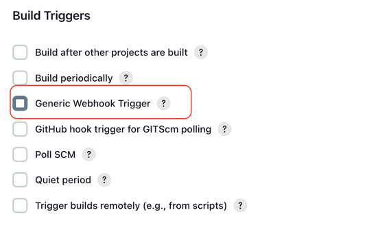
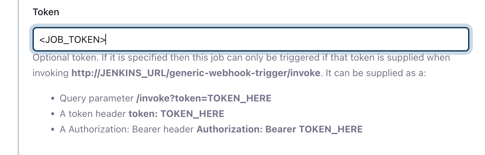
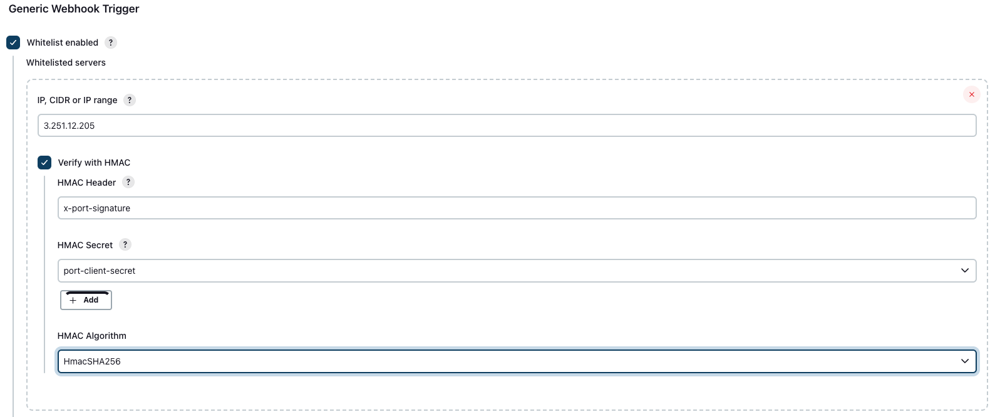
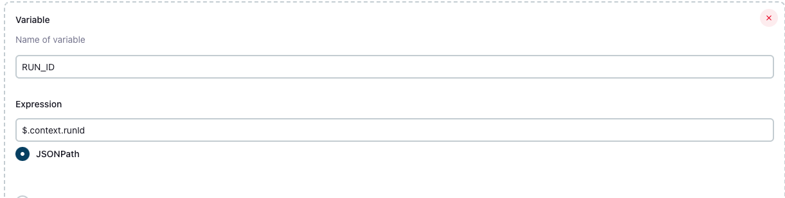

import Image from "@theme/IdealImage";
import DefineVars from "../../../../static/img/self-service-actions/setup-backend/jenkins-pipeline/define-variables.png";

# Triggering Jenkins using webhooks

In this guide, you will learn how to trigger your [Jenkins](https://www.jenkins.io/) Pipelines from Port, using [Webhook Actions](../webhook/).


The steps shown in the image above are as follows:

1. An action is invoked in Port;
2. Port signs the action payload using SHA-1 with the [`clientSecret`](../../../build-your-software-catalog/custom-integration/api/api.md#find-your-port-credentials) value and puts it in the `X-Port-Signature` request header.

   :::info
   Verifying the webhook request using the request headers provides the following benefits:

   - Ensures that the request payload has not been tampered with
   - Ensures that the sender of the message is Port
   - Ensures that the received message is not a replay of an older message
   :::

3. Port publishes an invoked `WEBHOOK` via a `POST` request to `https://{JENKINS_URL}/generic-webhook-trigger/invoke`

   An example flow would be:

   1. A developer asks to run a Jenkins pipeline;
   2. Port sends a `POST` request with the action payload to the Jenkins webhook `URL`;
   3. The Jenkins webhook receives the new action request;
   4. The Jenkins webhook triggers the pipeline;

## Prerequisites

Jenkins required plugins:

- [Generic webhook trigger](https://plugins.jenkins.io/generic-webhook-trigger/) - Allows triggering Jenkins pipelines using webhook calls.

## Setting up the webhook

### Enabling webhook trigger for a pipeline

To enable triggering a Jenkins pipeline using a webhook invocation, you will need to add "Generic Webhook Trigger" as a build trigger to your pipeline.

In your job's page, enter the **Configuration** tab, and scroll down to the **Build Triggers** section. Check the `Generic Webhook Trigger` box:



By default, when enabling the webhook trigger for a job, it can be triggered by sending an event to `http://JENKINS_URL/generic-webhook-trigger/invoke`. This means that, if not configured otherwise, all jobs will be triggered when sending an event to this route. It is recommended to set up a [job token](jenkins-pipeline.md#token-setup) to avoid running unwanted jobs.

### Defining variables

After checking the box, look for the **Post content parameters** section. This is where you will define the variables which will be passed to your pipeline run.

- The `Variable` field value should match the name of the variable that is defined in your job configuration and expected by the job run.
- The `Expression` field should be set to `JSONPath` and be directed to the relevant property sent by the Port action.

<br/>

<Image img={DefineVars} style={{ width: 550 }} />

<br/>

:::tip
Here is part of the JSON scheme of the Port action, which shows the inputs sent by Port when triggering the action:

```json showLineNumber
[
  {
    "identifier": "runPipeline",
    "title": "Run Pipeline",
    "icon": "Jenkins",
    "userInputs": {
      "properties": {
        "input1": {
          "type": "string"
        }
      }
    }
    ... # Port Action configuration
]
```

Here is a sample payload that is generated when the action is triggered and sent to Jenkins:

```json showLineNumber
{
    ... # Event metadata
    "payload": {
        "properties": {
            "input1": "input1_value"
        }

    }

}
```

For example, the JSONPath for `input1` would be:

```text
$.payload.properties.input1
```

**Port Action** - The full Port action definition can be found [here](./jenkins-pipeline.md#setting-up-the-port-action).

:::

### Token setup

The [token parameter](https://plugins.jenkins.io/generic-webhook-trigger/#plugin-content-token-parameter) allows triggering a specific (or a group) of jobs.

To set up a token for you job, scroll down to the **Token** section, and provide a job token:



After saving, you will be able to specifically trigger this job job, using the following URL:

```text showLineNumbers
http://JENKINS_URL/generic-webhook-trigger/invoke?token=<JOB_TOKEN>
```

:::tip
For advanced configuration of your Jenkins webhook trigger, check out the [Generic webhook trigger](https://plugins.jenkins.io/generic-webhook-trigger/) plugin page!
:::

### Setting up the Port action

To trigger the Jenkins pipeline, you will setup a Port [Webhook Action](../webhook/).

Here is an example for an action that will trigger the webhook you just set up:

```json showLineNumbers
[
  {
    "identifier": "runPipeline",
    "title": "Run Pipeline",
    "icon": "Jenkins",
    "userInputs": {
      "properties": {
        "input1": {
          "type": "string"
        }
      }
    },
    # highlight-start
    "invocationMethod": {
      "type": "WEBHOOK",
      "url": "http://JENKINS_URL/generic-webhook-trigger/invoke?token=<JOB_TOKEN>"
    },
    # highlight-end
    "trigger": "CREATE",
    "description": "Run Jenkins pipeline"
  }
]
```

### Securing your webhook

It is possible to add a protection layer to your exposed pipelines by [configuring whitelisting](https://plugins.jenkins.io/generic-webhook-trigger/#plugin-content-whitelist-hosts).

Whitelisting gives you the following security options:

- Limit the list of IP addresses that can send a request that triggers the pipeline;
- Add [validation](../webhook/signature-verification.md) for the webhook payload content to verify that it really originated from Port.

Here is an example of the required configuration:



:::note

- The IP field should be set to `3.251.12.205`, which is our hosted outbound WEBHOOK Gateway;
  - For more information about Port's outbound calls, check out Port's [actions security](../../security/security.md) page.
- In the **HMAC Secret** field, choose a secret containing your `port-client-secret`.

If this secret doesn't already exist, create a `secret text` type secret using [this guide](https://www.jenkins.io/doc/book/using/using-credentials/). The value of the secret should be your `Port Client Secret` which can be found by following the guide [here](https://docs.getport.io/build-your-software-catalog/custom-integration/api/#find-your-port-credentials).
:::

### Report Jenkins action run status to Port

Once you have triggered your Jenkins pipeline successfully, it is essential to update the status of the run action in Port.

In order to update the action, you'll need to create the `RUN_ID` variable, and to set it to be fetched from the [action payload](/create-self-service-experiences/reflect-action-progress/#action-run-json-structure):



The code snippet below demonstrates how you can report the progress of your pipeline to Port:

<details>
<summary> Click here to see the code</summary>

```groovy showLineNumbers
import groovy.json.JsonSlurper

pipeline {
    agent any

    environment {
        PORT_CLIENT_ID="YOUR_CLIENT_ID"
        PORT_CLIENT_SECRET="YOUR_CLIENT_SECRET"
        ACCESS_TOKEN = ""
    }

    stages {
        // highlight-next-line
        stage('Get access token') {
            steps {
                script {
                    // Execute the curl command and capture the output
                    def result = sh(returnStdout: true, script: """
                        accessTokenPayload=\$(curl -X POST \
                            -H "Content-Type: application/json" \
                            -d '{"clientId": "${PORT_CLIENT_ID}", "clientSecret": "${PORT_CLIENT_SECRET}"}' \
                            -s "https://api.getport.io/v1/auth/access_token")
                        echo \$accessTokenPayload
                    """)

                    // Parse the JSON response using JsonSlurper
                    def jsonSlurper = new JsonSlurper()
                    def payloadJson = jsonSlurper.parseText(result.trim())

                    // Access the desired data from the payload
                    ACCESS_TOKEN = payloadJson.accessToken
                }
            }
        }

        // highlight-next-line
        stage('Send logs example') {
            steps {
                script {
                    def logs_report_response = sh(script: """
                        curl -X POST \
                            -H "Content-Type: application/json" \
                            -H "Authorization: Bearer ${ACCESS_TOKEN}" \
                            -d '{"message": "this is a log test message example"}' \
                            "https://api.getport.io/v1/actions/runs/$RUN_ID/logs"
                    """, returnStdout: true)

                    println(logs_report_response)
                }
            }
        }

        // highlight-next-line
        stage('Update status example') {
            steps {
                script {
                    def status_report_response = sh(script: """
                        curl -X PATCH \
                          -H "Content-Type: application/json" \
                          -H "Authorization: Bearer ${ACCESS_TOKEN}" \
                          -d '{"status":"SUCCESS", "message": {"run_status": "Jenkins CI/CD Run completed successfully!"}}' \
                            "https://api.getport.io/v1/actions/runs/${RUN_ID}"
                    """, returnStdout: true)

                    println(status_report_response)
                }
            }
        }
    }
}
```

</details>
