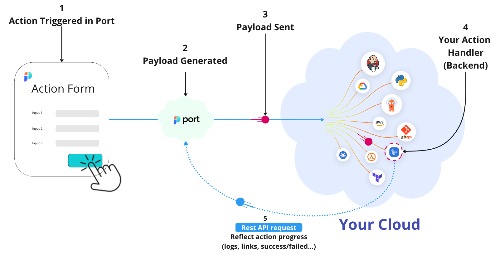

import DocCardList from '@theme/DocCardList';

# ⚙️ Setup Backend

<iframe width="60%" height="400" src="https://www.youtube.com/embed/cU7W3xYbsEw" title="YouTube video player" frameborder="0" allow="accelerometer; autoplay; clipboard-write; encrypted-media; gyroscope; picture-in-picture; web-share" allowfullscreen allow="fullscreen;"></iframe>

Port's self-service actions support a variety of backends that can be triggered when a user invokes an action.

Here is the basic backend model:

The Port-backend integration includes the following steps:

1. **The action is triggered in Port** - the trigger can be either a user interacting with the self-service actions UI, or an automation triggering an action via the API;
2. **Port generates the event payload** - the payload includes metadata about the invoked action and the user inputs;
3. **The payload is sent to your backend** - the backend can be a URL, a dedicated Kafka topic or one of your CI/CD workflows and pipelines;
4. **Your backend receives the payload and handles the request** - depending on the action, the backend might open a PR, create a new cloud resource, provision a new environment etc.;
5. **Your backend updates Port on the status of the execution** - You can enrich the action run object in Port by adding logs, attaching links to other workflows or pipelines that help fullfil the request and add a final success/fail status once the action is complete.

## Supported backends

<DocCardList/>
