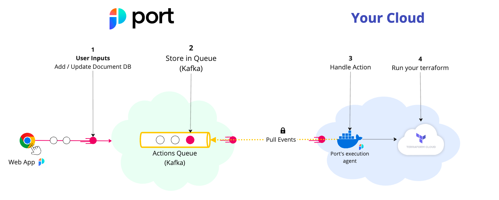

# Terraform Cloud Actions

Port's Terraform Cloud Action can trigger
a [Terraform Cloud run](https://developer.hashicorp.com/terraform/cloud-docs/api-docs/run#create-a-run) using a customer
provided input
and [`port_payload`](/create-self-service-experiences/reflect-action-progress/#action-run-json-structure).



The steps shown in the image above are as follows:

1. Port publishes an invoked `Action` message containing the pipeline details to a topic;
2. A secure topic (`ORG_ID.runs`) holds all the action invocations;
3. Port's execution agent pulls the new trigger event from your Kafka topic, and triggers your Terraform Cloud run.

## Prerequisites

- [Helm](https://helm.sh) must be installed to use the chart. Please refer to
  Helm's [documentation](https://helm.sh/docs) for further details on the installation;
- The connection credentials to Kafka are provided to you by Port;
- If you want to trigger a Terraform Cloud run, you need to have a Terraform Cloud
  [User token](https://developer.hashicorp.com/terraform/cloud-docs/users-teams-organizations/users#api-tokens) or
  [Team token](https://developer.hashicorp.com/terraform/cloud-docs/users-teams-organizations/api-tokens#team-api-tokens).

:::warning
**Note**: Terraform Cloud run endpoint cannot be accessed with organization tokens. You must access it with a **user
token** or **team token**.
:::

## Further steps

- See the [Triggering example](#Triggering-example) for Terraform Cloud.
- Contact us through Intercom to set up a Kafka topic for your organization.
- [Install the Port execution agent to trigger the Terraform Cloud Run](#Installation).

## Triggering example

Create the following blueprint, action and mapping to trigger a Terraform Cloud run.

<details>
<summary>Blueprint</summary>

```json showLineNumbers
{
  "identifier": "terraform_cloud_workspace",
  "title": "Terraform Cloud Workspace",
  "icon": "Terraform",
  "schema": {
    "properties": {
      "workspace_id": {
        "title": "Workspace Id",
        "type": "string"
      }
    },
    "required": ["workspace_id"]
  },
  "mirrorProperties": {},
  "calculationProperties": {},
  "relations": {}
}
```

</details>

<details>
<summary>Action</summary>

```json showLineNumbers
[
  {
    "identifier": "trigger_tf_run",
    "title": "Trigger TF Cloud run",
    "icon": "Terraform",
    "userInputs": {
      "properties": {},
      "required": [],
      "order": []
    },
    "invocationMethod": {
      "type": "WEBHOOK",
      "agent": true,
      "synchronized": false,
      "method": "POST",
      "url": "https://app.terraform.io/api/v2/runs/"
    },
    "trigger": "DAY-2",
    "requiredApproval": false
  }
]
```

</details>

<details>
<summary>Mapping - (Should be saved as a file named `invocations.json`)</summary>

:::info
To read more about the `controlThePayload` configuration, please refer to
the [Control the payload](/create-self-service-experiences/setup-backend/webhook/port-execution-agent/control-the-payload.md) documentation.
:::

```json
[
  {
    "enabled": ".action == \"trigger_tf_run\"",
    "headers": {
      "Authorization": "\"Bearer \" + env.TF_TOKEN",
      "Content-Type": "\"application/vnd.api+json\""
    },
    "body": {
      "data": {
        "attributes": {
          "is-destroy": false,
          "message": "\"Triggered via Port\"",
          "variables": ".payload.properties | to_entries | map({key: .key, value: .value})"
        },
        "type": "\"runs\"",
        "relationships": {
          "workspace": {
            "data": {
              "type": "\"workspaces\"",
              "id": ".payload.entity.properties.workspace_id"
            }
          }
        }
      }
    },
    "report": {
      "status": "if .response.statusCode == 201 then \"SUCCESS\" else \"FAILURE\" end",
      "link": "\"https://app.terraform.io/app/\" + .body.payload.entity.properties.organization_name + \"/workspaces/\" + .body.payload.entity.properties.workspace_name + \"/runs/\" + .response.json.data.id",
      "externalRunId": ".response.json.data.id"
    }
  }
]
```

</details>

## Installation

1. Add Port's Helm repo by using the following command:

```sh showLineNumbers
helm repo add port-labs https://port-labs.github.io/helm-charts
```

:::note
If you already added this repo earlier, run `helm repo update` to retrieve
the latest versions of the charts. You can then run `helm search repo port-labs` to see the charts.
:::

2. Create a JSON file named `invocations.json` with the mapping above.

3. Install the `port-agent` chart by using the following command after filling in the required values:

```sh showLineNumbers
helm install my-port-agent port-labs/port-agent \
    --create-namespace --namespace port-agent \
    --set-file controlThePayloadConfig=./invocations.json \
    --set env.normal.PORT_ORG_ID=YOUR_ORG_ID \
    --set env.normal.KAFKA_CONSUMER_GROUP_ID=YOUR_KAFKA_CONSUMER_GROUP \
    --set env.secret.PORT_CLIENT_ID=YOUR_PORT_CLIENT_ID \
    --set env.secret.PORT_CLIENT_SECRET=YOUR_PORT_CLIENT_SECRET \
    --set env.secret.TF_TOKEN=YOUR_TERRAFORM_CLOUD_TOKEN
```
